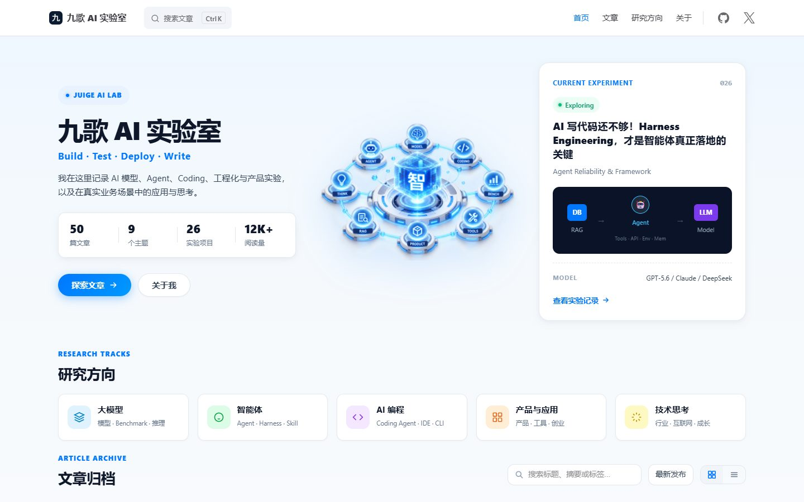
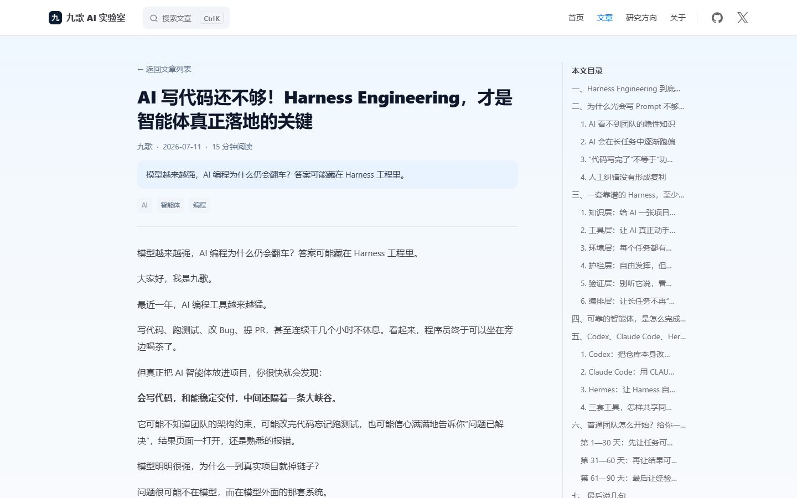
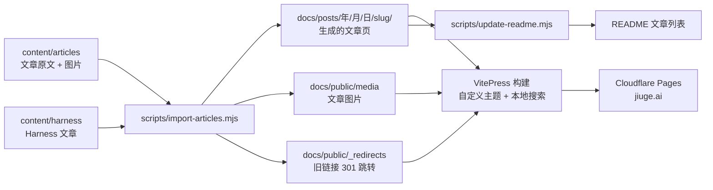

<div align="center">

# 九歌 AI 实验室

**Build · Test · Deploy · Write**

记录 AI 模型、Agent、Coding、工程化与产品实验，以及在真实业务场景中的应用与思考。

[](https://jiuge.ai)
[](https://vitepress.dev)
[](https://pages.cloudflare.com)
[](https://jiuge.ai/feed.xml)

[🌐 访问网站](https://jiuge.ai) · [📚 文章归档](https://jiuge.ai/posts/) · [👤 关于九歌](https://jiuge.ai/about) · [📡 RSS](https://jiuge.ai/feed.xml)



</div>

## 📖 简介

这是 [jiuge.ai](https://jiuge.ai) 的完整源码与文章原文。博客关注五个方向：

| 方向 | 关键词 |
| --- | --- |
| 🧠 大模型 | 模型 · Benchmark · 推理 · 本地部署 |
| 🤖 智能体 | Agent · Harness · Skill · MCP · 工作流 |
| 💻 AI 编程 | Coding Agent · IDE · CLI · Vibe Coding |
| 🧩 产品与应用 | 产品 · 工具 · 创业 · 企业落地 |
| 💡 技术思考 | 行业 · 互联网 · 电商 · 职场成长 |

## 🖼️ 界面预览



<p align="center"><sub>文章阅读页：文章头信息、右侧目录、上一篇/下一篇；<kbd>Ctrl</kbd> + <kbd>K</kbd> 唤起中文全文搜索</sub></p>

## ✨ 功能特性

- **纯静态站点**：VitePress 构建，部署在 Cloudflare Pages，无服务端、无数据库，全球 CDN 分发
- **中文全文搜索**：基于 MiniSearch + `Intl.Segmenter` 中文分词，在浏览器本地完成检索，覆盖全部正文
- **可读的文章链接**：`/posts/年/月/日/英文短名/`，分享时不会变成一长串 `%E5%A6%82…` 编码
- **旧链接永不失效**：旧版网站的文章地址全部 301 永久跳转到新地址
- **SEO 优化**：JSON-LD 结构化数据（文章、作者、面包屑）、canonical、Open Graph / Twitter 分享卡片、带 lastmod 的 sitemap、robots.txt、RSS，以及构建后的自动 SEO 自检
- **主题聚合**：每个标签都有独立的聚合页（如 `/tags/agents/`），文章底部按标签推荐相关文章
- **加载性能**：文章图片懒加载并带固有宽高，首屏主图使用 WebP
- **中文排版优化**：修复 CommonMark 中 `**粗体**` 紧贴中文标点不生效的问题
- **内容与站点分离**：文章以 Markdown 原文保存在 `content/`，站点页面由脚本生成，README 文章列表也自动同步

## 🏗️ 技术架构



| 类别 | 选型 |
| --- | --- |
| 站点框架 | [VitePress](https://vitepress.dev) 1.x（Vue 3 + Vite） |
| 主题 | 基于默认主题扩展的自定义主题（首页、归档、关于页、文章页头） |
| 内容处理 | gray-matter · markdown-it · cheerio · markdown-it-cjk-friendly |
| 搜索 | VitePress 本地搜索（MiniSearch）+ 中文分词 |
| 订阅 | feed（RSS 2.0）· VitePress sitemap |
| 托管 | Cloudflare Pages（`_headers` 缓存策略 · `_redirects` 跳转） |
| 类型检查 | TypeScript · vue-tsc |

## 📁 目录结构

```text
.
├── content/                     # 内容唯一来源（在这里写文章）
│   ├── catalog.json             # 文章目录
│   ├── articles/<文章目录>/
│   │   ├── index.md             # 文章原文（frontmatter + Markdown）
│   │   └── assets/              # 文章图片
│   └── harness/                 # Harness Engineering 文章及配图
├── docs/                        # VitePress 站点
│   ├── .vitepress/
│   │   ├── config.mts           # 站点配置：搜索、sitemap、RSS、Markdown 插件
│   │   ├── seo.ts               # SEO：meta 标签与 JSON-LD 结构化数据
│   │   └── theme/               # 自定义主题：布局、组件、样式、文章数据加载
│   ├── index.md                 # 首页
│   ├── about.md                 # 关于页
│   ├── posts/index.md           # 归档页（其余文章页由脚本生成）
│   ├── tags/                    # 标签页（由脚本生成）
│   └── public/                  # 静态资源、robots.txt、分享图、图标、_headers
├── scripts/
│   ├── import-articles.mjs      # content → 文章页 + 标签页 + 图片 + 跳转规则
│   ├── seo-audit.mjs            # 构建产物 SEO 自检
│   └── update-readme.mjs        # 生成 README 中的文章列表
└── wrangler.jsonc               # Cloudflare Pages 配置
```

## 🚀 快速开始

需要 Node.js 20 及以上版本。

```bash
npm install
npm run dev        # 本地开发（自动导入文章），默认 http://localhost:5173
npm run build      # 导入文章 → 更新 README 列表 → 构建站点
npm run preview    # 预览构建结果
npm run typecheck  # 类型检查（含 .vue 模板）
npm run seo:audit  # SEO 自检：title、description、h1、canonical、结构化数据、图片属性
```

## ✍️ 写一篇新文章

1. 在 `content/articles/` 下新建文章目录，放入 `index.md` 和 `assets/` 图片目录
2. 在 `content/catalog.json` 中登记该文章（`markdownPath` 指向 `index.md`）
3. 在 `index.md` 顶部填写 frontmatter，其中 **`slug` 必填**（小写英文、数字、连字符）：

```yaml
---
title: "文章标题"
slug: "my-new-post"          # 文章地址为 /posts/2026/09/30/my-new-post/
author: "九歌"
digest: "一句话摘要，用于列表和分享卡片"
publish_time: "2026-09-30"
---

正文从这里开始，图片使用相对路径：
```

4. 运行 `npm run dev` 预览。标签、阅读时长、封面图（正文第一张图）会自动生成；`digest` 会作为搜索结果和分享卡片的摘要，建议用一两句话认真写

> 文章发布后请勿再修改 `slug` 或发布日期；如确需修改，需在导入脚本中为旧地址补充跳转。

## ☁️ 部署

```bash
npm run build
npm run seo:audit  # 自检通过后再部署
npm run cf:deploy  # 部署到 Cloudflare Pages（需先 npx wrangler login）
```

<!-- POSTS:START -->
<!-- 本段由 scripts/update-readme.mjs 自动生成，请勿手动编辑 -->

## ⭐ 精选文章

- **[AI 写代码还不够！Harness Engineering，才是智能体真正落地的关键](https://jiuge.ai/posts/2026/07/11/harness-engineering/)**<br>
  <sub>2026-07-11 · 15 分钟阅读</sub>
- **[【人人都会做智能体】Agent是什么,简单中等复杂商用的智能体又是什么?](https://jiuge.ai/posts/2026/07/11/what-is-an-ai-agent/)**<br>
  <sub>2026-07-11 · 7 分钟阅读</sub>
- **[祛魅Manus！大模型通过Deep ReSearch驾驭Multi-Agent原理深度剖析](https://jiuge.ai/posts/2025/03/08/manus-deep-research-multi-agent/)**<br>
  <sub>2025-03-08 · 9 分钟阅读</sub>
- **[工具调用×大模型思考=超级智能体：ReAct 策略如何改变AI能力](https://jiuge.ai/posts/2025/02/28/react-strategy-tool-calling-agents/)**<br>
  <sub>2025-02-28 · 5 分钟阅读</sub>
- **[我悟了！论MCP Server与工作流在智能体开发场景中的作用和区别](https://jiuge.ai/posts/2025/04/06/mcp-server-vs-workflow/)**<br>
  <sub>2025-04-06 · 4 分钟阅读</sub>
- **[让外行秒变 AI 大模型专家的十个时髦技术词汇](https://jiuge.ai/posts/2025/03/02/ten-ai-buzzwords-explained/)**<br>
  <sub>2025-03-02 · 8 分钟阅读</sub>

## 📚 全部文章

共 **50** 篇，时间跨度 2018–2026，按发布时间倒序排列。

### 2026 年（2 篇）

| 日期 | 文章 | 标签 | 阅读 |
| --- | --- | --- | --- |
| 07‑11 | [AI 写代码还不够！Harness Engineering，才是智能体真正落地的关键](https://jiuge.ai/posts/2026/07/11/harness-engineering/) | AI · 智能体 · 编程 | 15&nbsp;min |
| 07‑11 | [【人人都会做智能体】Agent是什么,简单中等复杂商用的智能体又是什么?](https://jiuge.ai/posts/2026/07/11/what-is-an-ai-agent/) | AI · 智能体 · 编程 · 电商 | 7&nbsp;min |

### 2025 年（31 篇）

| 日期 | 文章 | 标签 | 阅读 |
| --- | --- | --- | --- |
| 08‑30 | [谷歌在文图影AI领域已经全面弯道超车并遥遥领先](https://jiuge.ai/posts/2025/08/30/google-leads-generative-media/) | AI · 电商 · 商业 | 4&nbsp;min |
| 08‑21 | [国内流畅使用GPT-5、Gemini2.5 Pro教程，手把手教你将Poe API集成到CherryStudio](https://jiuge.ai/posts/2025/08/21/poe-api-cherry-studio/) | AI · 智能体 · 编程 · 互联网 | 6&nbsp;min |
| 06‑28 | [如何用好知识库，以搭建智能体编排助手为例](https://jiuge.ai/posts/2025/06/28/knowledge-base-agent-assistant/) | AI · 智能体 · 编程 · 职场 | 1&nbsp;min |
| 06‑28 | [傻瓜式的可视化编程，正让知识学习变得更有趣](https://jiuge.ai/posts/2025/06/28/visual-programming-for-learning/) | AI · 智能体 · 编程 · 互联网 | 4&nbsp;min |
| 06‑15 | [智能体可以给C端消费智能硬件带来什么？附20大落地场景](https://jiuge.ai/posts/2025/06/15/agents-for-consumer-hardware/) | AI · 智能体 | 2&nbsp;min |
| 05‑27 | [谷歌AI Studio 10分钟开发网页应用，真正的所想所见所得的Vibe Coding！](https://jiuge.ai/posts/2025/05/27/google-ai-studio-vibe-coding/) | AI · 智能体 · 编程 · 互联网 | 4&nbsp;min |
| 05‑26 | [智能体与智能合约构建的Web3理想国](https://jiuge.ai/posts/2025/05/26/agents-and-smart-contracts-web3/) | AI · 智能体 · 编程 · 职场 | 5&nbsp;min |
| 05‑26 | [字节跳动Dolphin多模态文档解析神器开源，16G显存就能流畅运行](https://jiuge.ai/posts/2025/05/26/bytedance-dolphin-document-parsing/) | 智能体 · 编程 · 互联网 · 职场 | 3&nbsp;min |
| 05‑22 | [Data Agent在企业场景的落地问题剖析，太真实了！](https://jiuge.ai/posts/2025/05/22/data-agent-enterprise-challenges/) | AI · 智能体 · 编程 · 职场 | 4&nbsp;min |
| 05‑22 | [做好企业的决策顾问](https://jiuge.ai/posts/2025/05/22/enterprise-decision-advisor/) | 随笔 | 1&nbsp;min |
| 05‑20 | [5大企业级智能体的刚需落地应用场景](https://jiuge.ai/posts/2025/05/20/five-enterprise-agent-use-cases/) | AI · 智能体 · 编程 · 互联网 | 5&nbsp;min |
| 05‑19 | [Dify案例分享——小说大纲生成智能体，让AI帮你天马行空](https://jiuge.ai/posts/2025/05/19/dify-novel-outline-agent/) | AI · 智能体 | 1&nbsp;min |
| 05‑06 | [个人本地项目代码也能一键DeepWiki，这个开源项目有点意思！](https://jiuge.ai/posts/2025/05/06/deepwiki-for-local-code/) | AI · 智能体 · 编程 · 职场 | 10&nbsp;min |
| 04‑23 | [Pandas-ai+FastAPI-MCP，自己动手搭建AI数据分析服务](https://jiuge.ai/posts/2025/04/23/pandas-ai-fastapi-mcp/) | AI · 智能体 · 编程 · 互联网 | 8&nbsp;min |
| 04‑19 | [如何在Dify工作流节点中使用Coze的插件商店](https://jiuge.ai/posts/2025/04/19/coze-plugins-in-dify/) | AI · 智能体 · 编程 · 互联网 | 5&nbsp;min |
| 04‑11 | [Dify Sandbox实现文件路径获取与Excel数据处理](https://jiuge.ai/posts/2025/04/11/dify-sandbox-excel/) | AI · 智能体 · 编程 · 职场 | 5&nbsp;min |
| 04‑08 | [MCP_SSE插件使用体验](https://jiuge.ai/posts/2025/04/08/mcp-sse-plugin-review/) | 随笔 | 1&nbsp;min |
| 04‑06 | [我悟了！论MCP Server与工作流在智能体开发场景中的作用和区别](https://jiuge.ai/posts/2025/04/06/mcp-server-vs-workflow/) | AI · 智能体 · 编程 · 互联网 | 4&nbsp;min |
| 03‑30 | [这样本地部署数字人开源模型，效率能够提升80%](https://jiuge.ai/posts/2025/03/30/deploy-digital-human-locally/) | 互联网 | 3&nbsp;min |
| 03‑24 | [Dify多版本Windows虚拟机免费下载，10分钟傻瓜式部署智能体开发平台！](https://jiuge.ai/posts/2025/03/24/dify-windows-vm-setup/) | AI · 智能体 · 编程 · 互联网 | 3&nbsp;min |
| 03‑24 | [智能体（Agent）的3种表现类型：聊天助手、工作流与对话流](https://jiuge.ai/posts/2025/03/24/three-types-of-agents/) | AI · 智能体 · 编程 · 互联网 | 3&nbsp;min |
| 03‑15 | [Trae+Dify 1小时制作对话流OA请假智能体](https://jiuge.ai/posts/2025/03/15/trae-dify-leave-request-agent/) | AI · 智能体 · 编程 · 互联网 | 6&nbsp;min |
| 03‑12 | [2100元主机稳定运行谷歌Gemma3-27B大模型，一体机厂家要哭了！](https://jiuge.ai/posts/2025/03/12/gemma3-27b-on-budget-pc/) | AI · 编程 · 商业 | 3&nbsp;min |
| 03‑10 | [Dify 搭建私有数据可视化智能体，效果直逼 ChatGPT](https://jiuge.ai/posts/2025/03/10/dify-data-visualization-agent/) | AI · 智能体 · 编程 · 互联网 | 5&nbsp;min |
| 03‑08 | [祛魅Manus！大模型通过Deep ReSearch驾驭Multi-Agent原理深度剖析](https://jiuge.ai/posts/2025/03/08/manus-deep-research-multi-agent/) | AI · 智能体 · 编程 · 电商 | 9&nbsp;min |
| 03‑07 | [2000元台式机成功本地部署通义千问QwQ-32B推理模型实录](https://jiuge.ai/posts/2025/03/07/qwq-32b-on-budget-pc/) | AI · 智能体 | 4&nbsp;min |
| 03‑06 | [Trae + Dify 10分钟构建 Data McpServer 与 Agent，和 Excel 说再见！](https://jiuge.ai/posts/2025/03/06/trae-dify-data-mcp-server/) | AI · 智能体 · 编程 · 职场 | 5&nbsp;min |
| 03‑04 | [花半小时做的智能体，竟让我的文章创作效率提高了10倍！](https://jiuge.ai/posts/2025/03/04/writing-agent-10x-productivity/) | AI · 智能体 | 1&nbsp;min |
| 03‑03 | [Markdown + AI = 效率神器：现代人必学的大模型文本格式](https://jiuge.ai/posts/2025/03/03/markdown-for-ai/) | AI · 智能体 · 编程 · 互联网 | 7&nbsp;min |
| 03‑02 | [让外行秒变 AI 大模型专家的十个时髦技术词汇](https://jiuge.ai/posts/2025/03/02/ten-ai-buzzwords-explained/) | AI · 智能体 · 编程 · 职场 | 8&nbsp;min |
| 02‑28 | [工具调用×大模型思考=超级智能体：ReAct 策略如何改变AI能力](https://jiuge.ai/posts/2025/02/28/react-strategy-tool-calling-agents/) | AI · 智能体 · 编程 · 成长 | 5&nbsp;min |

### 2021 年（2 篇）

| 日期 | 文章 | 标签 | 阅读 |
| --- | --- | --- | --- |
| 01‑02 | [文章索引](https://jiuge.ai/posts/2021/01/02/article-index/) | 编程 · 电商 · 互联网 · 职场 | 1&nbsp;min |
| 01‑02 | [Selenium控制已打开的浏览器抓取公开跨境电商数据](https://jiuge.ai/posts/2021/01/02/selenium-scrape-cross-border-ecommerce/) | 编程 · 电商 · 互联网 · 职场 | 2&nbsp;min |

### 2020 年（3 篇）

| 日期 | 文章 | 标签 | 阅读 |
| --- | --- | --- | --- |
| 02‑22 | [标品和非标品在电商运营方式上的区别](https://jiuge.ai/posts/2020/02/22/standard-vs-non-standard-products/) | 电商 · 商业 | 3&nbsp;min |
| 02‑17 | [土老板都应该明白的电商原理](https://jiuge.ai/posts/2020/02/17/ecommerce-basics-for-owners/) | 电商 · 互联网 · 职场 · 商业 | 3&nbsp;min |
| 02‑15 | [2020年的电商会怎么发展](https://jiuge.ai/posts/2020/02/15/ecommerce-trends-2020/) | 电商 · 互联网 · 商业 | 2&nbsp;min |

### 2018 年（12 篇）

| 日期 | 文章 | 标签 | 阅读 |
| --- | --- | --- | --- |
| 11‑10 | [不知道做什么的时候就思考学习](https://jiuge.ai/posts/2018/11/10/think-and-learn-when-lost/) | 互联网 · 职场 · 成长 | 4&nbsp;min |
| 11‑08 | [中国商业往事—茶马古道](https://jiuge.ai/posts/2018/11/08/tea-horse-road/) | 互联网 · 商业 | 3&nbsp;min |
| 10‑30 | [我们都在告别中学会成长](https://jiuge.ai/posts/2018/10/30/growing-up-through-goodbyes/) | 职场 · 成长 | 3&nbsp;min |
| 10‑02 | [拼多多简史——在质疑声中长成的电商巨头](https://jiuge.ai/posts/2018/10/02/pinduoduo-history/) | 电商 · 互联网 · 职场 · 商业 | 7&nbsp;min |
| 09‑27 | [曾经比阿里巴巴都红的8848，因为内讧成了互联网先烈](https://jiuge.ai/posts/2018/09/27/rise-and-fall-of-8848/) | 编程 · 电商 · 互联网 | 5&nbsp;min |
| 09‑18 | [你也能打字如飞，只要1个网站就够了！](https://jiuge.ai/posts/2018/09/18/type-fast-with-one-website/) | 互联网 · 职场 · 商业 · 成长 | 3&nbsp;min |
| 09‑08 | [职场毒鸡汤：凡事有交代，件件有着落，事事有回音](https://jiuge.ai/posts/2018/09/08/workplace-always-follow-up/) | 电商 · 职场 · 商业 | 2&nbsp;min |
| 09‑01 | [为什么很多人忙了一辈子，依然生活在最底层](https://jiuge.ai/posts/2018/09/01/busy-all-life-still-at-the-bottom/) | 职场 · 成长 | 3&nbsp;min |
| 08‑20 | [《血色浪漫》的钟跃民，不是每个人都能像他一样任性](https://jiuge.ai/posts/2018/08/20/zhong-yuemin-blood-romance/) | 职场 · 成长 | 3&nbsp;min |
| 08‑13 | [如何看待异性之间的纯洁友谊?](https://jiuge.ai/posts/2018/08/13/platonic-friendship-between-sexes/) | 成长 | 2&nbsp;min |
| 08‑10 | [1小时学会双拼输入法，打字速度提高两倍](https://jiuge.ai/posts/2018/08/10/learn-shuangpin-in-one-hour/) | 互联网 · 职场 · 成长 | 3&nbsp;min |
| 08‑06 | [觉得大学读的专业没用怎么办？](https://jiuge.ai/posts/2018/08/06/is-my-college-major-useless/) | 编程 · 职场 · 成长 | 3&nbsp;min |

<!-- POSTS:END -->

## 👋 关于作者

大家好，我是**九歌**，关注 AI、大模型、智能体和真实的软件工程实践，也记录互联网商业与个人成长。

- 🌐 网站：[jiuge.ai](https://jiuge.ai)
- 🐙 GitHub：[@JiugeLi](https://github.com/JiugeLi)
- 𝕏 Twitter：[@jiugeAgent](https://x.com/jiugeAgent)

## 📄 版权说明

本仓库中的文章与图片版权归作者所有，转载请注明出处并附上原文链接。
