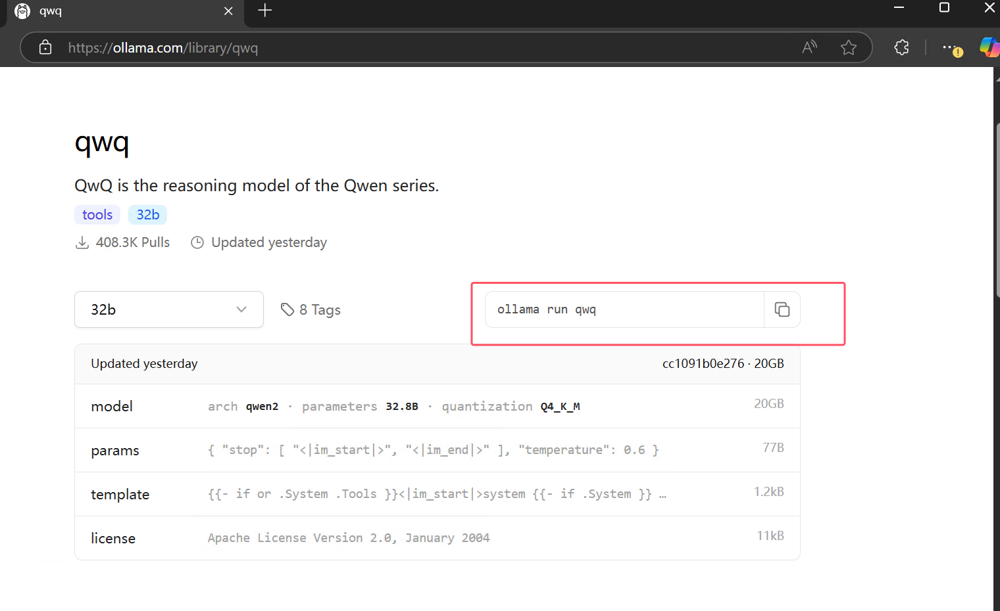
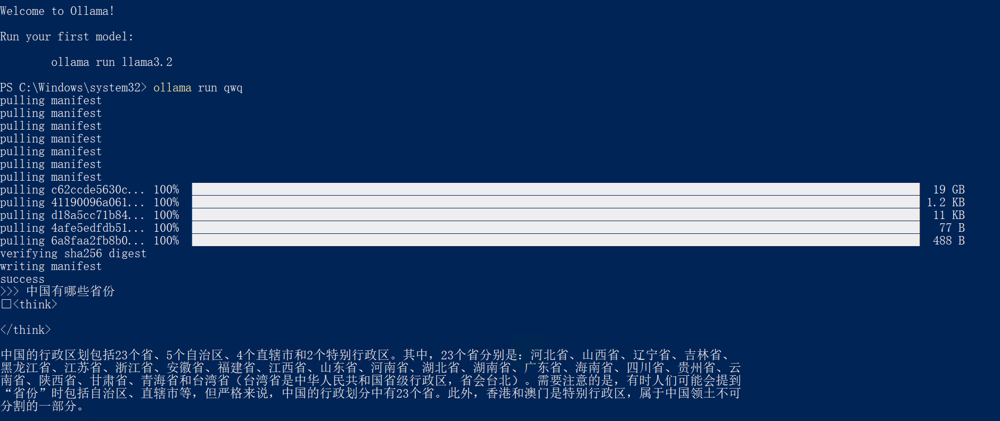
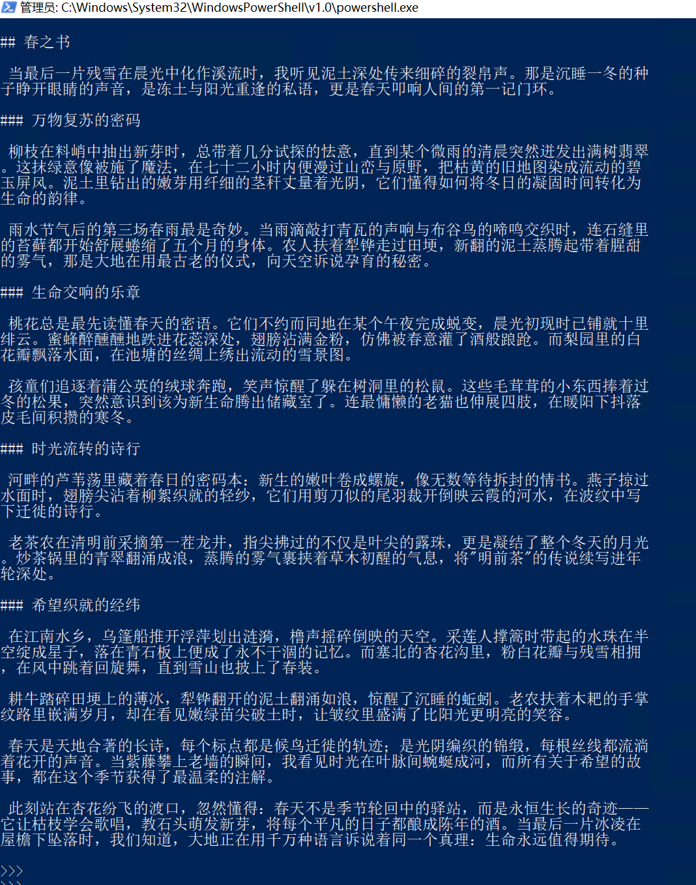

# 2000元台式机成功本地部署通义千问QwQ-32B推理模型实录

大家好，我是九歌AI。

今天手痒痒，想折腾一下本地部署了，主要是通义千问 QwQ-32B对我太有吸引力了。只有 320 亿参数，性能确可与具备 6710 亿参数的 DeepSeek-R1 媲美。

于是上班开会小憩（**摸鱼**）的时候，我决定部署玩玩。

我环顾四周，才发现我消费级显卡只有某宝500元买的1060显卡，整个主机也是洋垃圾拼起来的，总造价2000元！

**以下是主机的配置和成本。**


**主机成本明细如下：**

> 2680V4 CPU 80元
> x99主板 200元
> 三线内存条32G   300元
> 二线固态硬盘500G  260元
> 不知名机箱  110元 
> 1060显卡  540元 
> 二线电源 360元 
> 散热器 60元
> **总计：1910元**

之所以介绍主机，是让大家不要期望太高，**能跑起来就行，要啥自行车！**

算完经济账，我们开始部署通义千问 QwQ-32B，图省事，我们当然用神器Ollama!官网直接下载win安装包（注意要科学上网，不然下载巨慢！）

直接运行官网给的命令：


```Markdown
ollama run qwq
```



OK ,开始下载了 ！

千呼万唤始出来，在便秘般网速的加持下，通过长达一个下午的镜像拉取，终于成功了！



看着熟悉的命令行窗口，动了动电脑鼠标，发现电脑还是很丝滑。

那我们就不客气了，直接让它干活吧。让它写一篇赞美春天的散文。

结果....

运行**挺稳定的，不急不躁！**

我录了个前面几分钟的视频，大家可以看一下。

QWQ大模型经过15分钟后成功生成了如下的文章，我觉得写的还是非常不错，大家一起来欣赏吧。

> ## 春之书
>  当最后一片残雪在晨光中化作溪流时，我听见泥土深处传来细碎的裂帛声。那是沉睡一冬的种
> 子睁开眼睛的声音，是冻土与阳光重逢的私语，更是春天叩响人间的第一记门环。
> ### 万物复苏的密码
>  柳枝在料峭中抽出新芽时，总带着几分试探的怯意，直到某个微雨的清晨突然迸发出满树翡翠
> 。这抹绿意像被施了魔法，在七十二小时内便漫过山峦与原野，把枯黄的旧地图染成流动的碧
> 玉屏风。泥土里钻出的嫩芽用纤细的茎秆丈量着光阴，它们懂得如何将冬日的凝固时间转化为
> 生命的韵律。
>  雨水节气后的第三场春雨最是奇妙。当雨滴敲打青瓦的声响与布谷鸟的啼鸣交织时，连石缝里
> 的苔藓都开始舒展蜷缩了五个月的身体。农人扶着犁铧走过田埂，新翻的泥土蒸腾起带着腥甜
> 的雾气，那是大地在用最古老的仪式，向天空诉说孕育的秘密。
> ### 生命交响的乐章
>  桃花总是最先读懂春天的密语。它们不约而同地在某个午夜完成蜕变，晨光初现时已铺就十里
> 绯云。蜜蜂醉醺醺地跌进花蕊深处，翅膀沾满金粉，仿佛被春意灌了酒般踉跄。而梨园里的白
> 花瓣飘落水面，在池塘的丝绸上绣出流动的雪景图。
>  孩童们追逐着蒲公英的绒球奔跑，笑声惊醒了躲在树洞里的松鼠。这些毛茸茸的小东西捧着过
> 冬的松果，突然意识到该为新生命腾出储藏室了。连最慵懒的老猫也伸展四肢，在暖阳下抖落
> 皮毛间积攒的寒冬。
> ### 时光流转的诗行
>  河畔的芦苇荡里藏着春日的密码本：新生的嫩叶卷成螺旋，像无数等待拆封的情书。燕子掠过
> 水面时，翅膀尖沾着柳絮织就的轻纱，它们用剪刀似的尾羽裁开倒映云霞的河水，在波纹中写
> 下迁徙的诗行。
>  老茶农在清明前采摘第一茬龙井，指尖拂过的不仅是叶尖的露珠，更是凝结了整个冬天的月光
> 。炒茶锅里的青翠翻涌成浪，蒸腾的雾气裹挟着草木初醒的气息，将"明前茶"的传说续写进年
> 轮深处。
> ### 希望织就的经纬
>  在江南水乡，乌篷船推开浮萍划出涟漪，橹声摇碎倒映的天空。采莲人撑篙时带起的水珠在半
> 空绽成星子，落在青石板上便成了永不干涸的记忆。而塞北的杏花沟里，粉白花瓣与残雪相拥
> ，在风中跳着回旋舞，直到雪山也披上了春装。
>  耕牛踏碎田埂上的薄冰，犁铧翻开的泥土翻涌如浪，惊醒了沉睡的蚯蚓。老农扶着木耙的手掌
> 纹路里嵌满岁月，却在看见嫩绿苗尖破土时，让皱纹里盛满了比阳光更明亮的笑容。
>  春天是天地合著的长诗，每个标点都是候鸟迁徙的轨迹；是光阴编织的锦缎，每根丝线都流淌
> 着花开的声音。当紫藤攀上老墙的瞬间，我看见时光在叶脉间蜿蜒成河，而所有关于希望的故
> 事，都在这个季节获得了最温柔的注解。
>  此刻站在杏花纷飞的渡口，忽然懂得：春天不是季节轮回中的驿站，而是永恒生长的奇迹——
> 它让枯枝学会歌唱，教石头萌发新芽，将每个平凡的日子都酿成陈年的酒。当最后一片冰凌在
> 屋檐下坠落时，我们知道，大地正在用千万种语言诉说着同一个真理：生命永远值得期待。



今天开了整整一天会，时间有限，就不写很多了，祝大家天天有个好心情，在智能体领域找到自己的兴趣和爱好，以及事业！