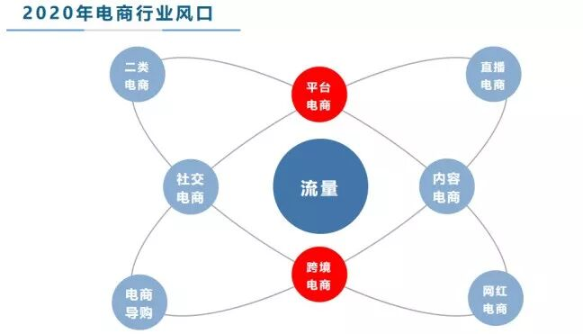

# 2020年的电商会怎么发展

虽然新型冠状病毒肺炎疫情还没散去，快递行业尚在复苏，供应链上的工厂有的依然还未复工，许多卖家的库存纷纷告急，但是我认为 2020年，电商行业会是一个百花齐放的一年。

  

**有流量的地方就会有电商**。不论是传统的国内平台电商、跨境电商，异军突起的社交电商、二类电商，流量的入口多元化，消费者购买渠道被分散稀释，流量费用水涨船高。无论你抓住哪一点，坚持去做，都会有回报。

  

**2020年电商发展形态将会呈现流量分散化、孤岛化**。举一个简单的例子，10年前，人们获取信息的主要方式可能是依靠百度搜索，现在呢？同样的道理，10年前我们购物主要依赖淘宝，现在网络购物，则是多种渠道。

这一点毋庸置疑，随着今日头条、抖音、快手等短视频平台的崛起，消费者一部分购物需求，特别是冲动型购物需求，将被这些媒体平台瓜分。在这些平台上开展电商业务，就如同在闹市或者步行街摆地摊，放上大喇叭吆喝，我们消费者消费内容的时候，就好比在步行街闲逛，看到自己喜欢的东西，就顺手买了。

  

媒体平台的流量，转化率虽然没有传统电商平台高，但是在海量流量面前，依然能支撑起一个直播电商、网红电商、导购电商等多个庞大的产业。

  

如果一旦下定决心，从事电商行业，需要注意的是切忌贪婪，什么都要做好！国内平台电商、跨境电商、社交电商、二类电商，对于个人来说，做好一个领域，做好垂直行业，精细化运营，早日建立技术壁垒，才是长久之道。

  

**2020年开网店，特别是跨境电商开店，常用套路有两种:1.群店铺货2.精细化运营。**这两个方式都可以尝试，没有必要分出个孰优孰劣。

  

根据营销漏斗，总销售额\=展现\*点击率\*转化率\*售价:铺货模式通过增加SKU数量提高商品总体展现量，从而提高销售额;精细化运营通过提高单品点击率和转化率，间接提高展现量，提高坑产，从而提高总销售额。

  

**群店铺货**属于轻资产运营模式，注重选品，以量取胜，但是往往忽略了品牌的运营，享受不到品牌带来的溢价。一般在平台发展前期见效快，比如早期的亚马逊、速卖通，以及现在的虾皮。但是从长远看，精细化运营才能更长久，能够建立自己的技术壁垒，不容易被模仿。
