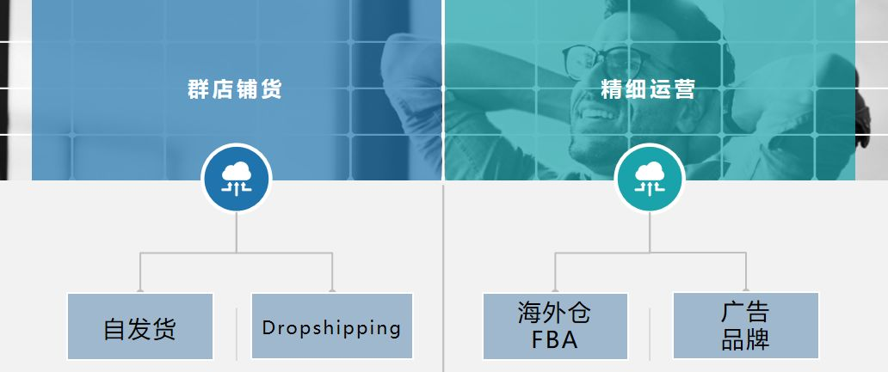

# 土老板都应该明白的电商原理

大家好，我是九歌，我的梦想是成为一名土老板，戴金链子的那种，最好能在水面上飘起来，这样我游泳就不用带游泳圈了。作为一名游离在电商行业多年的老兵，我今天跟大家谈一谈电商的原理，为什么别人挣到钱了，你没挣到钱。当然，即使明白了这些原理，你也不一定能挣到钱。因为挣到钱的人，一般没时间写文章（摊手~）。

  

很多人都从事电商行业，因为看起来入门简单，来钱快。看着别人挣钱就眼红，也想吃点肉。所以，我们很容易被网上哪些教你怎么月入过万的文章吸引了眼球，那些文章大都是无用的废话、空话，就是垃圾食品一样，虽然没啥营养，但是好吃。

  

（一）**电商收益公式**

  

**总销售额\=流量\*点击率\*转化率\*售价**

  

这个公式我感觉很简洁优雅，它基本告诉你，想开好网店，在进行网店推广的时候，应该注意哪些方面。所以现在开网店，逐渐分成了两派，这一点在跨境电商领域比较明显，一类是铺货模式，通过增加SKU数量提高商品总体展现量，从而提高销售额;一类是精细化运营通过提高单品点击率和转化率，间接提高展现量，提高坑产，从而提高总销售额。

  

个人兼职开网店，干电商，往往比较累。所以，如果你想把电商当作副业来做，一定要选择客单价高、利润高的商品来做，或者去尝试一下跨境电商，也就是将精力放在转化率和售价上，抓大放小。不然，售前售后的客服和打包发货，会占用你大量的时间，你看起来是挣钱了，但是相对于你付出的时间成本和体力成本，你是亏的。

  

（二）**电商是一场三方博弈**

每一个流量的产生，都涉及到了三方利益。哪三方**？****用户、平台、卖家**。

  

我们一般是作为用户出现，也就是流量的产生源，我们每检索一次页面或者点击一次页面，就产生了一次流量。我们在网上下单购买成功，那也就意味着产生了多个流量。在这个过程中，我们完成了一次购买决策，更准确地说，我们完成了一次博弈，我们选择了这个平台，选择了一个卖家。那我们在购买过程中，利益诉求是什么呢？购买物美价廉的商品或者是仅仅因为一次冲动型消费，只有卖家满足了我们的需求，卖家就赢得了商机。

  

对于卖家这一方呢，他们的利益诉求点就是能够将自己的商品推荐给更多想购买自己产品的用户，希望平台能够给予他们更多精准用户，也就是更多精准流量。这样，卖家才能挣到更多的钱。

  

对于电商平台方来说，自己是撮合用户与卖家进行交易的中间者，而广告费是自己的主要利润来源。所以，对于平台方来说，它不希望浪费自己的每一次广告展现机会，恨不得在每个流量的页面，都塞满了广告。但是，只有用户点击了这些广告，他才能挣到卖家的广告费用。广告太多了，又会影响用户的购物体验，所以，**点击率成为平台衡量卖家广告质量的一个重要因素。****电商平台更喜欢将更有可能点击的广告推送给用户。所以，卖家必须在挣到钱的同时，和平台一起服务好用户。**

这就是电商平台中的三方博弈，三者相互制衡，最终会处于一种动态平衡，这种平衡，也叫**纳什均衡。**

**总结**

2020年的疫情让我们反思，现在我们可以在心里估量一下，假设你的工作突然没了，你的生活会变得怎么样？为自己打工一定是人生中一定要做的一件事情。鸡蛋不要放在一个篮子里，如果你刚好在想要不要从事电商行业，开个网店，那就去做吧，光想不做，一点用都没有。
