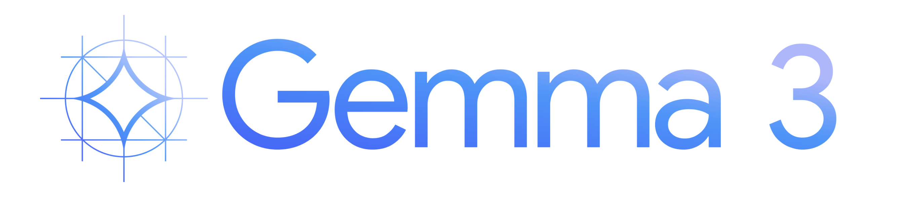
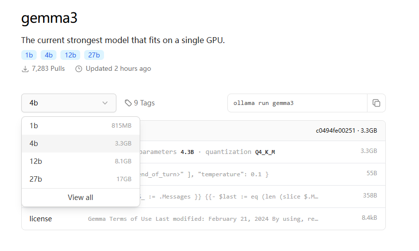
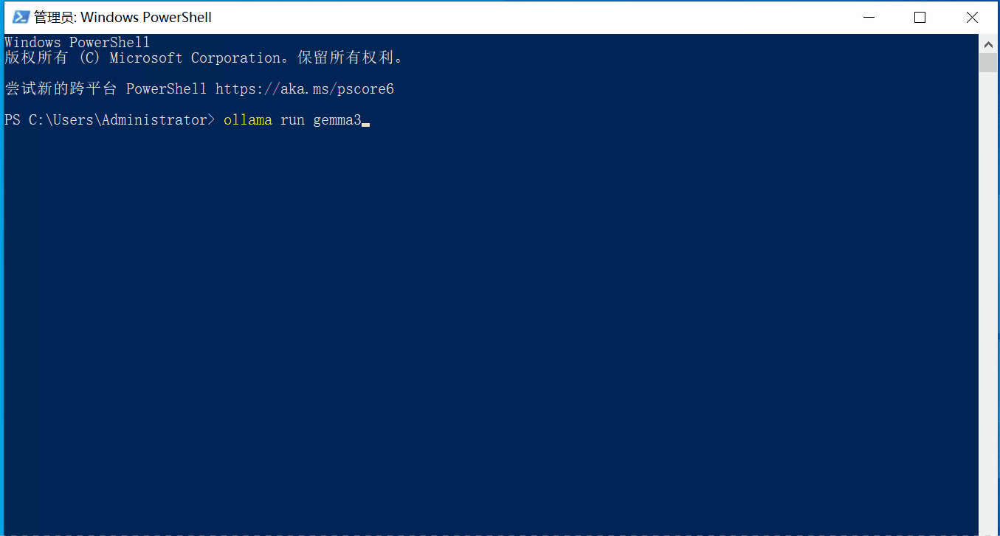
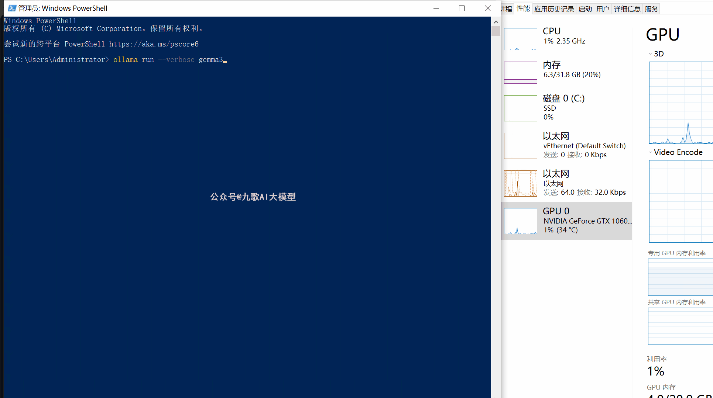
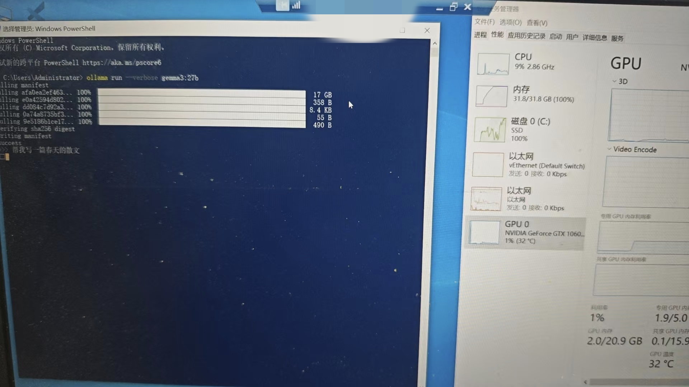
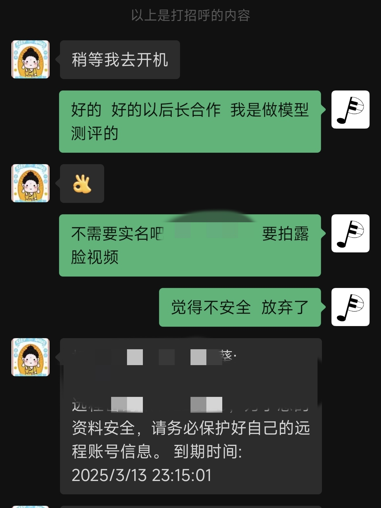
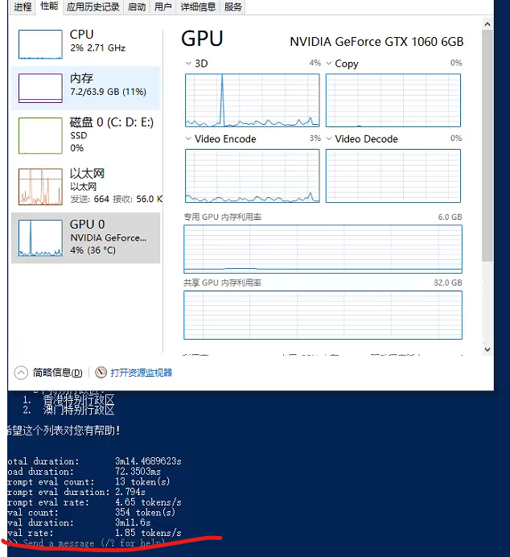

# 2100元主机稳定运行谷歌Gemma3-27B大模型,一体机厂家要哭了！

大家好，我就是九歌AI。一个会写代码的产品经理。

今天我又手痒了，看到一条消息，谷歌直接把**Gemma3全家桶**都开源了！

在巴黎开发者日上，开源Gemma系模型正式迭代到第三代，原生支持**多模态**，128k上下文。支持**多模态**呀！

**Gemma 3**一共开源了四种参数，1B、4B、12B和27B。最最最关键的是，一块GPU/TPU就能跑模型！！



前几天手痒刚用我的2000元洋垃圾主机装了通义千问QwQ 32B，竟然跑起来了，虽然跟老太太一样慢吞吞的，但是能干活呀！

再让我这个主机装上**Gemma3** ,会有啥不一样呢（心里的算盘在敲打...）？

**主机成本明细如下：**

> 2680V4 CPU 80元
> x99主板 200元
> 三线内存条32G   300元
> 二线固态硬盘500G  260元
> 不知名机箱  110元 
> 1060显卡  540元 
> 二线电源 360元 
> 散热器 60元
> **总计：1910元**

激动的心，颤抖的手，百闻不如一一试，我打开ollama官网一搜，竟然光速上线了**Gemma3!**



要啥自行车，直接搞起！下载速度非常快，不到10分钟就下载好了！

```python
ollama run gemma3 
```



**竟然没运行起来！！提示版本不对！原来ollama要先升级吗？**

升级结束。

等等！我下载的好像是**4B版本**！

那我们先试试4B版本的推理速度吧！竟然高达58token/s，那如果装27B版本，是不是能跑8token/s 😄！



看来太激动了也不好，重新下载**27B版本**吧，ollama再看看需不需要更新！

经过 4 小时漫长的等待，终于下载完成了。输入提示词！

等了一会没反应！再仔细看，死机了！😂



内存条已经满了，32G 太小了！怎么办？就这么放弃了吗？

直接买内存条好像来不及，那样热乎劲就过去了。

我小脑袋一转，一拍大腿，不是还有万能的 xx 吗？为啥不租个差不多配置的洋垃圾，这个搞虚拟机多开的，到处都是！

先是问了已经销量高的，开开心心付完钱，让我实名认证，还要露脸拍视频！我一想，这好家伙，我就租一天电脑，我啥信息也卖了呀！果断拜拜，申请退款 。


深夜 11 点，终于勾搭上一个老板，太敬业了，我都被他感动了。



支付一顿排骨米饭后，我如愿获得了一台跟我配置基本相同，但是内存加到了 64G！

下面的就比较顺利了。下载大模型还是慢，不过可以挂机载，先去睡觉😪。

早晨起床后一看，没运行成功，还是需要升级。这次升级直接重启 ollama 就行。

输入下面熟悉的命令，成功了！速度高达1.85token ....



录了个小视频，大家实际感受下这个速度有多稳定！