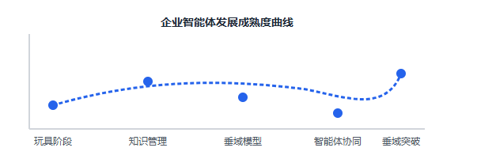
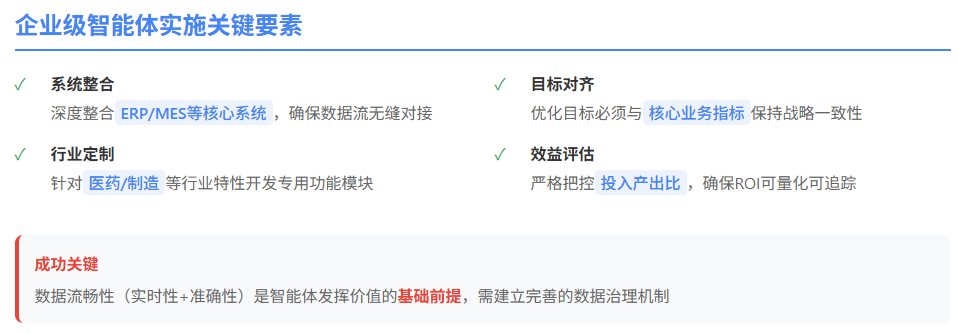

# 5大企业级智能体的刚需落地应用场景

文/九歌

图/长文配图助手

大家好，我是九歌，一个智能体科普和实践者。

做智能体最难的事情，并不是如何怎么学会做智能体，工具的学习往往是简单的，如何找到智能体真正有用的应用场景和业务需求才是核心能力。我们目前在各大智能体开发平台上的智能体，说实话，更多是玩具的属性。

在AI大模型领域，企业端正在探索的方向主要有：

| 1.企业的知识管理与数据治理 | 老生常谈的方向 |
|-|-|
| 2.垂域模型打造 | 利用企业私有的数据、知识、通用大模型，训练极速的垂域模型 |
| 3.智能体构建 | 业务驱动的，能够部分解放员工的智能体 |
| 4.智能体多元协同 | 基于MCP、A2A协议、物联网等，打造超级智能体 |

其中基于垂直行业或岗位的相关智能体构建，只属于精通此业务的人。通用智能体，我觉得是个伪命题，在5年内不会有突破，欢迎大厂早日打我脸。**垂域方向的智能体**倒是有点希望，比如专门解决大数据处理和可视化分析的智能体。

最近看了整整一天某头部财务企业的AI产品发布会，正好借这个机会，捋一下企业级的智能体刚需应用场景，希望能打开大家的思路和灵感，也准备当做《人人都会做智能体》科普公开课的内容。

**刚需1：重复低级的工作流程**

在AI大模型没有爆发前，这个方向的场景就已经被探索很多年了，比如大家所熟知的RPA、自动化脚本，以及借助专门训练过的神经网络，来解决企业在财务报销、合同审计、文档归结、智能招聘等工作场景中产生的大量的重复的工作内容。

这个方向的工作场景特点可以总结为6个字：**重复、低级、量大**

就以大家熟悉的人力资源招聘为例，从企业职位发布、简历筛选评价等场景就可以总结出以下智能体开发场景。

<sheet sheet-id="3XzbNq"></sheet>

**刚需2：基于数据的分析与决策**

从企业的实际落地来看，数据决策类智能体是容易上手的方向，包含经营分析、业绩预测、报表生成、数据整合、趋势分析、风险预警等。这个更像是传统的商业数据分析的主要事情。

这个方向的工作场景可以总结为这几个关键字：**定量分析、变量有限、数据准确、业务明确。**

首先为什么是定量分析而不是定性分析，因为定量分析是最能直观感受智能体效果的，数字是不会骗人的。而定性分析的智能体，产生的结果，一般AI味很重，大模型的幻觉明显。

数据准确和业务明确要求智能体的工作流一定是清晰明确的，只有清晰明确的路径才能保证每次智能体输出的结果的稳定性，降低错误成本和技术债。从这方面看，从管理会计这门课程去出发，反而容易找到很多智能体的应用场景。

数据决策类智能体，离不开数据的准确处理和分析，但是大模型并不擅长，而且企业的生产用语是非常专业和私有的，通用大模型也不一定能准确理解提示词中的生产用语，智能体开发中，用户意图的识别反而成了一件难事。

但是我相信短则半年，长则一年，擅长千万行级别的数据分析开源垂域大模型ChatBI即将问世，效果和震撼度不亚于在Vibe Coding领域的Claude 3.7。

下面是一些容易想到的，场景相对具体的数据决策类智能体。

<sheet sheet-id="PjGF0j"></sheet>

**刚需3：客户洞察与营销**

这个方向其实就是CRM方向的场景，主要方向包括客户画像、消费习惯分析、需求预通、营销策略生成、订单智能录入等。这个方向，就是我们提到的定性分析，在当前的技术阶段，是个比较难做出效果的。

这个方向的工作场景，主要特点都是围绕**客户**展开。

不管是客户画像、消费习惯、需求预测，其实是10年前的大数据技术主要解决的事情。想要得到有价值的客户画像、消费习惯，必须要有海量的数据和算法，这是中小企业都不具备的。

对于中小企业来说，最有使用价值的是产品客服助手、潜在客户获取和产品营销方向。以下是我们能想到的一些智能体应用场景。

<sheet sheet-id="ypygcl"></sheet>

**刚需4：财务风险与合规**

这个方向的智能体在企业中，也是绝对刚需中的刚需，主要包括财务风险与合规、费用合规审核、凭证检直、成本还源、账务处理、资金风险检测等等。这些智能体其实可以应用到企业会计、审计、法务、投资等多个岗位，是一个非常大的市场。

这类智能体的特点是和**钱**直接相关，虽然市场大，但是对智能体的要求也非常高。以下是我们能想到的一些智能体应用场景。

<sheet sheet-id="Si5BVG"></sheet>

**刚需5：生产与供应链优化**

这个方向的智能体，不同的企业需求是不一样的，虽然是刚需，但是个性化确非常强，只有定制才能满足企业的需求。

生产与供应链优化主要包含智能排产、设备故障预测、工艺参数优化、供应链调度、物料管理、库存管理等。这类智能体的特点就是**个性化、与业务强关联**！

我们能想到的具体智能体场景主要有下面这些，不过颗粒度还是比较粗，实际开发的话，还需要进一步细化。

<sheet sheet-id="9yHtmP"></sheet>

**总结**

总体而言，企业级的智能体开发，需要对接企业现有的ERP、MES（制造执行系统）或WMS（仓储管理系统）等，确保数据流畅整合，而且也需要根据企业的行业特点（如电子制造、汽车、医药等），提供定制化的智能体功能模块，每个智能体的优化目标（如降低能耗、提高设备利用率、减少库存）需要与企业业务目标清晰绑定，确保投入产出比最高。

