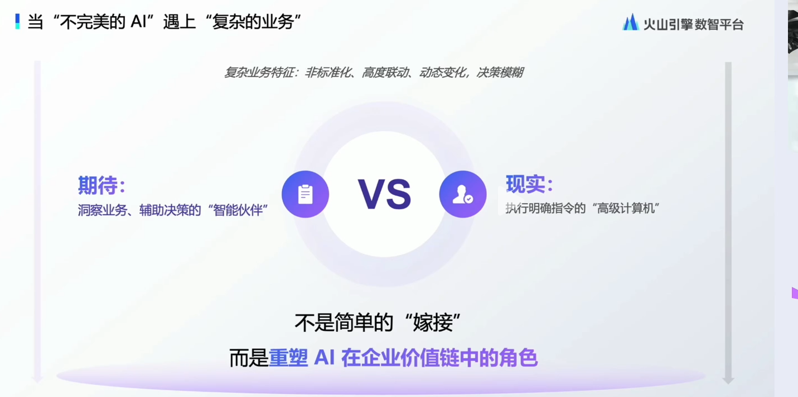
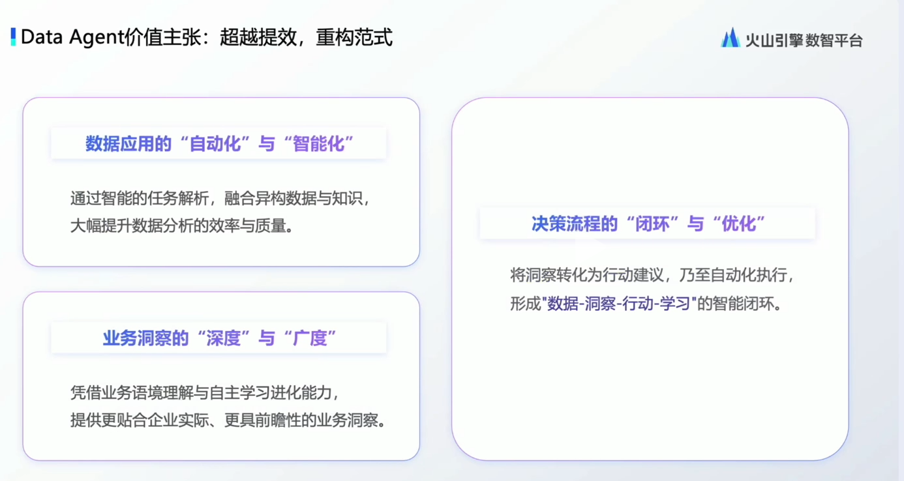
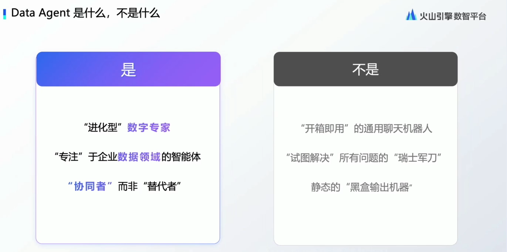
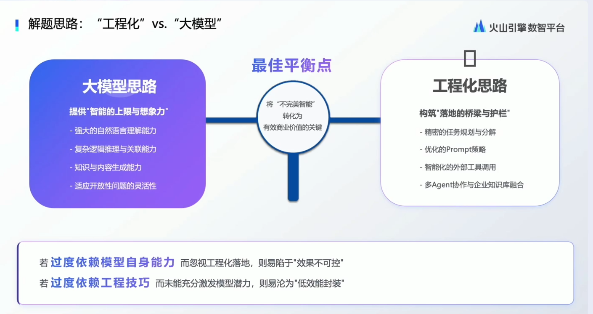
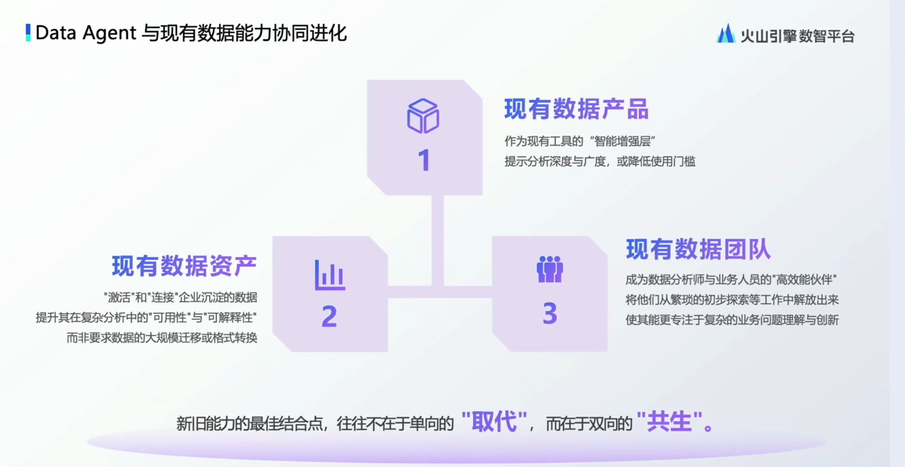
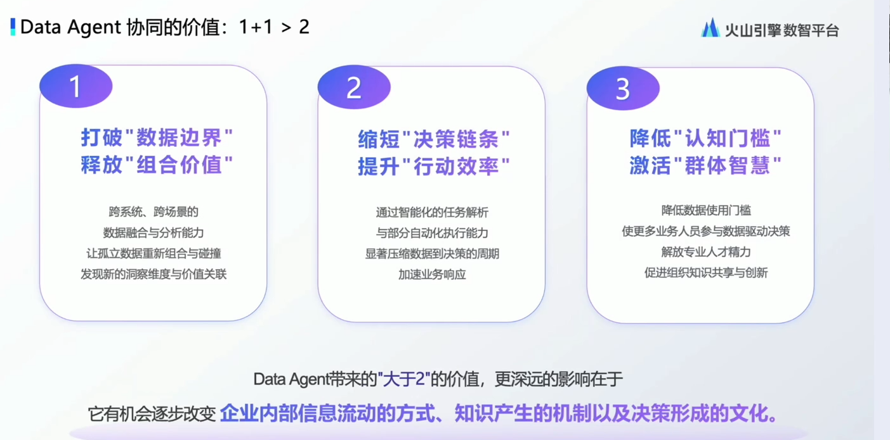
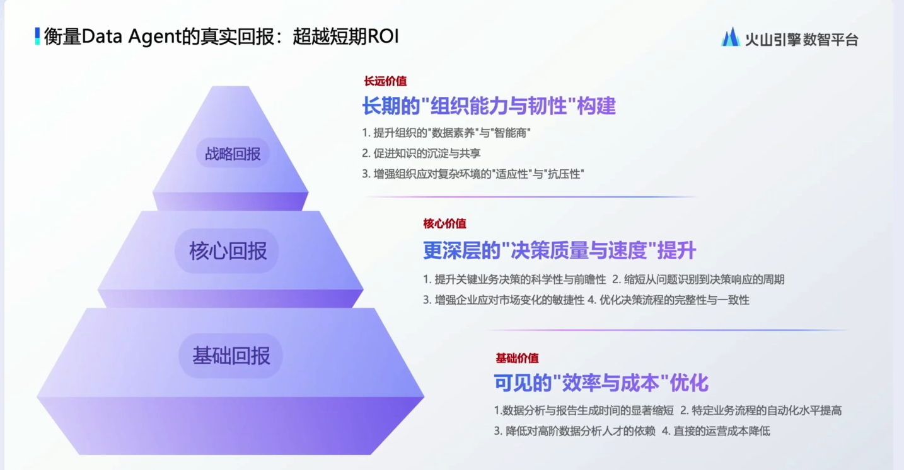
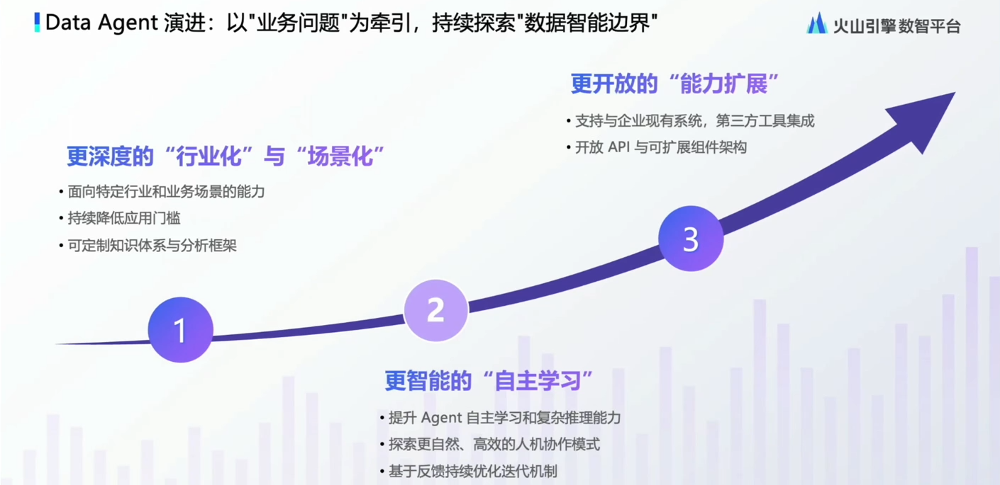
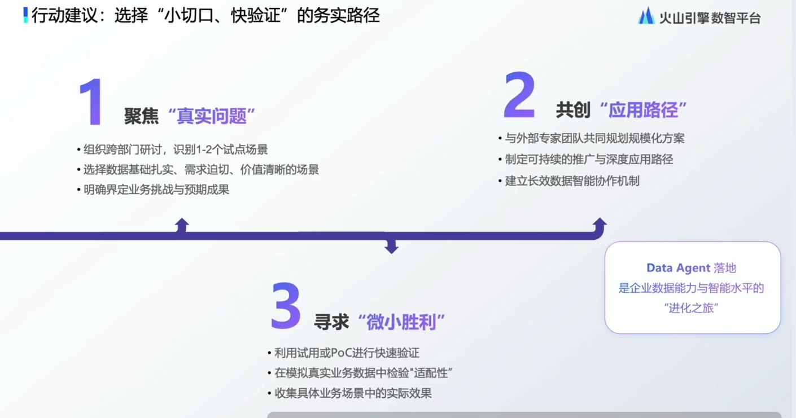

# Data Agent在企业场景的落地问题剖析，太真实了！

大家好,我是九歌AI。

今天看了火山引擎Data Agent相关的直播，觉得受益匪浅，特别是第一个项目负责人海书山的发言，适合多次回味，大厂的同志对智能体的认知，就是有深度，不得不服。完整直播回放请直接视频号观看。

下面我结合发言人的PPT内容，整理一下自己的收获和感想。

AI是不完美的,AI在将来很长时间,也是不完美的。AI将在很长的时间，承担辅助、提效的工具角色。通用Agent无法解决企业中复杂的业务问题。AI工具的简单堆积，并不能解决数据赋能业务的落地难题。

数据在AI时代应该怎么用？企业数字化有几个成功的？这是Data Agent应该解决的问题，提供一种新的决策方式。如何将数据价值最大化并有效地应用于实际业务场景中。

在面对数据和业务之间的选择时，不要纠结于是否需要升级工具或购买更多产品上，这在逻辑上可能是一种安慰剂效应，意味着他们习惯于用旧方式处理问题，而不考虑改变方法。

Data Agent不应该沉迷于图表看板的展示，酷炫的图表展示只适合拍领导的马屁，让老板看着高兴。

解决业务问题永远是最重要的！真正有用的是让数据真的对企业业务产生价值，比如通过数据决策智能体，找出利润下降的关键原因；通过Data Agent，找到真正影响企业业务的那几个核心数据指标。

Data Agent利用AI技术深度挖掘数据价值，与大模型结合，为业务提供更深入的洞察和决策支持，将企业的海量数据资产转化为有效的业务决策工具。b不仅关注数据的归因分析，即理解销售数字升降背后的原因，还应扩大洞察的广度，从仅分析结构化数据扩展到同时处理结构化和非结构化数据，以提供更全面的视角。

垂域领域的智能体应该像人一样，专注某一个业务方向。智能体不应该随着大模型能力的增强，失去护城河，变得没价值，而是应该随着大模型能力的提升，这个智能体自身也能进化，变得更强。 

标准通用的智能体产品可能无法清晰理解企业的业务预期，因此在解决所有问题时深度往往不够。

怎么像智能体提问，是一个比使用智能体更重要的事情。要让Data Agent理解当前业务的语境，明白行话黑话，明白这个业务习惯性的数据处理方式是什么。智能体能够借助结构化的知识库，自主规划相对合理的执行路径。

通过结构化的提示词和细致规划的工作流，借助外部工具的使用，降低大模型的幻觉，提供智能体过程的可控性，从而保证结果的稳定性和准确性。工程化思路侧重于通过任务分解、固定策略的prompt、调用外部工具或结合知识库和数据库，提升业务场景落地的下限，搭建大模型与业务场景间的桥梁。

Data Agent 虽然是个数字员工，但是不会替代原有的数据团队，而是和原有员工共生，一起成为业务团队的左膀右臂。

不要浪费时间在大量前置工作上，亦或者重复造轮子，尽量避免从头开始构建复杂系统，而是利用现有的数据和流程，专注于快速实施有效场景，避免过度复杂的定制化工作，确保快速产生价值。

智能体可以打破数据边界，通过关联结构化数据和非结构化数据，提升数据组合的价值。降低知识门槛，将团队中顶尖人才的隐性知识转化为显性知识，通过大模型学习和分享其思考方式，提升整体团队水平。

拥抱智能体不管是当下还是未来，从长期中期短期来看，收益远远大于风险和成本。智能体决策的质量的优先级要远远高于数据的优先级。智能体在企业中的普及，只会让厉害的人越厉害，原有不同同事之间的能力差距，也会越拉越大。

企业应该与客户及第三方合作，不断拓展生态，通过务实的方法面向具体的业务问题，专注于解决特定行业和场景中的实际需求。确保所有迭代和开发都紧密围绕解决具体业务问题展开，避免为迭代而迭代，与通用AI区别开来，聚焦于行业特定问题的解决。

在AI快速变化中，找到本质的东西，找到一直不变的内容，想明白自己的真正需求，比如企业中落地智能体后，是否真的带来了价值，这个价值体现在哪个地方，比如简历沟通效率提升了20%，而不是多了个向老板汇报的东西，这样是没意义的。

快速试错，敢于尝试新的内容，不要一直等待新产品的出现，即使发现在企业中不适合也没关系，在这个过程中，积累的经验和认知都是宝贵的财富。面对AI技术的不断进步，企业需保持灵活性和适应性，专注于解决具体业务问题，而非单纯追求技术先进性。