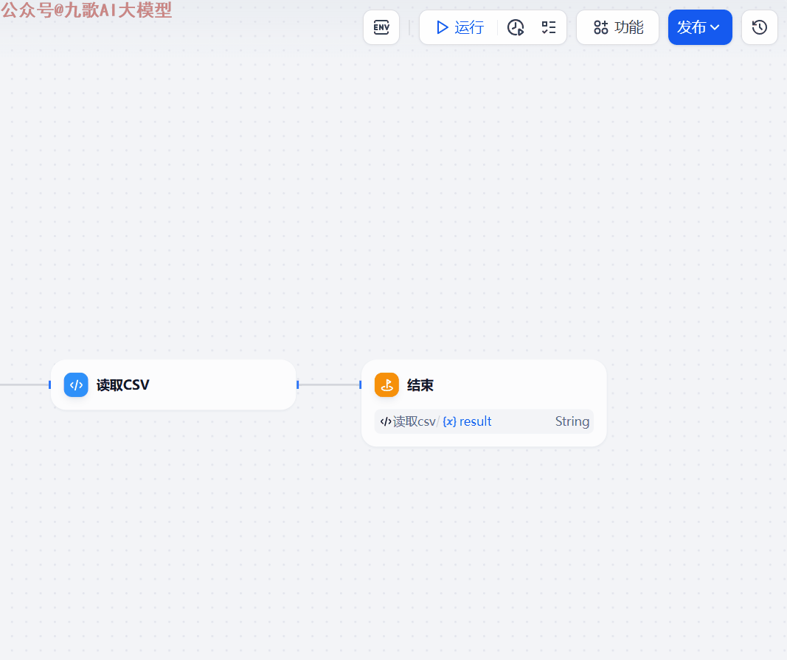
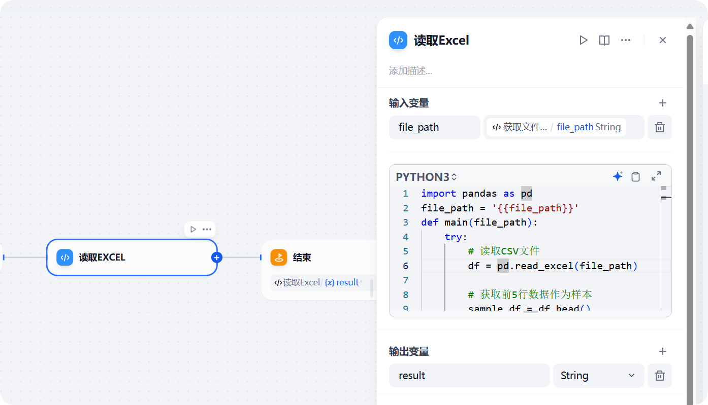
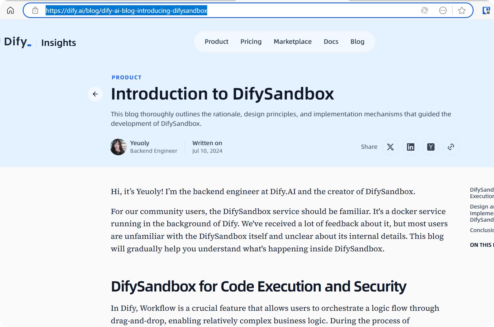
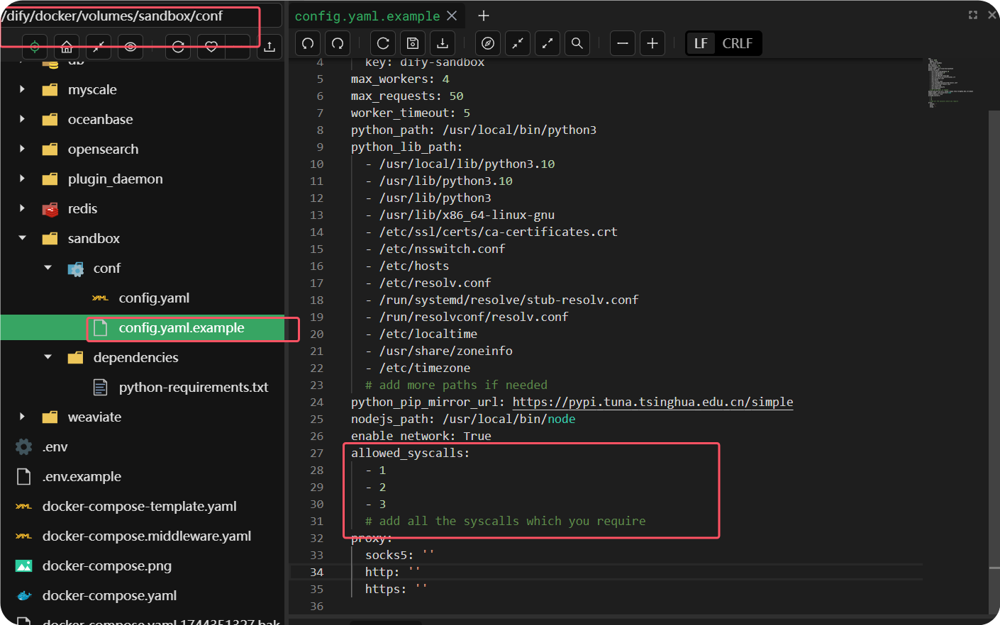
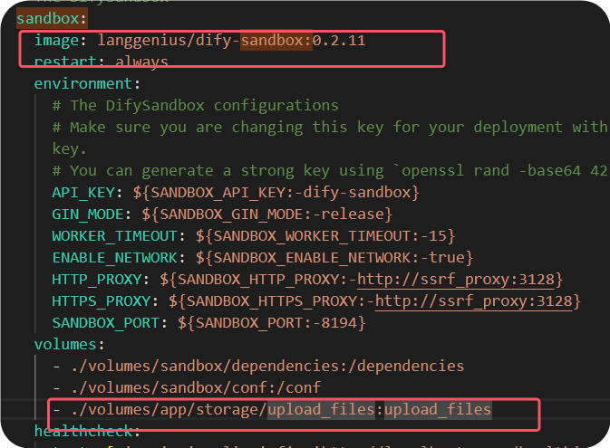
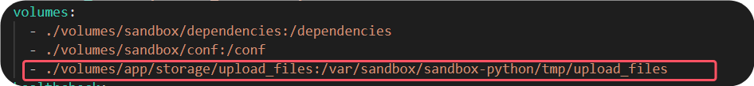
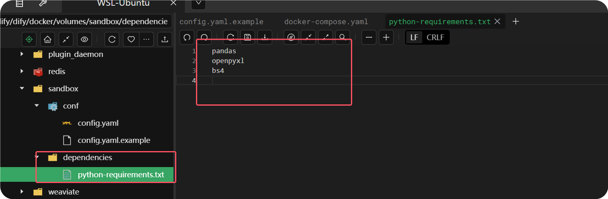
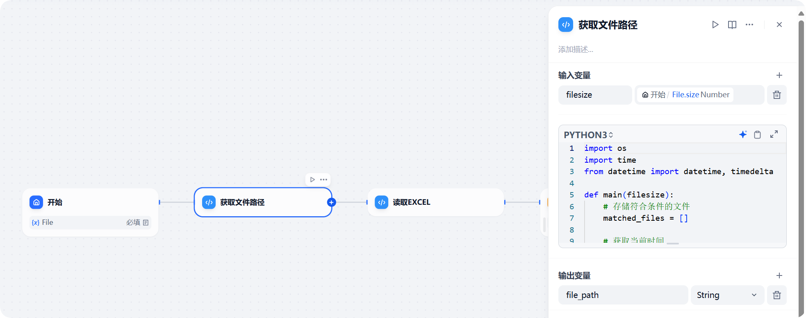

# Dify Sandbox实现文件路径获取与Excel数据处理

文/九歌

今天集中精力，花2个多小时把Dify Sandbox官方源码研究了一下，终于理清了Sandbox 执行代码的逻辑，顺便实现了在不修改官方dify-sandbox docker镜像，用户上传文件后路径的获取和对Excel文件的数据处理。

话不多说，先看效果。



下面我来说一下，这个如何实现。

Dify 安装成功后，会有10个Docker容器，其中docker-sandbox 的作用是用来执行工作流中”代码“这个节点运行的代码。这样就保证了用户的代码不会获取到服务器的文件资源或者执行敏感的系统调用操作，保证了Dify系统和数据安全。



Dify后端工程师Yeuoly，是Dify sandbox的作者，她写了一篇博客详细讲解了Dify Sandbox通过沙盒运行代码原理的英文博客，我借助大模型认真研读了一下。



总结起来，主要使用了两种技术。

1.**系统级隔离： 利用 Docker 的底层技术：Seccomp（安全计算模式）。**

在 Linux 上，Docker 是一种常见的系统沙箱解决方案。`Seccomp`充当所有访问系统的尝试的过滤器。它拦截和控制各种作，包括但不限于文件读/写作、系统配置修改、网络访问，甚至标准输入/输出。这之所以有效，是因为这些作本质上是 （），并且每个作都表示访问系统的尝试。

在dify的源码 docker/volumes/sanbox文件夹下，有个文件config.yaml,可以通过allowed_syscalls参数来控制允许开放哪些系统调用命令，这些命令大约有400个，比如常见的文件的读写、文件的执行操作等等。



```yaml
allowed_syscalls: # please leave it empty if you have no idea how seccomp works
  # 基础文件操作
  - 0   # read - 从文件描述符读取数据
  - 1   # write - 向文件描述符写入数据
  - 2   # open - 打开文件
  - 3   # close - 关闭文件描述符
  - 4   # stat - 获取文件状态
  - 5   # fstat - 获取文件描述符状态
  - 6   # lstat - 获取符号链接状态
  - 7   # poll - 等待文件描述符上的事件
  - 8   # lseek - 重新定位读/写文件偏移量
  - 9   # mmap - 将文件或设备映射到内存
  - 10  # mprotect - 设置内存区域的保护
  - 11  # munmap - 取消内存映射
  - 12  # brk - 改变数据段大小
  
  ###其它参数请网上自己搜索
```

1. **chroot（更改根目录）虚拟文件系统**

但是上面的Docker Seccomp方案只能允许或者拒绝所有文件的访问，要么全部允许，要么全部拒绝。这样就没法是某些用到的文件单独访问了，比如Python的库文件。

所有dify-sandbox又使用了第二个解决访问，在执行代码进程的时候，使用Linux chroot('/tmp')命令，将代码所在的/tmp文件夹作为根目录。也就是代码只知道它位于/tmp文件夹下面，无法读取到系统其它文件夹路径。

在dify-sandbox的源码中，是这样实现的,使用的是Go 语言。


Sandbox的沙盒安全原理大致就是这样，如果我想用代码获取到dify用户刚刚上传的文件路径，就必须将用户上传文件夹的实际文件夹挂载到sandbox Docker容器中。

这里要非常感谢Awesome-Dify-Workflow这个Github开源项目，让我找到了File_read.yml 这个Dify工作流。它的实现前提将用户上传文件保存路径app/storage/upload_files文件夹的路径挂载到sandbox Docker容器的/upload_files文件夹下面，并且要使用作者制作的Docker镜像替换官方镜像。



这个作者制作的镜像权限开的太多，我反而有了安全顾虑，所有想继续使用官方镜像完成用户上传文件路径的获取。这时候对上面chroot命令的理解就派上用场了。

既然执行代码都只认/tmp文件夹，那直接将app/storage/upload_files文件夹的路径挂载到/tmp下面就可以了（以python代码执行为例）。



同时修改sandbox的python库依赖，添加pandas等Python数据处理库，来编写代码完成Excel文件的处理。



执行 docker compose down 和 docker compose up -d 命令重建Dify Docker容器后，我们将打开Dify，将File_read.yml导入。



修改获取文件路径处的代码，将"/upload_files"改为"/tmp/upload_files"，再运行这个工作流便大功告成。也就是文章一开始大家看到的效果。

更新版本的File_read.yml我已经放到"人人都会做智能体"知识库，大家可以直接阅读原文获取。

今天的分享就先到这里，谢谢大家观看。