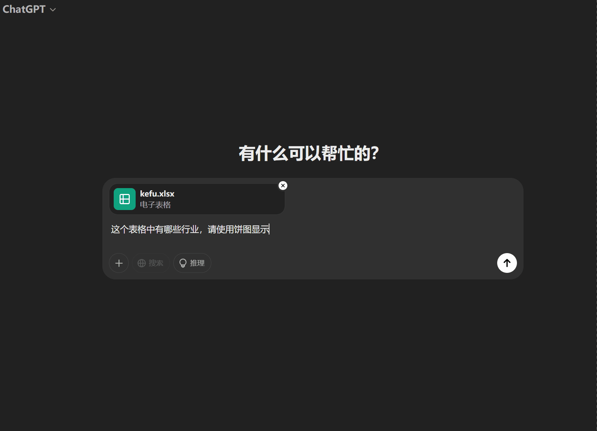
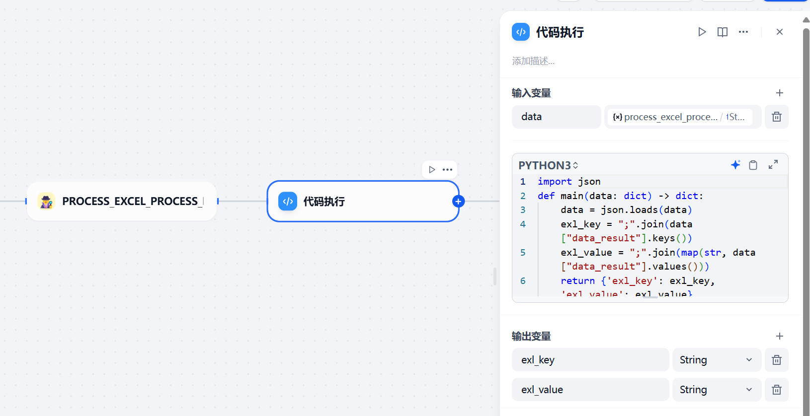
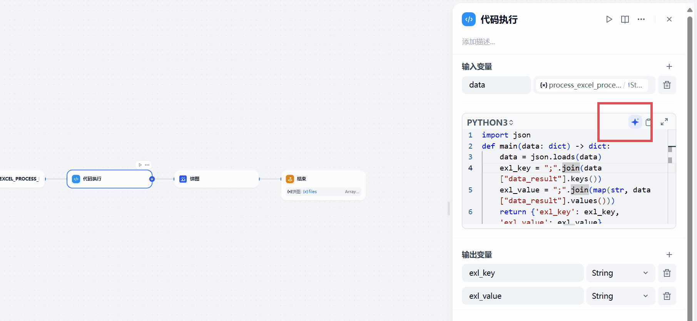
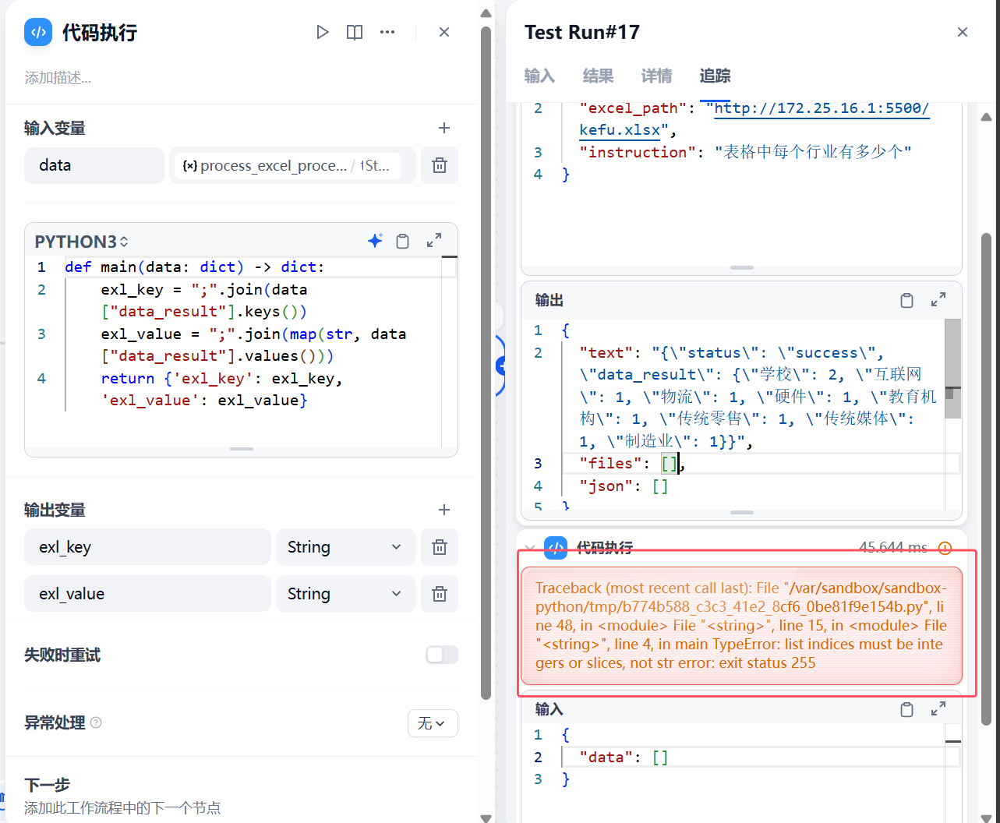
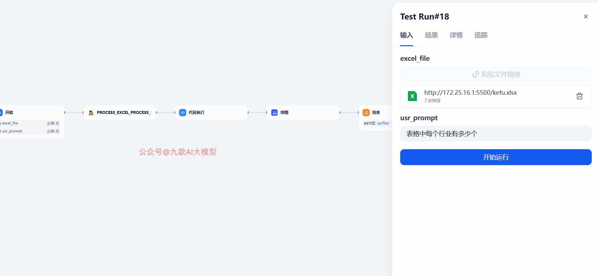
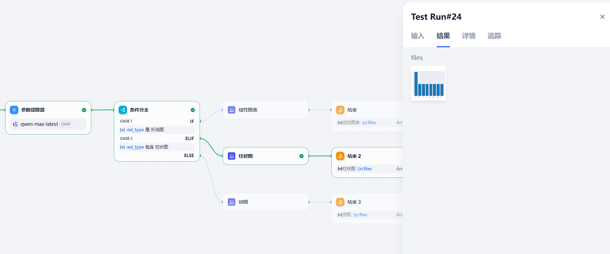
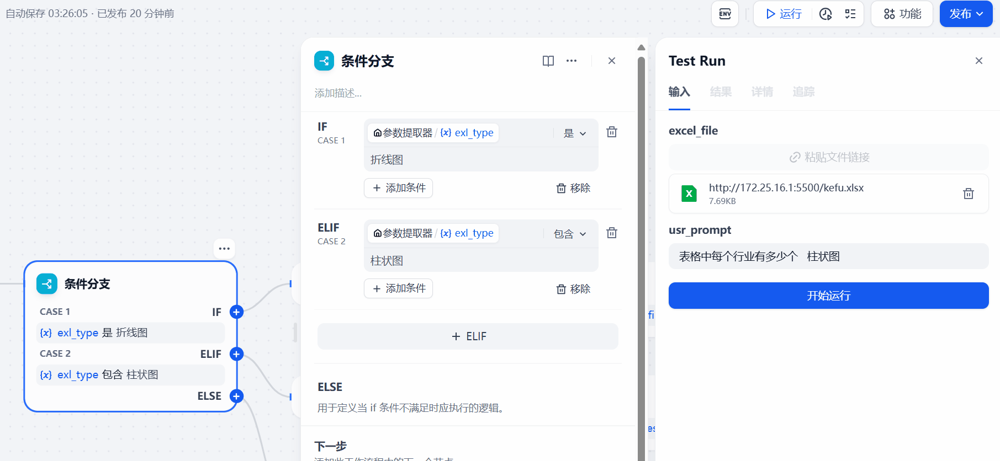
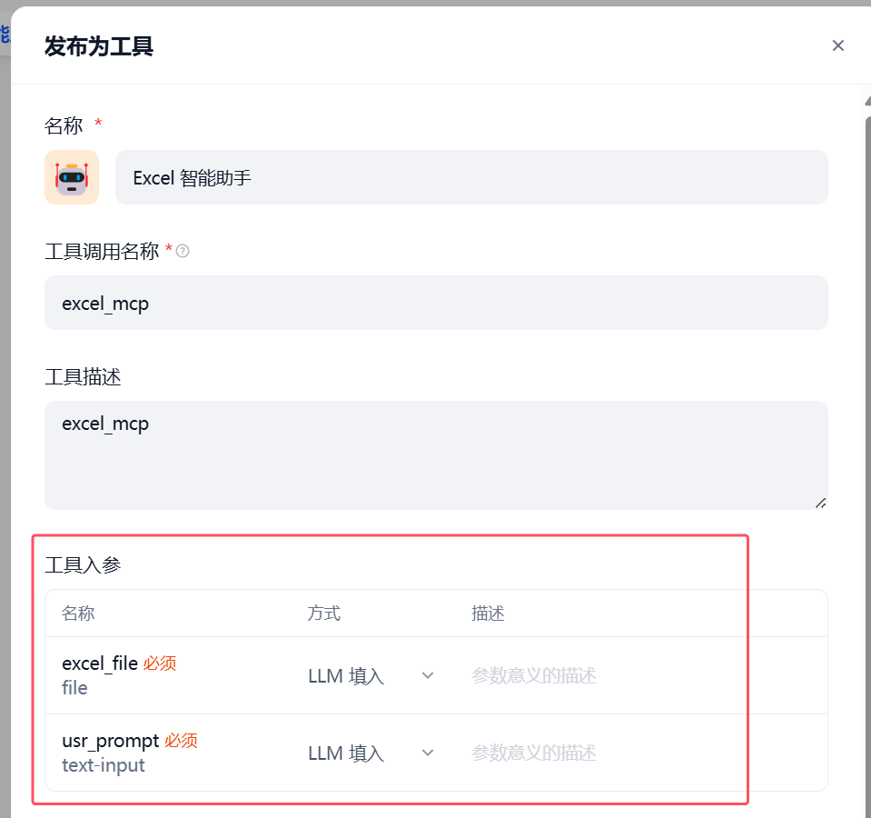
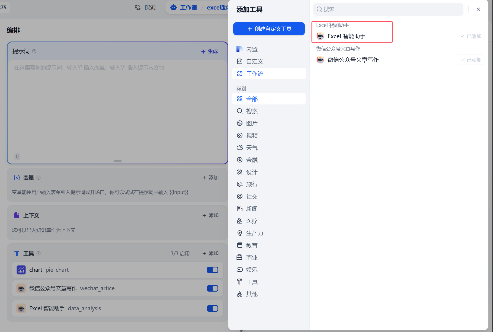
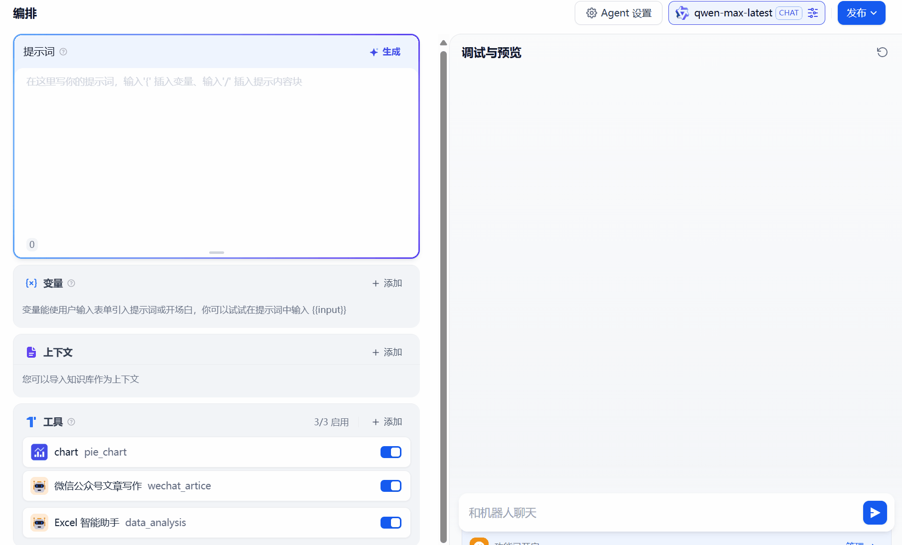

# Dify 搭建私有数据可视化智能体，效果直逼 ChatGPT  副本

大家好，我是九歌AI。

前几天写的文章《Trae + Dify 10分钟构建 Data McpServer 与 Agent ，和 Excel 说再见！》，跟大家一起实现了简单的大模型数据处理，返回的最后结果只是json格式的数据。今天我们做一个完整的聊天应用，可以在聊天结果中实现数据可视化分析。

标题说效果直逼ChatGPT，还是有点差距的，这差距多大呢，差不多**一光年**吧！毕竟我们今天做的还只是玩具。

我们先一起来看一下ChatGPT如何实现数据可视化结果的呈现。



很显然，ChatGPT的思路和我们一样，现将用户的提问转为Python代码，后台运行后，在前台显示。不过最后做的饼图对中文不太友好呀！

按照这个思路，我们其实再把前几天的Pandas代码生成的提示词修改成直接写生成Pyecharts的代码，后台沙箱运行后，获取最后生成的图片或者Html文件，这是个比较容易的方案。

但是我不太想讲太多代码，而是想让大家多了解一下Dify这种低代码智能体设计平台是如何实现简单的可视化的。这就需要我们继续编排之前的工作流。


下面就是我们要用到的Dify内置的图表生成工具，我们可以很知道这三种图表传入的**参数要求，都是字符串且格式一样。**


下面这个Json数据，是我们上一个教程，工作流输出的最后结果格式，不能直接将其传入到上面的dify图表格式中。所以我们需要修改之前的工作流，对输出结果进行处理。

这里面直接选用了最省事的Python代码格式转化，也就是需要增加这个**代码执行**的节点。在里面填写需要执行的Python代码。



这个Python代码我们直接问大模型就可以，Dify自带代码生成器，我们只需要描述清楚需求就可以了。下面是我输入的代码生成提示词。

> {"status": "success", "data_result": {"学校": 2, "互联网": 1, "物流": 1, "硬件": 1, "教育机构": 1, "传统零售": 1, "传统媒体": 1, "制造业": 1}}  边写一段Pytho函数代码，，接受json输入，将data_result的所有key值拼接为一个字符串，每个key之间用 ";" 分隔，赋值到变量exl\_ key,将data_result的所有value值拼接为一个字符串，每个value之间用 ";" 分隔，赋值到变量exl_value,将exl_key exl_value返回



直接生成的代码还是有点小问题的，返回的变量只有一个，而Dify的饼图工具需要两个变量，所以我们修改了return语句，返回结果必须是dict。

> ```python
> import json
> def main(data: dict) -> dict:
>     data = json.loads(data)
>     exl_key = ";".join(data["data_result"].keys())
>     exl_value = ";".join(map(str, data["data_result"].values()))
>     return {'exl_key': exl_key, 'exl_value': exl_value}
> ```

**上面的代码其实有个大坑，如果大模型生成的数据格式不是{key:value,key,value}这种格式，这种代码会报错，这个我们下次再解决，这次先实现。**

这里还有一个易错点是代码执行起接受的输入变量格式的问题，默认传入的是字符串，需要使用json库强制转化一下。不然会报下面的错误。



OK ,现在我们可以整体跑一遍工作流看一下结果了。



**大功告成，**这样工作流就可以根据用户的分析需求，生成饼图的结果了。

但是，如果用户想看条形图、折线图该怎么**实现**呢。这里需要对工作流进行改进了。

第一是增加一个节点——**参数提取**，让大模型从用户的提示词中查找可视化图表的需求，是做成饼图和柱状图。

第二是增加在数据处理和可视化饼图之间增加**条件分支节点**，根据参数的提取结果，选择不同的分支。最后工作流的效果如下。



我们下面先来看参数提取器怎么设置。其实从下面的设置我们可以看到，有三个地方。

1.**输入变量**是指大模型会从用户的提示词这段文本中提取出需要的参数。

2.**提取啥参数，**就是用户的提示词中有没有提到想要什么样的图表结果，如果能提取到，赋值到新的变量exl_type。

3.**指令**就是参数提取器给大模型的提示词，这对大模型来说小菜一碟。


这样下一个条件分支的节点就由大模型来决定了。条件分支这个地方，看着复杂，其实很简单，就是判断大模型给出的图形类型,也就是上一步新增的变量exl_type的值是啥，然后生成对应的图表即可。


下面我们再看一下整体工作流的运行效果。



效果还是非常不错的，**我们要把这个工作流用在聊天里面！**

我们可以先将这个工作流发布为**dify的内置工具。点击工作流右上方的发布，点击最下方发布为工具。**



**注意这里是重点，敲黑板了 ！这是我当小白的时候，踩过的最大的坑，完全是自己试出来的。发布为工具的工作流，参数格式必须是文本text-input，Dify Agent应用中，大模型才能Function Call调用，不然大模型是忽略这个工具的！**

所以你的工作流中的输入变量要调整成下面这样！再发布为工具！


OK ,接下来我们就要把数据分析这个工作流当做**Function Call**了。再dify中创建Agent应用，不懂没关系，照着做，后面见多了就明白了。我后面也会写文仔细对比这几个类型的区别。


然后不需要做什么，把工具添加上就行了。



这样就大功告成了！直接预览调试，我们直接看结果吧！



**最新的代码和Dify工作流配置文件，请后台回复"datamcp"免费获取。**