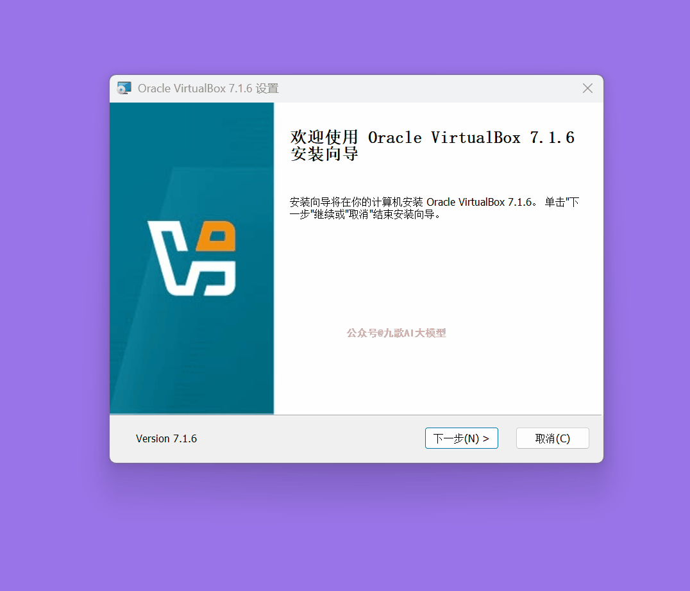
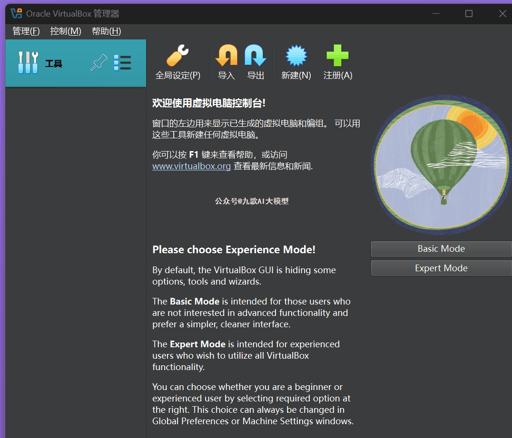
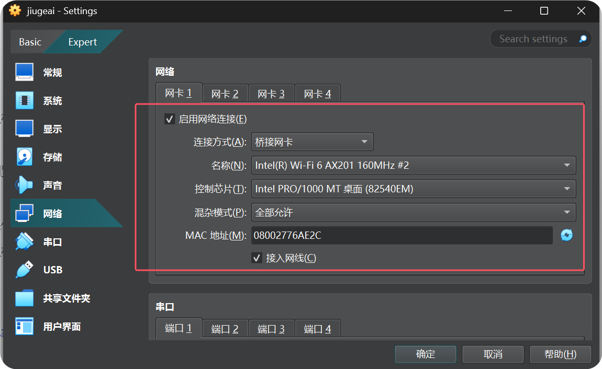
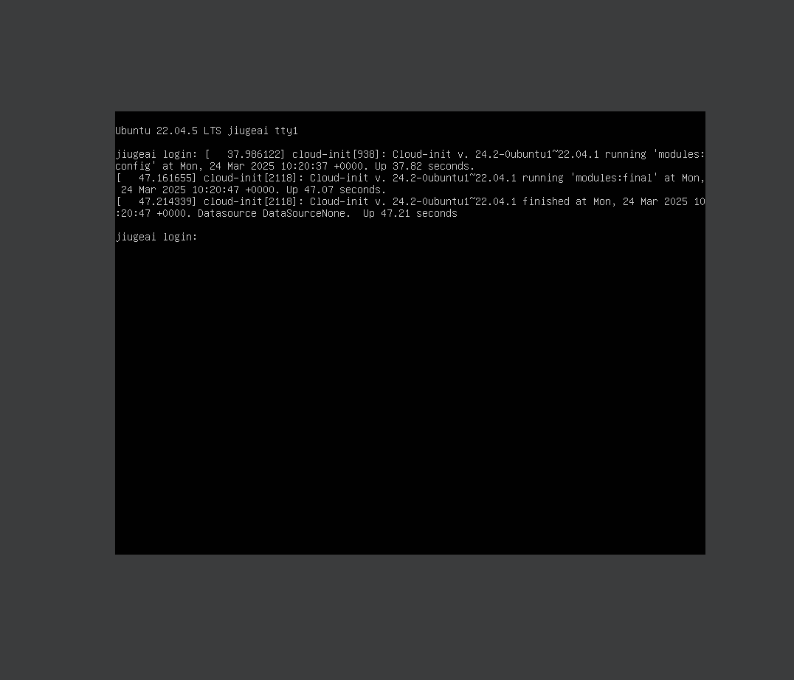
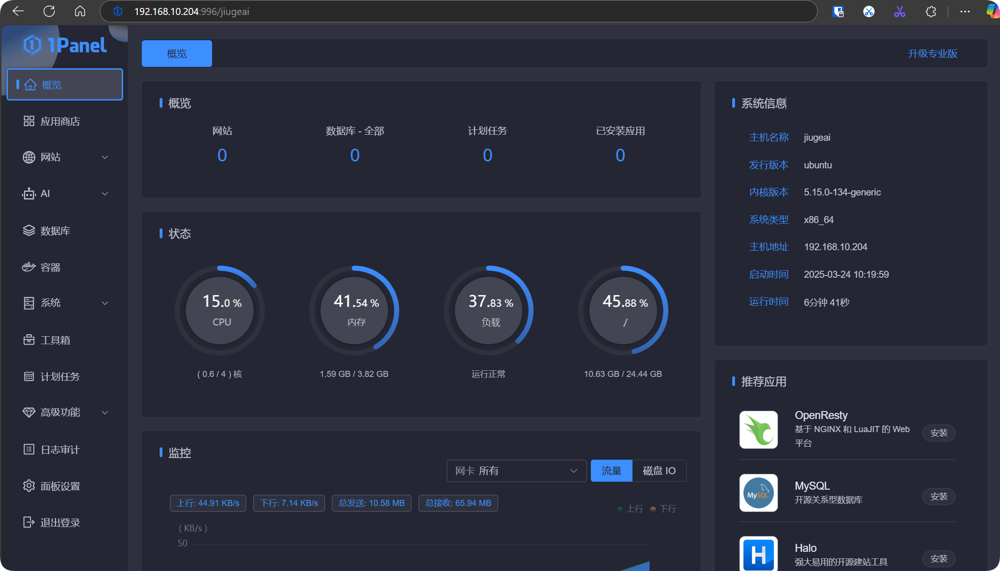

# Dify多版本Windows虚拟机免费下载，10分钟傻瓜式部署智能体开发平台！

大家好，我是九歌AI，一名智能体科普和落地实践者。

我们都知道智能体开发的平台非常多，Dify是开源的智能体开发平台中用户比较多的一款。但是跟Coze平台相比，很多想使用Dify的用户，第一个难关就是Dify的本地部署。

很多小白可能对Linux、Docker一窍不通，所以我之前写过一篇怎么借助WSL完成windows下Dify的部署，其实没有解决痛点，Dify的主要用户还是只局限于程序员这个群体。

为了能够更好的完成智能体的科普，让更多人无门槛使用Dify这种开源的智能体开发平台，经过这两天的实践，我觉得使用VitualBox的虚拟机是一个非常好的解决方案，优点有3个。

**1.**VitualBox下载安装非常方便，大部分windows系统都支持！

**2.**VitualBox打包的虚拟电脑格式OVA，支持随意的导入导出，而且速度非常快！

**3.**能够高效完成Dify不同版本的数据隔离和管理，Dify的配置环境能够完全打包分发。

所以，我制作了Dify0.15版本和1.0版本的虚拟机，直接放在网盘中，共享给大家，大家直接下载使用就可以了。下载地址，请后台回复**"虚拟机"**   三个字获取

好下面，我们来看一下，5分钟如何傻瓜式部署本地智能体开发平台！开始之前请提前下载后VitualBox和对应的虚拟机ova文件，放在容易找到的文件夹。

**第一步：安装VitualBox**

可以直接官网下载VitualBox安装包或者从我提供的网盘下载。

直接点击安装，非常快捷！

安装完成后，**重启电脑！重启电脑！重启电脑！**

**第二步：导入Dify虚拟机**

这一步非常简单，点击**“导入”**  按钮，找到从网盘下载的OVA文件，导入即可。

在启动Dify虚拟机之前，要设置一下虚拟机的网络为“**桥接网卡**”，选默认第一个网卡。这个要设置好，混杂模式选择“全部运行”！

好的，下面可以启动Dify虚拟机了！找到启动按钮点击即可！然后输入以下账号密码登录。

> 虚拟机Ubuntu系统账号：jiugeai  密码jiugeai 

虚拟机登录后，在命令行界面输入hostname  -I ，查看虚拟机IP 。

在浏览器输入 http://IP  就能直接访问dify。Dify的登陆账号为 jiugeai@qq.com  密码  jiugeai2025  

如果你想管理这个虚拟机，我这边也安装了Linux Web面板，访问 http://IP:996/jiugeai 就可以。

虚拟机Linux面板账号：jiugeai  密码 jiugeai2025

**第三步：Dify功能测试**

OK，一切顺利，现在我们测试一下Dify的功能！

**这个虚拟机还有个问题，就是链接本地的Ollama网络有点问题，这个只能后续优化了，使用大模型API目前没发现问题。**

好的，以上就是Dify多版本Windows虚拟机的相关内容，如果大家在使用的过程中遇到技术问题，欢迎积极反馈。