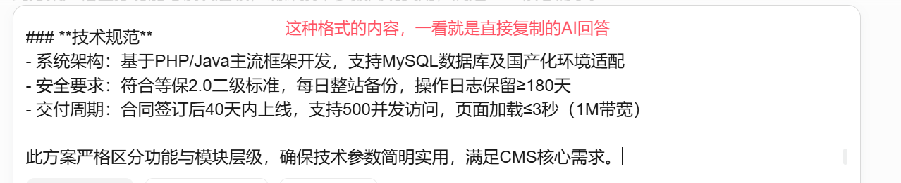
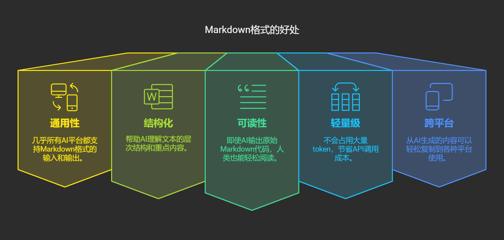

# Markdown + AI = 效率神器：现代人必学的大模型文本格式，10分钟就能学会！

大家好，我是九歌AI。

为什么写这篇文章，因为见过太多人，在复制大模型回答的时候，**连格式都没有调一下**，而是直接就用了。每次看到下图这样的格式，出现在正式的文件或者报告中，竟有点忍俊不禁。



再就是不懂编程的小白，想做好智能体应用开发，即使是像Coze这种低代码平台，也必须懂的Markdown语言，不然无法输出排版精美的文档。

## Markdown是什么？

Markdown是一种轻量级标记语言，由John Gruber于2004年创建。它使用纯文本格式编写文档，然后转换成有效的HTML文档。与复杂的文字处理软件不同，Markdown让你专注于内容本身，而不是繁琐的排版。

最令人惊叹的是，Markdown的语法极其简单，**几乎不需要学习成本**。它的设计理念是"易读易写"——即使是原始的Markdown文本，也能轻松阅读，不会被标记符号干扰。

## 为什么Markdown在AI时代如此重要？

在与ChatGPT、Claude等大模型交互时，我们需要一种既能表达格式要求，又不会过于复杂的语言。Markdown恰好满足了这一需求：

1. **通用性**：几乎所有AI平台都支持Markdown格式的输入和输出
2. **结构化**：帮助AI理解文本的层次结构和重点内容
3. **可读性**：即使AI输出原始Markdown代码，人类也能轻松阅读
4. **轻量级**：不会占用大量token，节省API调用成本
5. **跨平台**：从AI生成的内容可以轻松复制到各种平台使用



## Markdown基础语法速成

#### 标题

Markdown中的标题非常直观，使用`#`符号表示：

```Markdown
# 一级标题
## 二级标题
### 三级标题
#### 四级标题
##### 五级标题
###### 六级标题
```

实际效果就像本文各个部分的标题一样，层次分明，一目了然。

#### 文本样式

```Markdown
*斜体文本* 或 _斜体文本_
**粗体文本** 或 __粗体文本__
***粗斜体文本*** 或 ___粗斜体文本___
~~删除线~~
```

这些简单的符号让我们能够轻松强调文本中的重点部分：**重点**、*补充说明*或~~废弃内容~~。

#### 列表

无序列表使用`-`、`*`或`+`作为列表标记：

```Markdown
- 第一项
- 第二项
- 第三项
```

有序列表则使用数字加点：

```Markdown
1. 第一项
2. 第二项
3. 第三项
```

列表可以嵌套，只需在子列表项前添加四个空格：

```Markdown
1. 第一项
    - 子项一
    - 子项二
2. 第二项
```

#### 链接与图片

链接的语法非常直观：

```Markdown
[链接文本](https://www.example.com)
```

图片则在链接前加一个感叹号：

```Markdown

```

#### 引用

使用`>`符号创建引用块：

```Markdown
> 这是一段引用文本。
> 这是引用的第二行。
```

引用也可以嵌套：

```Markdown
> 外层引用
>> 内层引用
```

#### 代码

行内代码使用反引号包裹：

```Markdown
使用 `print("Hello World")` 输出问候语
```

代码块则使用三个反引号包裹，还可以指定语言以获得语法高亮：

````Markdown
```python
def greet(name):
    return f"Hello, {name}!"
    
print(greet("AI"))
```
````

#### 表格

Markdown中创建表格虽然看起来有点复杂，但逻辑非常清晰：

```Markdown
| 姓名 | 年龄 | 职业 |
| --- | --- | --- |
| 张三 | 28 | 工程师 |
| 李四 | 32 | 设计师 |
```

冒号可以用来对齐列：

```Markdown
| 左对齐 | 居中对齐 | 右对齐 |
| :--- | :---: | ---: |
| 单元格 | 单元格 | 单元格 |
```

#### 分隔线

使用三个或更多的星号、减号或下划线创建分隔线：

```Markdown
---
***
___
```

## Markdown与AI大模型的完美配合

当我们使用ChatGPT等大模型进行创作时，Markdown成为了人机交流的理想媒介。下面是一些实用场景：

#### 生成结构化文档

我们可以要求AI使用Markdown格式输出各种结构化文档：

```Plaintext
请用Markdown格式生成一份《人工智能伦理指南》，包括引言、核心原则、应用案例和结论四个部分。
```

AI会自动使用适当的标题层级、列表和强调来组织内容，使输出更加清晰。

#### 创建技术文档

对于程序员来说，Markdown是编写技术文档的理想选择：

```Plaintext
请用Markdown格式编写一个React组件的使用说明，包括安装指南、API文档和使用示例。
```

AI会使用代码块、表格等元素生成专业的技术文档。

#### 课程大纲与学习笔记

学生和教育工作者可以利用Markdown组织学习材料：

```Plaintext
请用Markdown格式为我生成一份"Python数据分析"的10课时学习大纲，每课时包括学习目标、关键概念和练习项目。
```

分层的标题和列表使得学习计划一目了然。

## 在实际工作中应用Markdown

Markdown已经渗透到各种工作场景中，熟练掌握它将极大提高效率：

#### 1. 文档协作平台

> **GitHub/GitLab**：几乎所有代码仓库的README和文档都使用Markdown
> **Notion/飞书**：现代化工作平台对Markdown的原生支持
> **Confluence**：企业级知识管理平台支持Markdown语法

#### 2. 笔记应用

> **Obsidian**：基于Markdown的知识管理工具，支持双向链接
> **Typora**：所见即所得的Markdown编辑器
> **OneNote/印象笔记**：主流笔记应用提供Markdown支持

#### 3. 博客和内容平台

> **WordPress**：可以通过插件支持Markdown
> **Medium**：支持基本的Markdown语法
> **简书/知乎**：国内主流内容平台广泛支持Markdown

#### 4. 与AI工具集成

```Python
# 使用Python调用OpenAI API，要求输出Markdown格式
import openai

response = openai.ChatCompletion.create(
    model="gpt-4",
    messages=[
        {"role": "system", "content": "请使用Markdown格式回复。"},
        {"role": "user", "content": "生成一份周报模板"}
    ]
)

markdown_content = response.choices[0].message.content
print(markdown_content)
```

## Markdown进阶技巧

掌握了基础语法后，这些进阶技巧将让你的Markdown使用更加得心应手：

#### 1. 任务列表

```Markdown
- [x] 已完成任务
- [ ] 未完成任务
- [ ] 另一个未完成任务
```

这在项目管理中特别有用，可以直观地展示任务进度。

#### 2. 脚注

```Markdown
这里有一个脚注引用[^1]

[^1]: 这是脚注内容。
```

适合添加参考资料或补充说明。

#### 3. 数学公式

许多Markdown工具支持LaTeX语法的数学公式：

```Markdown
行内公式：$E=mc^2$

独立公式：
$$
\frac{d}{dx}(x^n) = nx^{n-1}
$$
```

这对于科学、工程和学术写作非常有价值。

#### 4. Mermaid图表

一些高级Markdown编辑器支持Mermaid语法，可以直接创建流程图、序列图等：

````Markdown
```mermaid
graph TD;
    A[开始] --> B{条件判断};
    B -->|是| C[处理1];
    B -->|否| D[处理2];
    C --> E[结束];
    D --> E;
````

```Plaintext

这使得复杂信息的可视化变得异常简单。

### 与AI大模型高效协作的Markdown提示词技巧

要让AI生成格式精美的Markdown内容，关键在于提供清晰的指令：

#### 1. 明确指定输出格式
```

请按照以下Markdown模板格式生成三篇博客大纲：

> ## [博客标题]
> ### 引言
> - [要点1]
> - [要点2]
> ### 正文部分
> #### [小标题1]
> ...

请生成一份学习计划，使用Markdown格式，包含以下元素：

> 1. 使用三级标题分隔每周内容
> 2. 使用任务列表表示待完成项目
> 3. 使用表格呈现每日时间分配
> 4. 使用引用块标注重点内容

Markdown以其简洁、高效的特性，正成为AI时代交流的通用语言。它不仅是技术人员的专属工具，更是所有需要进行文字创作、知识管理的现代人的必备技能。通过这10分钟的入门指南，相信你已经掌握了Markdown的核心用法，能够在与AI大模型协作时熟练运用这一工具。

  
无论你是写博客、做笔记、编写文档，还是与AI助手合作创作，Markdown都将是你强大而可靠的盟友。在这个AI大模型的时代，掌握高效的知识表达方式，就是掌握了未来的竞争力。