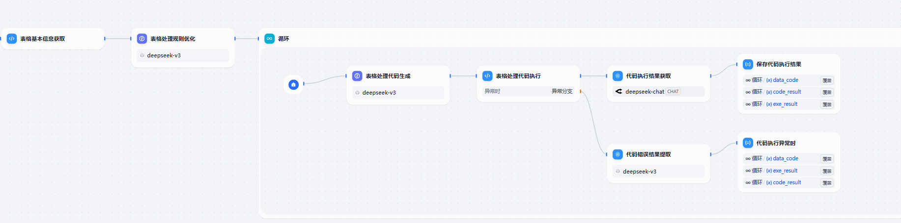
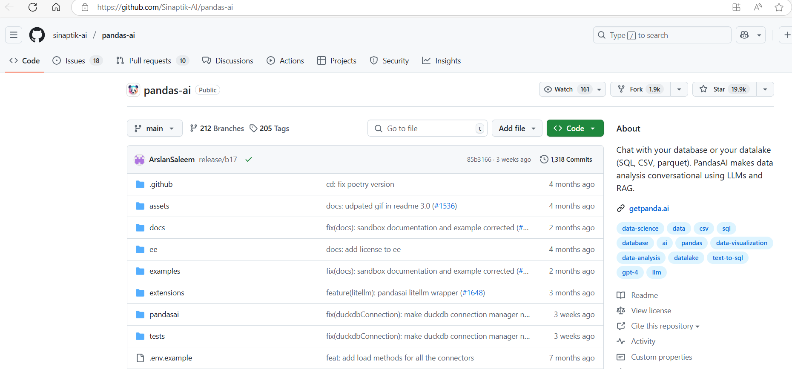
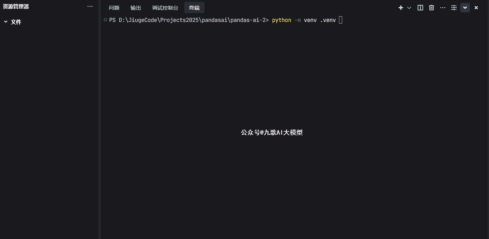
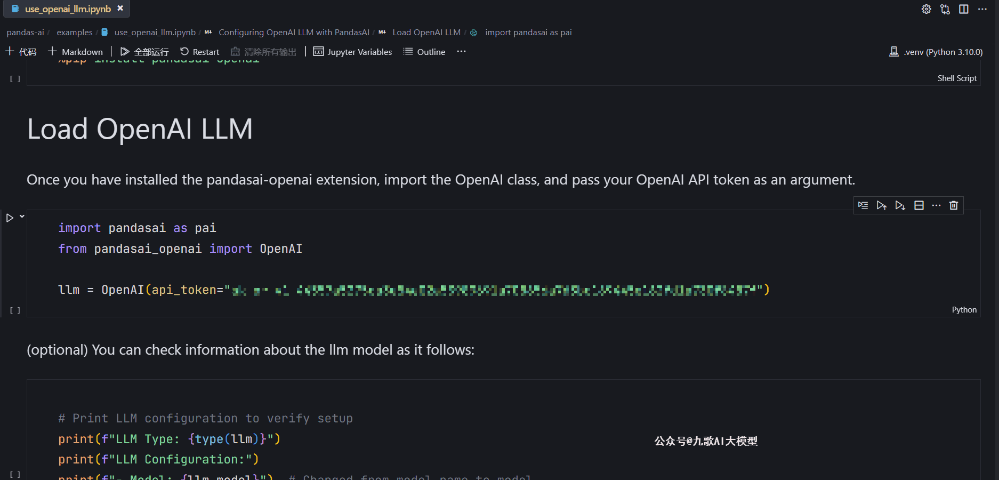
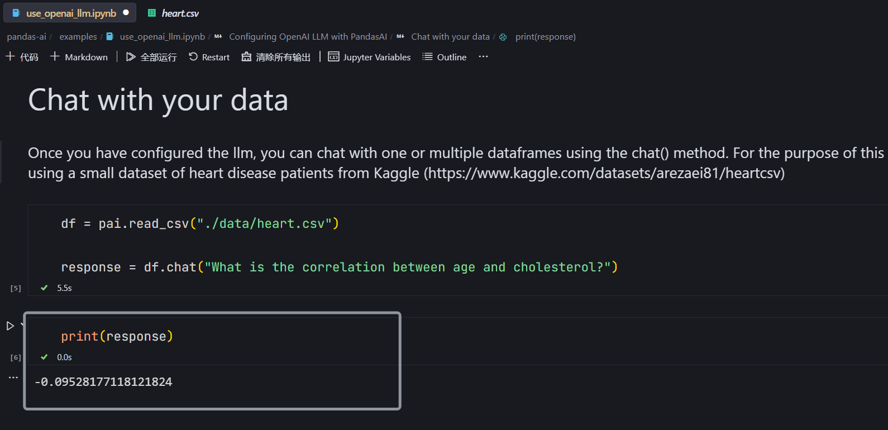
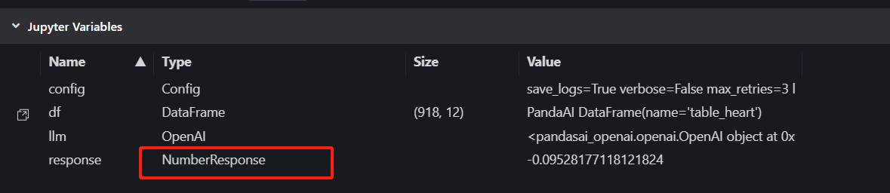
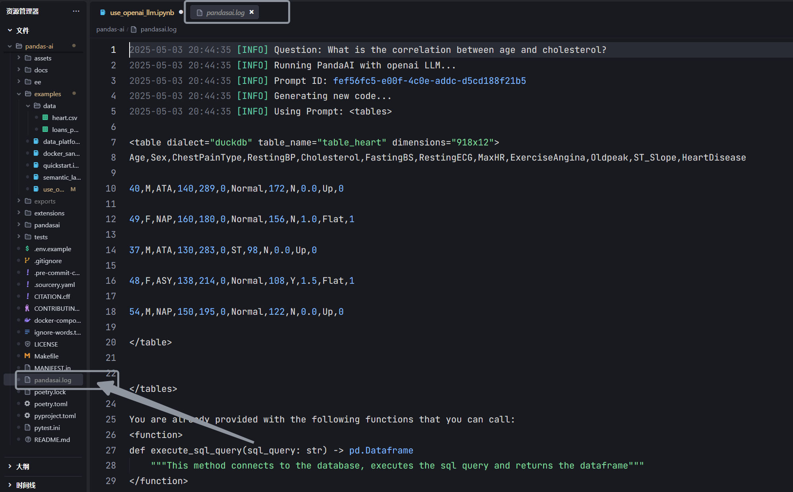
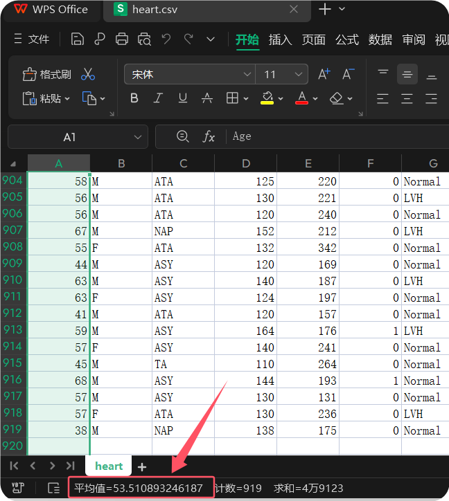

# Pandas-ai+FastAPI-MCP，自己动手搭建AI数据分析服务，效果不比大厂差

大家好，我是九歌。今天我们聊一聊使用大模型进行数据分析。

AI数据分析作为大模型应用的刚需，在各大平台上的表现却大相径庭。阿里百炼的析言、ChatGPT、商汤的小浣熊、豆包，用了一圈，发现能打的只有豆包。但是豆包只提供大模型接口，AI数据分析却没有对应的接口。


首先定义一下“AI数据分析”，本文所说的AI数据分析，专指大模型对数据表格的处理能力，默认数据超过2000行！

2000行的表格直接喂给大模型让其分析，可想而知，这是多么不现实的一件事情，更不要说是让大模型对表格中的某行或某列进行精准的函数计算了。

目前各大平台使用的解决方案，基本一致，主要是下面几个步骤：

```Plain Text
命令大模型对上传的Excel文件，生成Python代码，读取表头和表格前几行数据
将读取后的数据与用户的需求再重新提交给大模型
大模型根据需求生成Pandas或者SQL代码，对数据进行操作
在沙箱中执行数据处理代码，判断是否处理成功
若处理成功，将处理后的表格路径返回
若处理失败，将错误信息一并交给大模型，重新生成
```

按理说上面的过程看起来好像一点不麻烦，于是我自信满满的想要智能体工作流实现一个，但是很快被打脸了。遇到稍微复杂点的数据分析需求，工作流陷入死循环，一直报错！



本着不能重复造轮子的心态，我开始在Github上找AI数据分析相关的开源项目。功夫不负想偷懒的人，终于发现了一个将近2万star的项目——Pandas-ai！



Pandas是Python中数据分析必用的库!然后给ai赋能了!还这么多人星标了!

激动的心怦怦跳,颤抖的小手搓起来,让我们一块体验一下吧!

<callout emoji="🥇">
安装篇
</callout>

Pandas-ai 已经做成了Python库,所以我们直接安装使用就行,简直不要太方便。 我们通过以下命令即可完成Python环境搭建和Pandas-ai库的安装。

```Plain Text
#创建虚拟环境 
python -m venv .venv 
#激活环境
.\.venv\Scripts\activate
#安装Pandas-ai
pip install pandasai -i https://pypi.tuna.tsinghua.edu.cn/simple
```



<callout emoji="🥇">
配置篇
</callout>

将Pandas-ai的github库，下载到本地，在项目文件夹中找到pandas-ai\examples\use_openai_llm.ipynb 这个文件，并打开。

```Plain Text
https://github.com/sinaptik-ai/pandas-ai.git
```


这个文件中，告诉我们，如何配置OpenAI大模型的api_token,从而用Pandas-ai的 df.chat方法。我们只需要学会这一种使用方法就可以了。我们需要使用以下命令，额外安装 pandasai-openai库。

```Plain Text
pip install pandasai-openai -i https://pypi.tuna.tsinghua.edu.cn/simple
```

然后再下方的命令中填入OpenAI的api_token。Pandas-ai目前支持的大模型有限，首选OpenAI

```Plain Text
import pandasai as pai
from pandasai_openai import OpenAI
#我修改成了opentourer的token
llm = OpenAI(api_token="your_api_token")
```

问题来了，我没有OpenAI的api_token,但是我有OpenRouter的token，可以调用GPT-4o等模型。于是我找到pandasai-openai库的源文件base.py和openai.py，修改OpenAI的URL为OpenRouter的URL，并将默认模型设置为GPT-4o

```Plain Text
# .venv\Lib\site-packages\pandasai_openai\base.py
api_base: str = "https://openrouter.ai/api/v1"

#.venv\Lib\site-packages\pandasai_openai\openai.py
model: str = "gpt-4o"
```

在use_openai_llm.ipynb中，将api_token设置为openrouter的token，然后执行每一个单元格，查看是否输出为下方的正确信息。此处我直接使用Trae编辑器，配置了Jupyter的内核环境，按照提示安装相应的包之后，就可以直接执行ipynb文件。



如果你最后能够顺利执行 df.chat（）函数，能够将response打印出值来，恭喜你配置成功了！



<callout emoji="🥇">
进阶篇
</callout>

我们来看一下Pandas-ai的工作原理，非常简单！

第一步，引入Pandas-ai库，更换别名为pai，并初始化大模型！

```Plain Text
import pandasai as pai
from pandasai_openai import OpenAI

llm = OpenAI(api_token="your token")
```

第二步，指定需要处理的文件路径，然后输入数据分析需求就可以了！返回信息都存储在response变量中，你只需要将其直接打印或者保存成其他文件就可以了！

```Plain Text
#文件路径
df = pai.read_csv("./data/heart.csv")
#发送需求
response = df.chat("What is the correlation between age and cholesterol?")
```

你可以再Jupyter的变量面板查看当前所有变量属性！偷偷告诉你，如果response 的Type属性是DataFrameResponse，你直接可以使用pandas的函数操作，把response再保存成各种你想要的格式！



```Plain Text
import pandas as pd 
df2 = pd.DataFrame(response.value)
df2.to_csv("./data/result3.csv",index=False)
```

如果你再细心点，你会发现当前文件夹根路径下面多了个pandasai.log文件。恭喜你，发现了新大陆，pandas-ai在和大模型交流过程的请求和生成代码执行情况以及错误情况，你都可以在这个文件看见了！



对了，为了降低bug次数，请将所有的数据文件，全部转成UTF-8格式的CSV文件后，再使用pandas-ai进行处理！

<callout emoji="🥇">
接口篇
</callout>

Pandas-ai 在我们自己的电脑上已经成功跑起来了！如果我们想把这个服务分享出去，就需要开发接口了。我们已经有了基础功能，直接使用FastAPI编写接口就可以了。因为文章篇幅有限，全部接口代码请在文末说明中获取。

接口我主要加了一个判断处理，如果response数据长度超过1000，直接保存为csv文件，并返回在线下载地址；如果未超过1000，则将response内容直接通过接口返回。

我们来测试一下接口是否能正常工作！这里依然使用Pandas-ai提供的测试表格 ./data/heart.csv。


pandas-ai很快给出了正确结果，Age列的平均年龄为53.5108。我们用WPS打开heart.csv看一下结果，发现完全正确！



<callout emoji="🥇">
MCP篇
</callout>

现在接口有了，当然接口也不是很完善，读取的依然是本地文件路径或者在线URL路径。这段时间MCP非常火，我们再把上面的接口用MCP协议封装一层，看看能不能放在MCP客户端里面直接调用！

万幸Github上有个项目FastAPI-MCP，可以很容易就能将fastapi接口转成支持MCP协议的服务。我们安装项目文档，直接上手使用！只需要将fastapi对象，再用FastApiMCP封装一下就可以了！接口中，一定带上operation_id,不然客户端找不到工具名。

```Plain Text
#安装
pip install fastapi-mcp -i https://pypi.tuna.tsinghua.edu.cn/simple
#使用
from fastapi import FastAPI
from fastapi_mcp import FastApiMCP

##原有接口
@app.post("/process-attendance/",operation_id="data_analysis")
#省略代码
##

app = FastAPI()
mcp = FastApiMCP(app)

# Mount the MCP server directly to your FastAPI appmcp.mount()

#
```

我们重新启动接口文件，访问localhost:8989/mcp，发现如下信息，说明服务启动成功！


打开AI编辑器 Trae，手动添加MCP Server ,配置文件如下(使用时请换成自己的路径）：


我们创建一个智能体：数据分析师，然后调用这个智能体，看一下数据分析MCP的效果吧。

```Plain Text
#智能体输入问题
D:\JiugeCode\Projects2025\pandasai\pandas-ai-2\pandas-ai\examples\data\heart.csv  
表格Age列的平均值是多少
```


大功告成了！