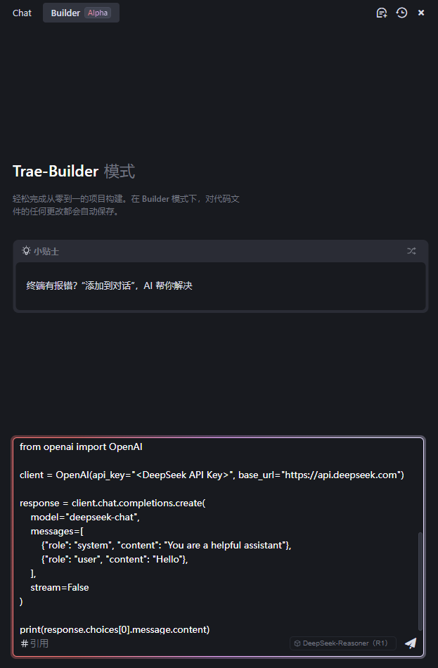
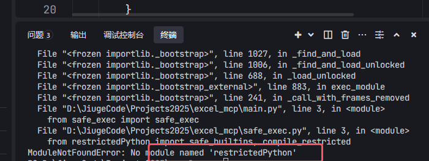
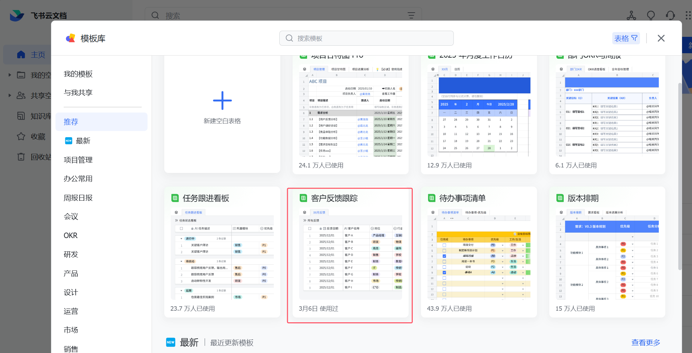
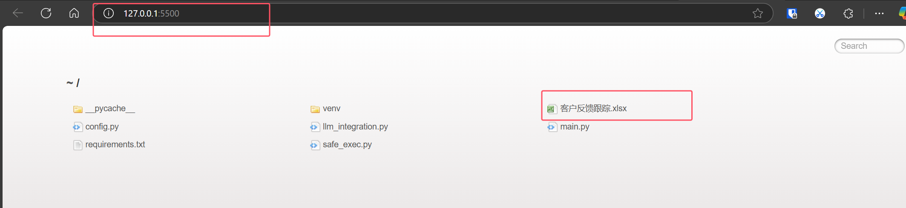
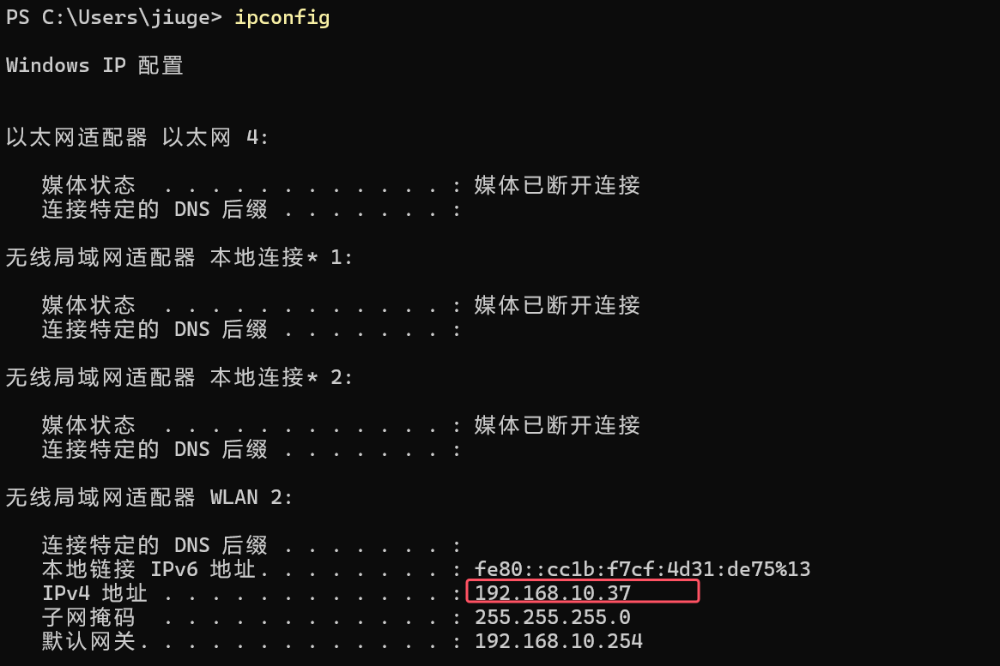
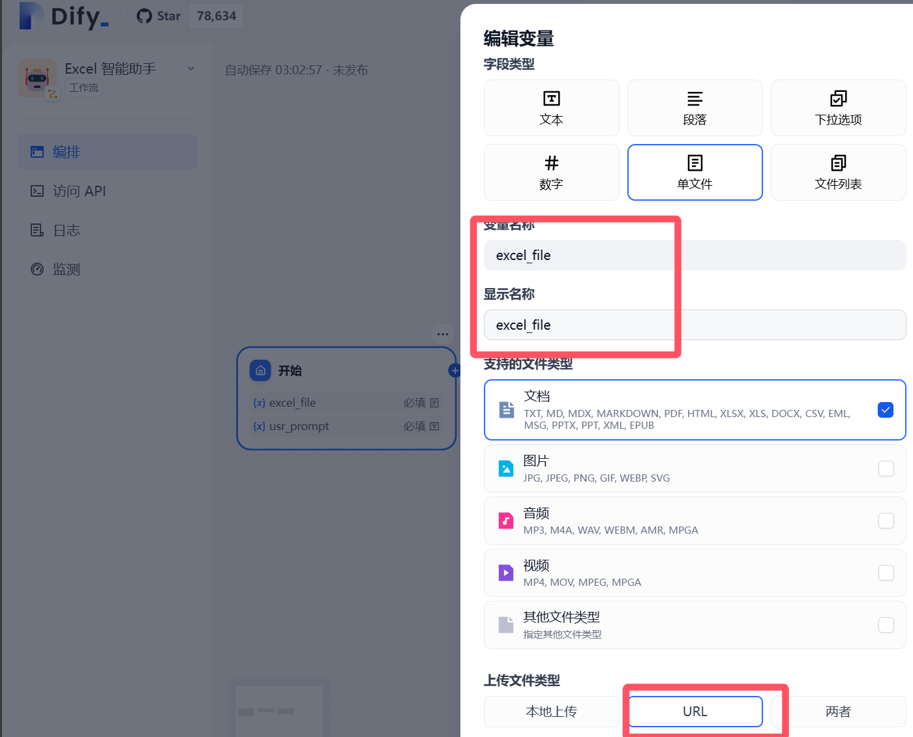

# Trae + Dify 10分钟构建 Data McpServer 与 Agent ，和 Excel 说再见！

大家好，我是九歌AI。

今天手把手教大家使用AI编程工具+Dify构建一个能**根据大模型对话处理Excel的智能体**。

当然，全程下来10分钟是不可能的，代码确实是Trae 几分钟就生成的，**但是我调Bug就花了2个小时啊！**

本来还想加上Pyecharts数据可视化部分，但是一口子吃成胖子也不好，先做个简单的吧。

话不多说，我们撸起袖子开干。

打开国内最新版的AI编程工具Trae，在新建Builder地方，输入下面的提示词,大模型选择DeepSeek R1。提示词为什么这么写，当然是避坑了！



## DeepSeek R1 **提示词**

> 我要使用 MCP  server 搭建1个服务，接受 Excel 路径和大模型对话中的数据处理要求，这个server服务里的 llm(使用deepseek) 将数据处理要求转变成 真实的 pandas 代码，然后服务执行这个代码，将代码运行结果返回。  请根据我的要求，一步步给出完整的解决办法和创建完整代码。
> 代码结构可以参考下面这样：
> excel_mcp/  
> ├── config.py  
> ├── llm_integration.py  
> ├── main.py  
> ├── safe_exec.py  
> └── requirements.txt
> 数据处理库使用Pandas
> LLM使用DeepSeek，DeepSeek的请求使用参考下方代码
> from openai import OpenAI
> client = OpenAI(api_key="<DeepSeek API Key>", base_url="https://api.deepseek.com")
> response = client.chat.completions.create(
>     model="deepseek-chat",
>     messages=[
>         {"role": "system", "content": "You are a helpful assistant"},
>         {"role": "user", "content": "Hello"},
>     ],
>     stream=False
> )
> print(response.choices[0].message.content)

使用Trae的Builder模式，将上面的提示词输入


再代码生成的过程中，一直惦记全部接受，直到代码执行阶段。这时候终端会报错，你根据报错信息就会陷入修Bug的无底洞，所以要自己把代码都读一遍，不然哪里错的都不知道。

比如下面这个报错，原因很简单，包的大小写弄错了！



代码全部生成后，你需要在config.py中 添加DeepSeep API的密钥，然后按下面步骤运行代码。

> 1. 替换config.py中的API密钥
> 2. 通过`uvicorn main:app --host 0.0.0.0 --port 8000` 启动服务
> 3. 访问`http://localhost:8000/docs` 测试接口
> 4. 如果使用venv管理环境，请先激活环境，再执行第2步。
> 5. vevn环境激活命令：.\venv\Scripts\activate

这时候，访问FastAPI的docs路径（可能需要科学上网，因为fastapi的一个js库被挡了），就可以看到Data McpServer的接口了。


紧接着，我们需要准备一个excel文件，我们可以直接在飞书文档的excel模板中找一个，下载下来。我找的是客户反馈跟踪表。



将这个表格放在Trae项目根文件夹，直接点击Trae右下角的Go Live,**会将项目文档以端口5000**的web服务暴露出来。


我们访问这个地址，复制表格的URL链接。



接下来再回到FastAPI Docs界面，找到接口，点击Try It!填写参数值，然后点击Execute按钮 执行！


查看结果，成功了！（中途修了半小时BUG!）


下面我们就要把McpServer 作为工具放到Dify上了。

**第一步**  先确定你Dify能访问到本地运行的Fastapi接口服务，所以我将地址换成了电脑的IP。



**第二步**  获取Fastapi openAPI-Swagger数据，点下面这里。


**第三步**  把json数据复制到dify 自定义工具界面。这里面需要手动添加servers信息，fastapi上没有带这个参数。


点击接口旁边的测试，测试一下工具是否可用。


回到Dify，创建一个工作流应用，取名为**Excel智能助手**。


编排这个简单的工作流如下,开始按钮设置变量类型,一个是Excel文件URL上传，一个是用户提示词。




在下一个节点，选择我们刚刚内置的工具，讲文件URL和用户提示词对接好。


**如何点击运行按钮，查看执行效果。**


运行这个智能体，查看效果！


好了，今天就先到这，我们还可以把这个工作流发布为工具，在新的智能体对话时作为Function Call调用，我们下期再详细讲。

所有的代码和Dify工作流文件，可以访问下方或原文链接获取。

```Markdown
https://mbd.pub/o/bread/aJWXm5dv
```