# Trae+Dify 1小时制作对话流OA请假智能体

大家好，我是九歌AI。

前几天《人人都会做智能体》社区的成员提问，OA请假可以用智能体实现吗？

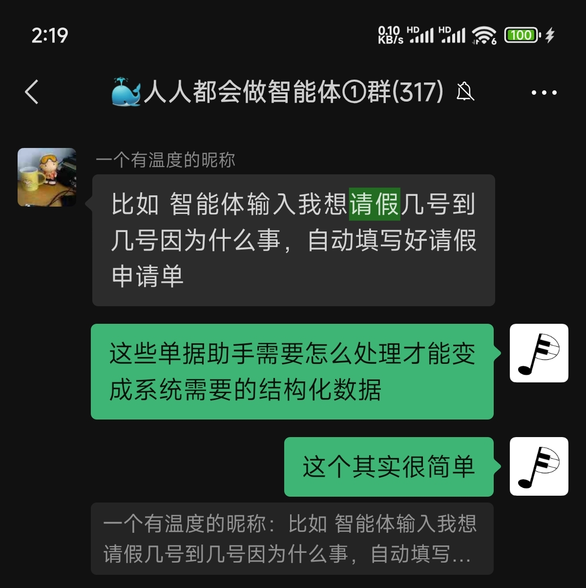

我第一反应是这种问题有点太简单了，但是转念一想，越是这种简单的任务，反而更有科普价值，因为很多人还没深入了解过智能体（Agent）到底是什么，我不能先入为主的将其定义为没有必要的简单。想了解智能体是什么，可以先看我之前的这篇文章。

【人人都会做智能体】Agent是什么,简单中等复杂商用的智能体又是什么?

所以今天我们一起来实现一个基于对话流的请假智能体，是一个非常简单的智能体。最终的实现效果是这样。

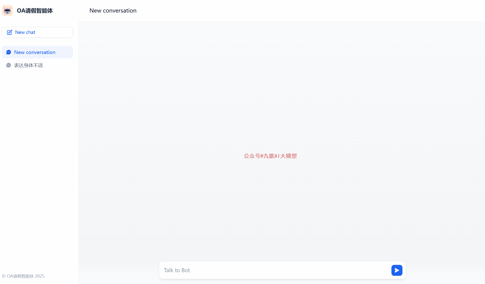

好，下面来一步步拆解这个智能体是怎么做出来的。不过在搭建OA对话流请假智能体，我们先需要**自己开发个简单的OA请假管理系统**，因为我们没有现成的OA系统接口可以用。

这个OA请假管理系统很简单，有个前台的请假申请页面和后台的审批页面，然后能提供接口就可以了。

打开国内某知名AI编辑器，新建项目文件夹，在Builder模式里，选择DeepSeek R1,输入提示词，开始制作软件。下面是第一次生成过程，bug非常多，只能重新优化提示词，重新开始。

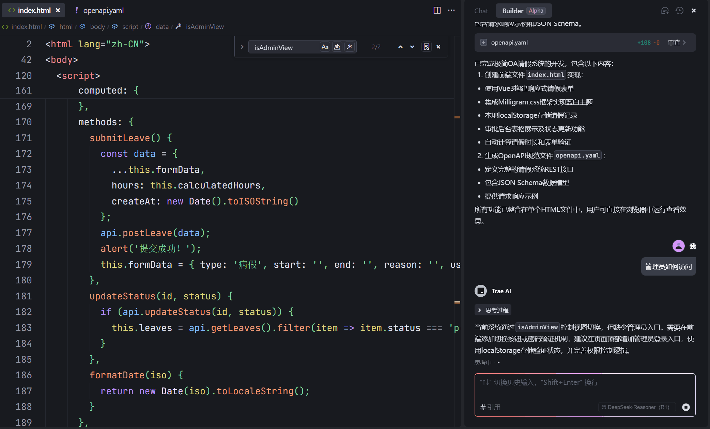

关于提示词怎么写，可以看一下我以前的这篇文章。下面的提示词是我第二次优化的版本，第一次我感觉思路错了，AI编辑器在跑偏的路上越跑越远，我直接删除了整个项目文件夹，优化了下面的提示词，重新生成。

智能体应用开发提示词模板技巧大全

> 帮我生成一个非常简单的OA请假系统，只有两个页面，前端请假页面为一个表单，包含请假类型、开始结束时间，请假时长，请假事由，备注等项，后台页面是一个审批页面，能够展示请假待审批列表，可以点击通过或者拒绝。请使用最简单的Djanog+ninja实现，数据存储使用Sqlite,网页简单美化即可，最后ninja能生成2个请假的API接口，一个是新增请假数据，另一个是查询请假状态，符合openjson格式。
> 请安装以下过程生成
> 1. 在当前文件夹下使用venv 生成新的Python环境 
> 2. 安装django ninja 等必须的库
> 3. 创建django新的项目和新的应用-OA请假
> 4. 创建OA请假的前端页面和后端视图等代码
> 5. 使用sqlite存储数据
> 6. 使用ninja创建请假的2个接口，并配置好urls.py 
> 7. 启动django ，使其能直接访问请假界面，输入管理员路径，可以查看和审批请假记录
> 8. 访问/docs 能测试api接口

输入优化后的提示词，开始生成！


软件构建完成，我们启动Django查看一下效果。

**（1）前台请假申请页面**

```json
本地访问地址 http://localhost:8000
```

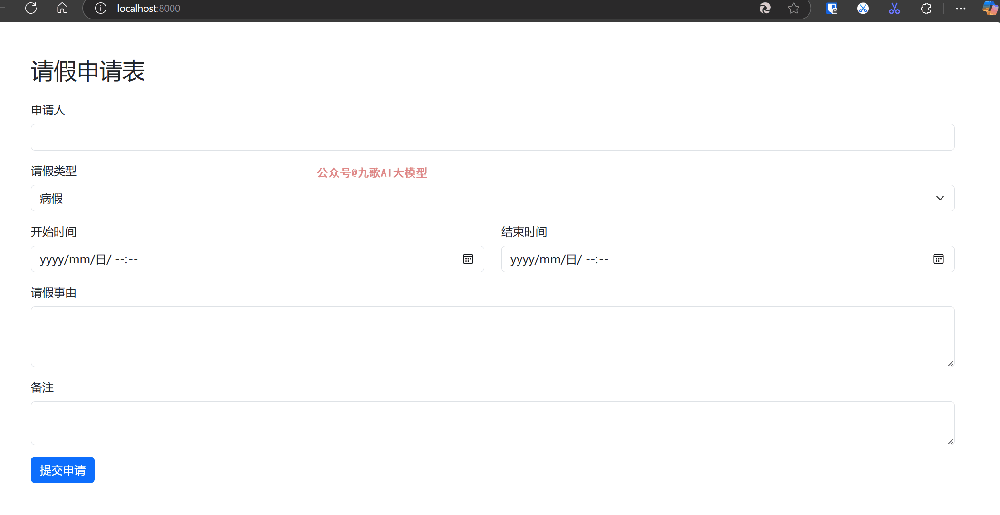

**（2）后台审批功能**

```json
本地访问地址：http://localhost:8000/approve/
```

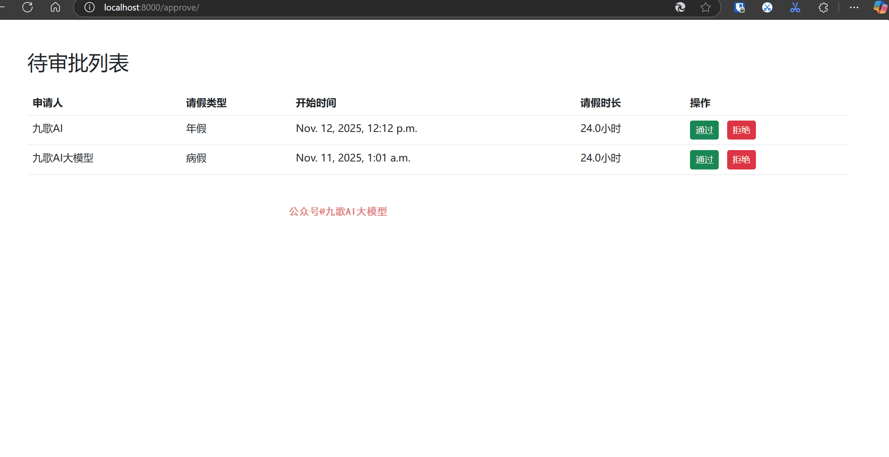

**（3）数据库增删改**


（4）**API接口调用**

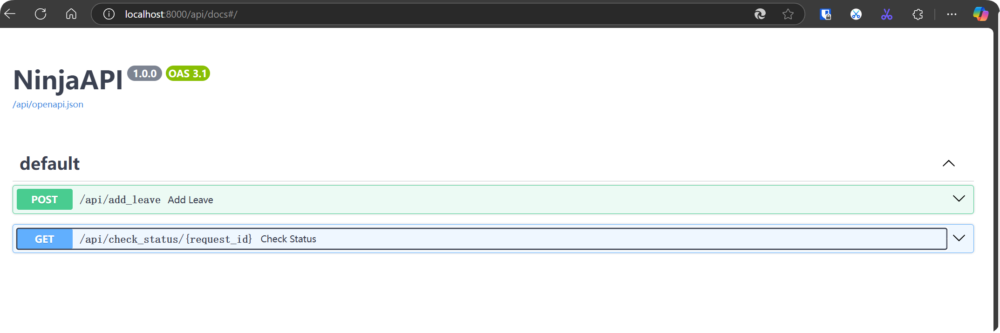

API这里面还是有坑的，主要是Api请求的数据不规范，需要用Pydantic库限定一下，我也不想重新生成了，直接使用Chat模式修改。引用api.py文件，并输入以下结构化提示词：

> 1.请对api.py 中add_leave 、check_status两个接口使用Pydantic重构
> 2.每个接口必须有默认参数值，并且可以在api/docs页面直接点击try it就可以运行。


点击对api.py文件进行修改保存后，重启Django（**略过后面继续改Bug的无聊时间**）访问localhost:8000/api/docs 查看效果。

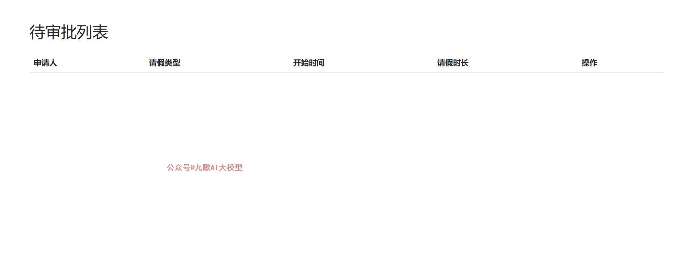

好了，OA系统开发完毕，我们先将OA请假的api对接到Dify中作为自定义工具。

**1**.在Dify中新增自定义工具，访问ip:8000/api/docs/openapi.json，将json数据粘贴到dify中，需要自己添加servers变量。这里面的IP一定要用dify能访问到的ip。

```json
 "servers": [
    {
      "url": "http://172.25.16.1:8000",
      "description": "Development server"
    }
  ]
```

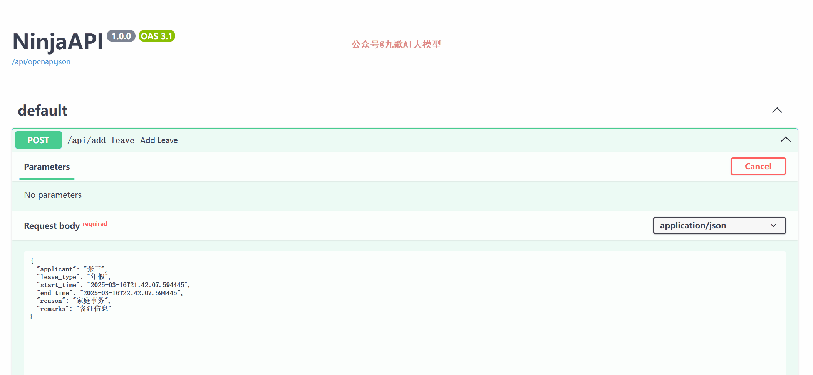

**2**.对新增的OA请假接口进行测试。


OK，OA工具已经没有问题，我们开始基于Dify**（0.15版本）**创建对话流智能体。**对话流智能体的特点就是每次对话就有从开始的节点重新运行工作流，但是会话变量已经发生变化。**

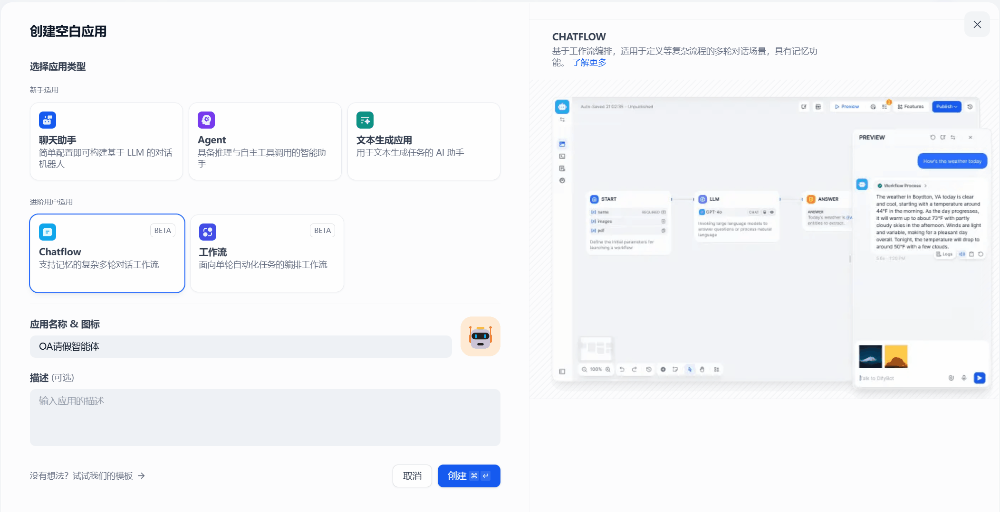

智能体的制作步骤主要分为以下7个步骤：

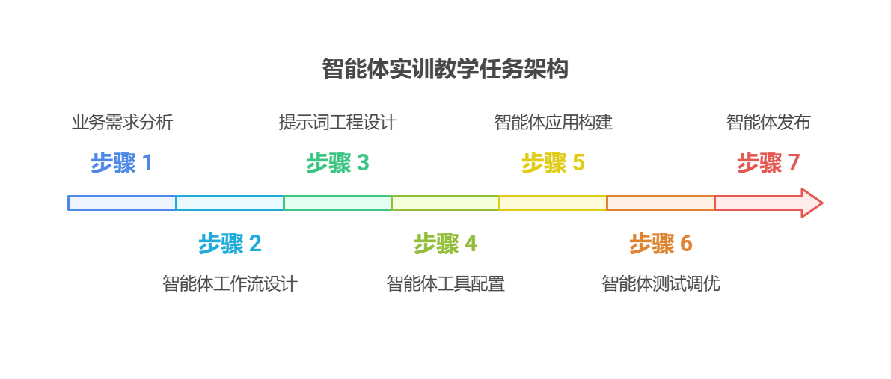

下面我们根据这7个步骤，实现这个智能体。

**（1）业务需求分析**

整体的业务不复杂，我们用伪代码的方式将业务逻辑理清楚。

> 1.用户在聊天对话说 “自己身体不舒服，帮他请个假”
> 2.请假助手通过大模型识别到这是个“请假申请”类问题，但是请假具体信息不明确，缺少天数
> 3.助手于是继续让用户补充信息
> 4.用户回答2天
> 5.助手于是获得了所有关于请假的信息，于是开始调用OA请假系统的接口
> 6.助手调用成功，返回给用户回复“您的请假信息已经提交审批流程，请稍后查询状态。具体请假信息如下：XXX”
> 7.用户继续提问“请假通过了吗”，助手识别为“请假查询”类问题，于是调用状态查询接口，并回复“审批中”
> 8.管理员如果后台通过了审批
> 9.用户继续提问“请假通过了吗”，助手查询后回复“已通过审批”

**（2）工作流设计**

我们根据上面梳理的业务逻辑，直接在Dify（0.15版本）上把工作流搭建起来，可以不用填写参数提示词等，只需要把工作流串起来。这一步其实应该用思维导图把工作流画出来，但是我偷懒了。

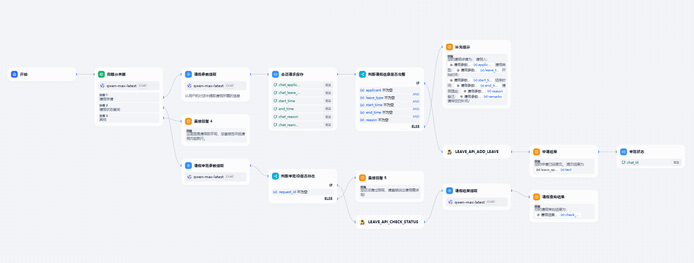

**（3）提示词工程设计**

这一步骤，需要对工作流中的节点提示词相关的部分，挨个进行参数的配置以及提示词的设计。其实都不难，按部就班的操作就可以。Dify内置的提示词生成功能还不错。我觉得难点是请求参数的提取以及会话变量的设置。

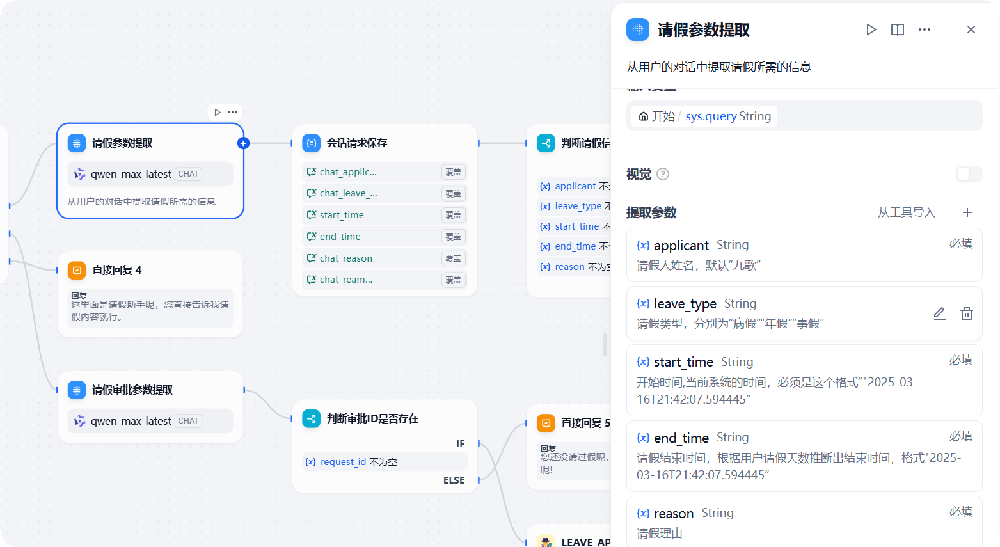

**（4）智能体工具配置**

这一步，是需要我们OA系统的请假工具在工作流中使用的前后节点进行参数的配置和测试。类似的操作我在之前的文章《Dify制作可视化智能体》这篇文章里面讲过。

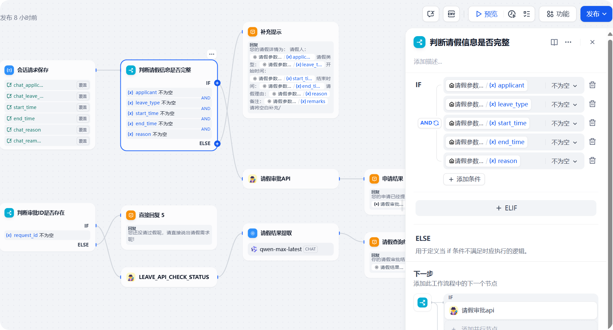

**（5-6）智能体应用构建和测试**

这2步我们放在一起讲，主要就是调试整个智能体的细节和Bug，主要犯错的点是会话变量的保存，在请求参数这个地方，除了用户的询问，还需要加入会话变量。

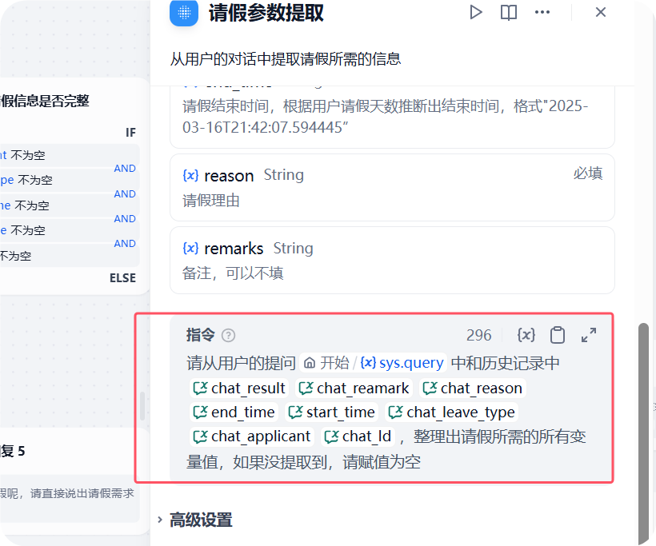

**（7）智能体应用发布**

这一步就更简单了，一键发布到Dify的探索区，或者讲智能体内嵌到你的网站、APP或者小程序里面。

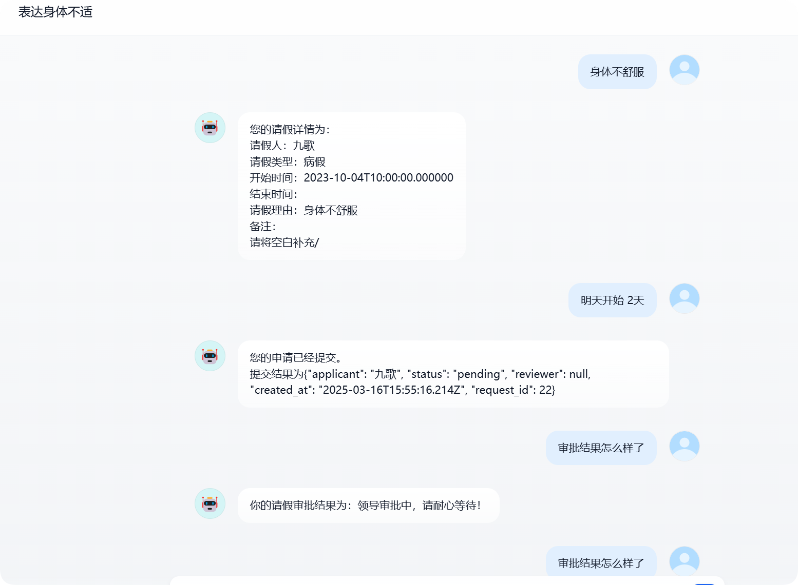

好的，以上就是关于Trae+Dify制作对话流OA请假智能体的所有内容，做的相对比较粗糙，还有很多细节优化，比如请假的开始时间和结束时间的格式，审批流通过后的回复消息，也没有美化。因为时间精力有限，只能到此为止了。

在写文章的时候，也发现这个智能体细节还是有点多，一篇文章很难面面俱到讲清楚，只能把大致思路说一下。后期我将会推出专门讲解的视频来详细拆解这个智能体。