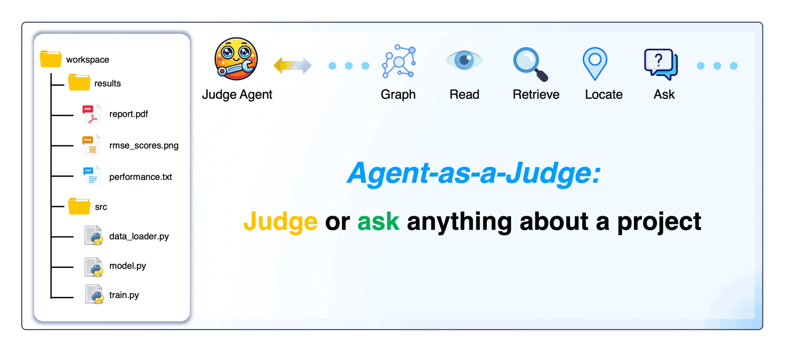
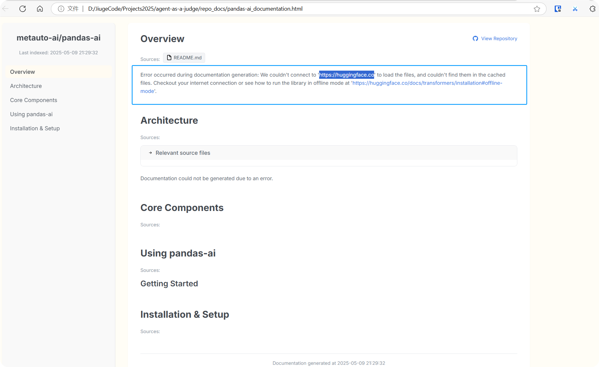

# 个人本地项目代码也能一键DeepWiki，这个开源项目有点意思！

大家好，我是九歌。

最近刷到最多的AI相关文章，就是一路好评的DeepWiki了！手痒难耐的我，也早早就上手体验了一下。整体体验下来，确实不错，对于想了解一个Github项目的新人来说，确实非常有帮助。

但是有一说一，DeepWiki的缺点也是很明显的，一是只能局限于Github项目，对于个人私有代码仓库却爱莫能助！二是时间具有滞后性，项目代码不是最新的！如果公司有传承已久的代码库，新入职的同事看到那山一样高的代码，内心肯定是崩溃的！


其实利用Dify工作流，也能快速做个简易版的DeepWiki出来，但是本着不要重复造轮子的原则，又发现了一个宝藏项目——Agent as a Judge! 怎么样，这个项目名称够长够别扭吧！但是利用这个项目可以快速对个人私有代码仓库生成如下样式项目Wiki，是不是和DeepWiki一样！


Agent as a Judge 项目的初衷就是让智能体评价智能体，把智能体当做裁判！主要提供了一种自动化评估智能体工作表现的方法，同时还能生成高质量的智能体数据集。它就像是一个严格的裁判，能够快速、准确地评判智能体在执行各种任务时的表现，并且为智能体的进一步训练提供有用的反馈。



简单说，Agent as a Judge 能够对项目代码进行**问答对话，生成Wiki文档，对智能体方向的项目进行测评**！

为了更快了解这个项目，我们先把这个项目在我们自己电脑上跑起来再说！因为这个项目是用poetry管理依赖，所以我们在自己电脑上装上它（以Windows为例）。poetry感觉不是很好用，我第一次用这个东西，浪费了很多时间。

```markdown
(Invoke-WebRequest -Uri https://install.python-poetry.org -UseBasicParsing).Content | py -
```

然后我们根据官方给的安装教程，完成项目的安装。步骤如下，我进行了优化。

```Plain Text
#1.拉取项目代码
git clone https://github.com/metauto-ai/agent-as-a-judge.git
cd agent-as-a-judge/
#创建虚拟环境
python -m venv .venv
#激活环境
.\.venv\Scripts\activate
#给poetry指定虚拟环境
poetry env use .\.venv\Scripts\python.exe
#安装依赖
poetry install 
```

遇到的坑，请大家避开，其实直接从pyproject.toml把依赖复制出来,用大模型整理成requirements.txt，直接用pip安装更方便：

```markdown
#1.删除poetry.lock文件
#2.poetry镜像拉取超时，修改pyproject.toml文件，在最后添加下面配置
[[tool.poetry.source]]
name = "tsinghua-pypi"
url = "https://pypi.tuna.tsinghua.edu.cn/simple"
priority = "primary"
#3 还需要额外安装的Python包
litellm
dotenv
tenacity
spacy
rank-bm25
sentence_transformers
pandas
python-docx
PyPDF2 
openpyxl
opencv-python
bs4
pylatexenc
python-pptx
```

最后一步，我们配置一下这个项目的大模型，将 .env.samplech重名为 .env ，添加openai_api_key。因为我没有openai官方的key,只有openrouter的，所以我顺便修改了一下源码。

```markdown
#将 .env.samplech重名为 .env 
DEFAULT_LLM="gpt-4o-2024-08-06"
#添加openrouter key
OPENAI_API_KEY="sk-***"
PROJECT_DIR="{PATH_TO_THIS_PROJECT}"

# 修改 agent_as_a_judge\llm\provider.py 代码 220行
 base_url = "https://openrouter.ai/api/v1"
```

**具体作用**

1.**Ask Anything**

可以针对任意工作区提出问题，了解工作区的内容和结构。例如，对一个药物反应预测的代码库进行问题查询，以及其包含的数据加载、模型实现和训练等相关文件。

```Plain Text
PYTHONPATH=. python scripts/run_ask.py \
  --workspace $(pwd)/benchmark/workspaces/OpenHands/39_Drug_Response_Prediction_SVM_GDSC_ML \
  --question "What does this workspace contain?"
```

2.**Agent-as-a-Judge**

对 DevAI 数据集中的任务进行评估，收集证据来判断项目的输出是否满足要求。这个功能有点复杂，我们现在先简单知道一下，等后面有时间再研究。

```Plain Text
PYTHONPATH=. python scripts/run_aaaj.py \
  --developer_agent "OpenHands" \
  --setting "gray_box" \
  --planning "comprehensive (no planning)" \
  --benchmark_dir $(pwd)/benchmark
```


3.**OpenWiki**：这个就是本文的主角，可以制作给仓库生成Wiki文档，帮助新开发者快速了解代码库的结构、目的和最佳实践。我们来看一下使用方法，好像很简单，直接运行run_wiki.py，后面带上github项目库的URL就可以了！

```Plain Text
python scripts/run_wiki.py https://github.com/metauto-ai/GPTSwarm
```

等等，咱的文章标题不是个人私有代码仓库吗？读取github仓库的功能，DeepWiki就支持啊，而且也支持私有仓库，说好的本地仓库代码呢？

别急，这个项目不是开源吗，咱研究一下代码，改成让它直接读取本地文件夹，不就行了吗？

通过阅读run_wiki.py的源码，我们可以理清它的工作逻辑，主要通过 `download_github_repo` 函数从 GitHub 克隆仓库，在 `main` 函数中使用 `parse_arguments` 函数获取用户输入的 GitHub 仓库 URL 来进行后续操作。

```Plain Text
def main():
    # ... 其他代码 ...
    args = parse_arguments()
    repo_url = args.repo_url or get_repo_url_interactive()
    # ... 其他代码 ...
    repo_dir = download_github_repo(repo_url, output_dir)
    # ... 其他代码 ...
```

也就是说，它的工作原理就是把github的仓库代码下载到本地文件夹，再进行分析！那我们直接让run_wiki.py的参数接受个本地路径不就可以了，这样改也很简单。添加一个新的命令行参数来指定本地文件夹路径，并且在代码中根据这个参数来决定是下载 GitHub 仓库还是直接使用本地文件夹。

```python
import argparse
from pathlib import Path
import logging
import time
import json
import datetime
import subprocess
from urllib.parse import urlparse
from dotenv import load_dotenv

# 省略其他代码
# ...

def parse_arguments():
    parser = argparse.ArgumentParser(description="Generate documentation for GitHub repositories or local folders")
    parser.add_argument(
        "--repo-url",
        type=str,
        help="GitHub repository URL (e.g., https://github.com/metauto-ai/gptswarm)",
        default=None
    )
    parser.add_argument(
        "--local-dir",
        type=str,
        help="Path to the local project folder",
        default=None
    )
    parser.add_argument(
        "--output_dir", 
        type=str, 
        default="./repo_docs",
        help="Directory to save documentation"
    )
    # 其他保持不变
    # ...
    return parser.parse_args()

def main():
    load_dotenv()
    logging.basicConfig(
        level=logging.INFO,
        format="%(asctime)s - %(levelname)s - %(message)s"
    )
    logger = logging.getLogger(__name__)

    args = parse_arguments()
    output_dir = Path(args.output_dir)
    output_dir.mkdir(parents=True, exist_ok=True)

    judge_dir = output_dir / "judge"
    judge_dir.mkdir(parents=True, exist_ok=True)

    start_time = time.time()

    try:
        if args.repo_url:
            logger.info(f"Starting repository download and documentation: {args.repo_url}")
            repo_dir = download_github_repo(args.repo_url, output_dir)
        elif args.local_dir:
            logger.info(f"Using local project folder: {args.local_dir}")
            repo_dir = Path(args.local_dir)
            if not repo_dir.exists() or not repo_dir.is_dir():
                raise ValueError(f"Invalid local directory: {args.local_dir}")
        else:
            raise ValueError("Please provide either a GitHub repository URL or a local project folder path.")

        # 后续代码保持不变
        # ...

    except Exception as e:
        logger.error(f"Error generating documentation: {str(e)}")
        import traceback
        logger.error(traceback.format_exc())
        sys.exit(1)

if __name__ == "__main__":
    main()
```

最后我们看一下结果，跑出来了，但是报错了！


生成的网页没有数据！因为访问不了huggingface!我打开科学上网，但是有些包又报代理错误！



最后我想说，尽力了，不想浪费时间在这个项目上了，前前后后用掉了我三个晚上！此天不让我跑通这个项目，非我不用心也！以后用时间再研究吧！