# 【人人都会做智能体】Agent是什么,简单中等复杂商用的智能体又是什么?

大家好，我是九歌AI 。

今天我将开启**《人人都会做智能体》公开课**的第1节课。

**《人人都会做智能体》**公开课以智能体的小白科普和初级制作为目标，将从**智能体基础认知（**LLM+RAG+WorkFlow+Agent**）、智能体拆解复原、开发环境部署、智能体项目实战**等几个部分，按照学习习惯，迭代式递进式的，**采用图文结合的方式**，循序渐进带领大家一步步掌握智能体制作的方法、技巧和经验。

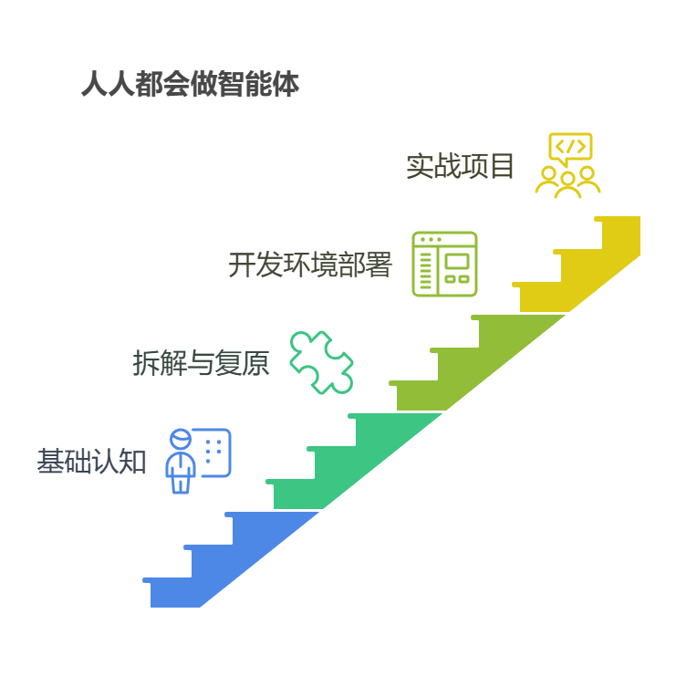

智能体项目实战部分，现在初步定了两个，我之前的文章已经开始写了。一个是**长篇图文智能体生成助手，**打算用5-10篇的文章**，**采用版本迭代的方式，让大家从一个最简单的帮你写固定格式内容的文章写作助手，变成一个**有商用应用场景**的写作智能体。另一个是**数据可视化智能体**，算是一个刚需领域。其他项目还在构思中。

回归本文主题，**智能体是什么，以及智能体是如何一步步做出来的？**

本节希望能够用一种通俗易懂的方式，帮大家了解智能体（Agent ）到底是什么，它的表现形式是什么，什么是简单的智能体，什么是复杂的智能体？以及通过具体的示例告诉大家，智能体是怎么在工作或者生活中帮助我们的。

希望通过本节课能帮助大家建立一个正确的认知，完成对**智能体（Agent）**的祛魅。

<callout emoji="🐋">
**什么是智能体**
</callout>

网上几乎99%的文章或者百科，甚至是DeepSeek，会告诉你智能体（Agent）是一个能够**感知环境、自主决策**并采取**行动**的计算系统。它像是一个数字助手，能够接收信息，根据这些信息做出决策，然后执行相应的操作。

其实我不太喜欢**感知环境**这样的描述，因为我觉得大部分人一听到这个词是蒙的。

如果把DeepSeek这样的**大模型**比作人类「大脑」，那智能体（Agent ）就是个不光长着大脑，而且是会使用各种工具的虚拟人，只是这个虚拟人的最终**表现形态**可能只是个聊天界面。

这个装配了智能大脑（**大模型**）的虚拟人（**智能体**），可以帮着订外卖、查天气、写周报、OA请假等等…每个功能其实都对应一个工具模块（tools）。

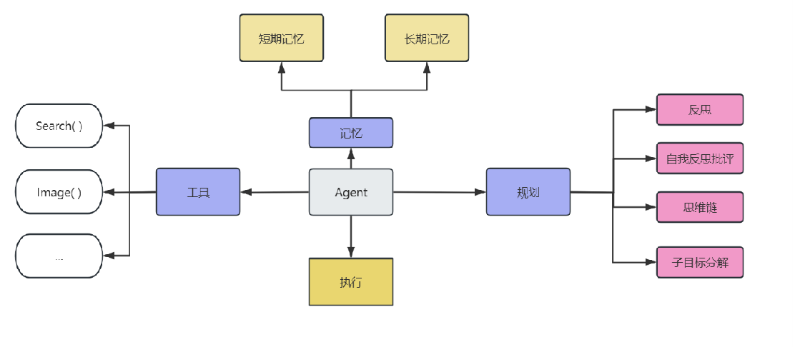

比如接收到主人**订外卖**命令（帮我订个午饭）后，虚拟人开始**自主决策**，有了以下思考：

> 1. 主人要订外卖了，现在是10点30分钟，主人是中午11点30下班，只有一个小时的配送时间。**【感知环境】**
> 2. 所以订外卖的范围不能超出当前位置5公里范围。**【自主决策】**
> 3. 当前位置在哪呀，我查一下当前定位，地点是北京故宫御书房。**【感知环境】**
> 4. 下一步我应该打开外卖app，查看系统推荐菜谱**【执行工具】**
> 5. 对了，我已经连续两天中午给主人点了他最爱吃的排骨米饭，今天应该换换口味了**【短期记忆】**
> 6. 先看看附近哪些菜比较受欢迎，再看看有没有差评**【规划能力】**
> 7. 这家水煮鱼综合比较后，不错就下单这个吧。**【执行工具】**
> 8. 对了，还要给主人发送邮件告诉他我已经订好外卖了。**【执行工具】**

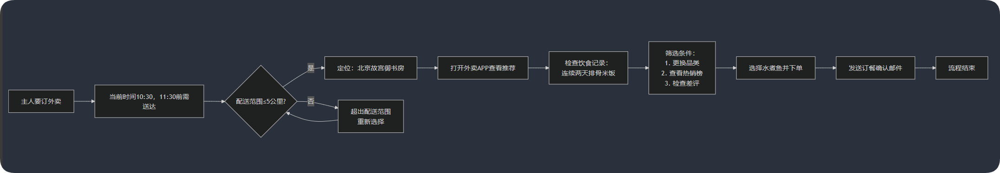

大家看完上面这个例子，也就明白**智能体**与**普通程序**的区别了。智能体其具有一定程度的自主性和适应性，而普通程序通常按照预设的指令执行任务；智能体能够根据环境变化调整自己的行为，有时甚至可以学习和改进自己的表现。

<callout emoji="🐋">
**智能体的商业应用场景**
</callout>

让我们通过几个具体的例子，来看看**商用的智能体**将如何在实际工作和生活中帮助我们。

**（1）个人助理智能体**

张先生是一名忙碌的企业高管，他使用一个个人助理智能体来管理日程和沟通。这个智能体可以：

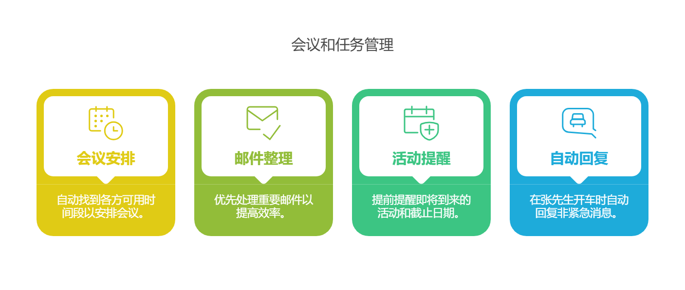

这个智能体大大提高了张先生的工作效率，让他能够专注于重要决策和创造性工作。

**（2）客服智能体**

某电商平台部署了客服智能体，它能够：

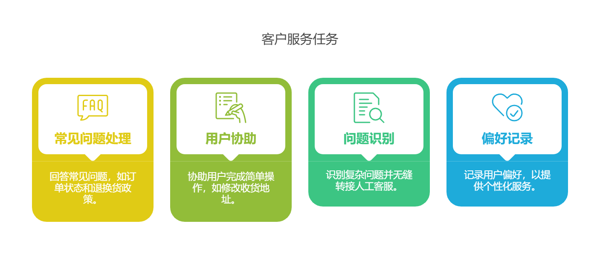

这个智能体每天能够处理数万次客户询问，大大减轻了人工客服的负担，同时提高了客户满意度。

**（3）健康管理智能体**

李女士使用一个健康管理智能体来监控和改善她的健康状况：

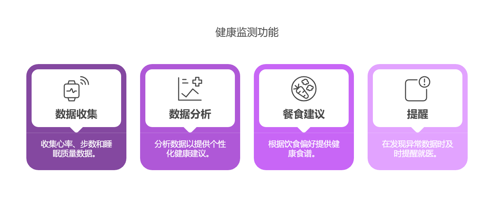

这个智能体帮助李女士养成了更健康的生活习惯，有效预防了潜在健康问题。

**（4）写作助手智能体**

王教授正在写一本学术著作，他使用写作助手智能体来提高效率：

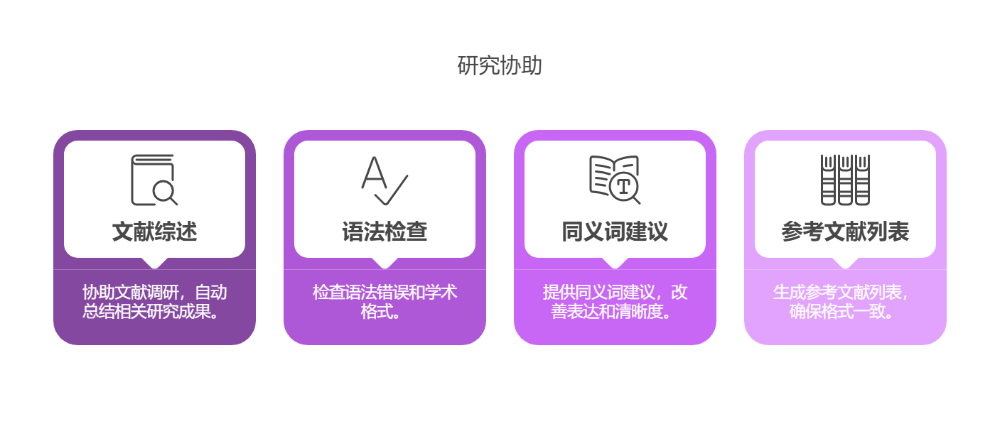

这个智能体不仅节省了王教授大量时间，还提高了著作的质量和准确性。

<callout emoji="🐋">
**简单与复杂的智能体**
</callout>

想必大家看完上面的例子后，感觉这个东西好像很早就一直在吹了，而且离自己的生活的工作好像还很遥远。而且《人人都能做智能体》不就是人人都能把这个智能体做出来的意思吗，上面那些例子根本无从下手，而且也很难直观的想象出来，这不是说大话吗？

首先，我觉得智能体这个概念应该从广义和狭义上的理解。广义上的智能体，就是商业化的那种，是一种相对比较成熟的智能解决方案；而狭义的理解，就是你从现在各种AI软件或者平台看到的那种智能体。我们今后研究的就是这个。

而狭义的智能体（Agent）,也有简单和复杂的智能体之分，并没有一个标准的形象定义。

（1）那什么是简单难度的智能体？

一段**结构化的提示词指令(Prompt)+大语言模型(LLM) =一个简单的智能体**。下图中的Markdown语法设定就是结构化的提示词。

这样的智能体我们在各个大模型网站随处可见，但是当这种智能体依托于你的业务需求时，基于业务规则的提示词则成了一件难事。也就是说，提示词人人都可以写，但是想写出符合业务需求的结构化提示词，确不是人人都会。

比如制作**一个“换热器”产品文案生成智能体**，如果不具备工科以及能源的丰厚知识储备，一般人是无法设计出这种智能体的，因为他连换热器是什么都不知道。所以**基于业务场景的提示词工程**才是有实用意义的工程。

（2）那什么是次中等难度的智能体？

  **结构化的提示词指令(Prompt)+大语言模型(LLM)+知识库（RAG）= 中等难度的智能体**

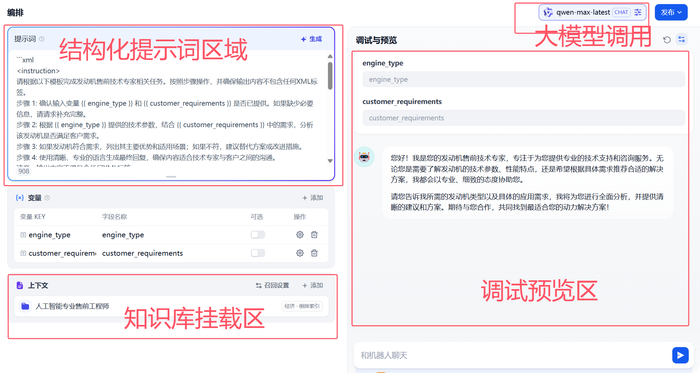

比如上图是一个“发动机售前技术专家”智能体，能够根据给定的发动机型号和客户需求，生成一定字数的售前支持方案。这个智能体就需要挂载发动机详细的产品参数、技术文档等资料，作为大模型在生成支持方案的参考依据。

（3）那什么是中等难度的智能体？

  **结构化的提示词指令(Prompt)+大语言模型+知识库（RAG）+工作流（WorkFlow） = 中等难度的智能体**

下图是一个“文章评分”智能体的设计界面，在中间区域，我们可以看到**插件、工作流、触发器、知识、记忆**等字段。其中工作流区域关联了一个叫Articlerating的工作流。

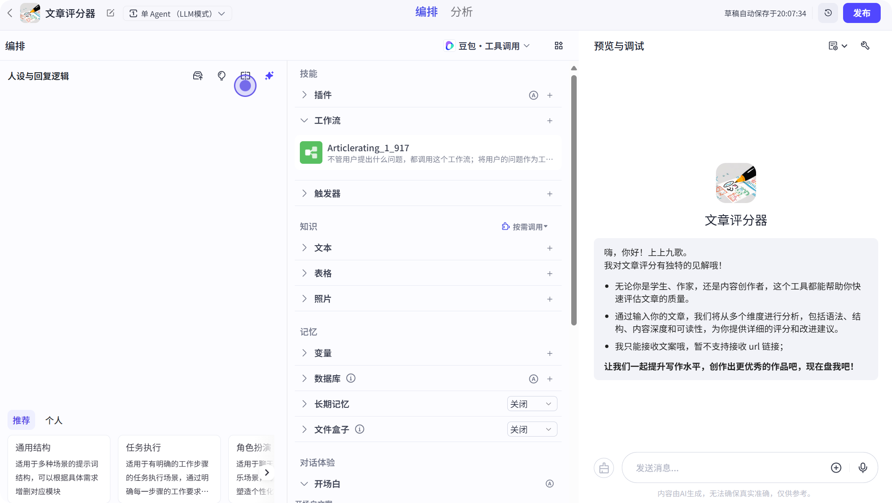

这个工作流，就是这个智能体实现“文章评分”的过程，是如何从多个维度进行评分。工作流的界面长下面这样。

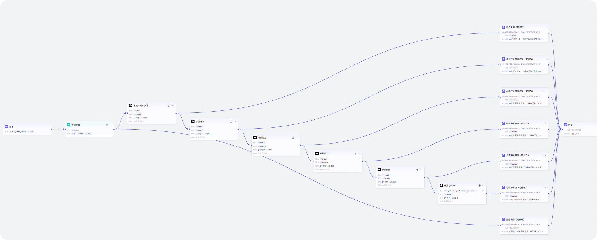

从途中我们可以看出，这个工作流是一个有开始和结束，有逻辑判断、分支的决策树。而想设计出这样一个智能体，就要去分析业务需求，想清楚实现“文章评分”的过程，然后再将需求以及评分过程设计为工作流节点，通过提示词模板去驱动大模型进行**【自主决策】**，最后能够输出需要的“文章评分”结果。

我们让DeepSeek快速帮我们数量一下这个工作流的主要思路。

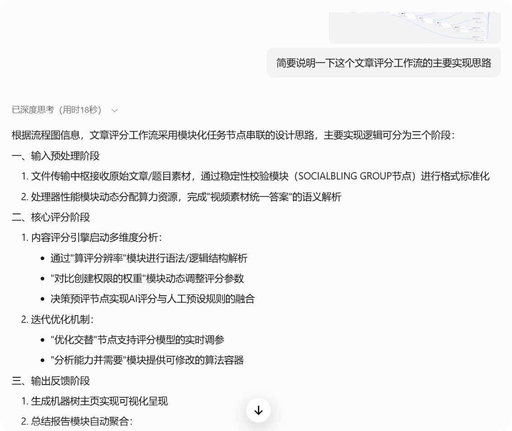

是不是还是不够通俗易懂，我们让DeepSeek用大白话再解释一下,下面清晰了吧。

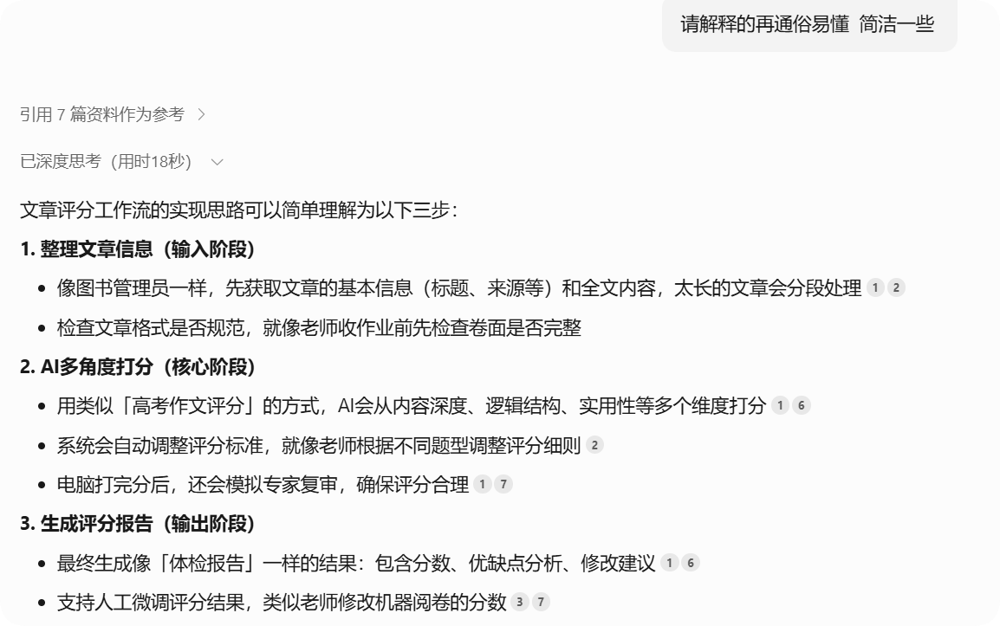

但是注意，到这一步还只是个中等难度的智能体。**因为它只有一个线性的工作流**！

工作流只有1个，还是相对线性，逻辑不是很复杂的这种工作流智能体，我们姑且称之为中等难度的智能体。

（4）那什么是复杂难度的智能体？

     

根据业务实现逻辑，将简单智能体+次中等难度智能体+中等难度智能体有机地组装在一起，是他们能够智能分工协作，就是复杂难度的智能体，也叫多智能体（Muti-Agent）!这种智能体已经到了商用级别！**换句话说可以卖钱了！**

比如前段时间爆火的Manus，是属于多智能体中的更系统更复杂的工程项目化的智能体。可以我之前的这篇文章。

也有复杂难度低点的智能体，比如下边这种，用户界面已经是Web页面，而相关的工作已经达到了5条，也使用到了数据库！

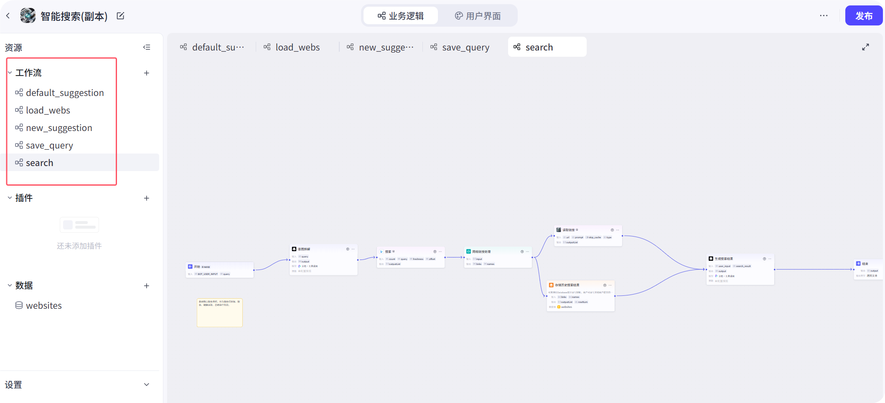

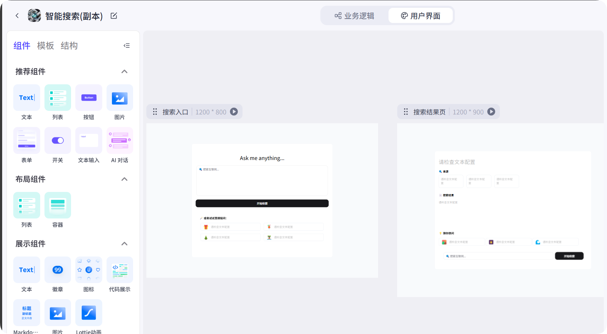

好，今天的公开课就先讲这！

本来这篇还设置了下面三个讨论方向，但是上面的文章一不小心就写长了，也就不拖堂了，我们第2节课再讲下面三个主题。

<callout emoji="🐋">
1.**智能体的常见表现形式**
2.**智能体制作平台和工具**
3.**智能体制作的原则与步骤**
</callout>

<callout emoji="😘">
**《人人都会做智能体》**知识库正在建设中，感兴趣的朋友请点击下方的阅读原文，或者后台输入关键词**“知识库”**！
</callout>