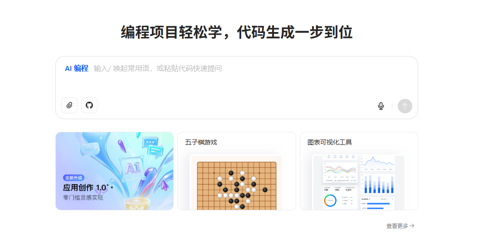

# 傻瓜式的可视化编程,正让知识学习变得更有趣

哈喽，Everybody, I'm 九歌～一个智能体空想家。

我最近把市面上的可视化编程软件都体验了一番,什么豆包的AI编程、扣子空间的网站开发专家、美团的NoCode、百度的秒哒、Poe的AppCreator，整体来说，各有各的优点，也都也明显的不足。今天不去比较这个，聊聊可视化编程，也可以说氛围编程Vibe Coding，对知识学习带来的影响。

可视化编程可以让普通人随手做出一个不错的交互式网页，可以是小游戏，也可以是在线工具，甚至是产品Demo，简直把产品经理武装到了牙齿。

**那学习，这件公认的、有点反人性的苦差事，能不能也用这种“氛围感”的方式，让它变得跟打游戏一样好玩？**

答案是，绝对能！而实现这个魔法的“神兵利器”，就是现在越来越猛的**可视化编程**。

#### **第一点：颠覆“呈现方式”——从“你看我听”，到“你来上手”**

咱先努力回忆一下，以前上学时最痛苦的是啥？

我猜很多人跟我一样，最怕那些抽象的概念。什么物理里的“力的相互作用”，化学里的“氧化还原反应”，金融里的“期权涨跌”，广告里的“CPC扣费”……

我记得高中刚开始学函数f(x)时，有个将f(x+3)变成f(x)，我死活理解不了，晚上大家都睡觉了，我就跑厕所去想，到底什么原理，后来终于顿悟了。

要是当时我能自己做个下面视频这样的网页，我就不用天天晚上跑厕所了！

<figure view-type="Preview"><source mime="video/mp4" origin-height="866.000000" origin-width="1040.000000"/></figure>

大部分时候的学习过程，老师在上面讲得口干舌燥，我们在下面听得云里雾里。知识是单向灌输的，就像看一场电影，我们永远是观众，没法参与进去。

**但可视化编程干了件最颠覆的事：它把电影院，直接改造成了游乐场。**

我们不再是观众，我们是玩家！

想象一下，学“自由落体”。以前是背公式 `h = ½gt²`。现在呢？我直接用AI生成一个“物理沙盘”小网页。

这个沙盘上有个按钮，可以切换“地球模式”、“月球模式”、“火星模式”。你亲手把一个小球拖到屏幕顶上，然后松手。

- 在“地球模式”下，“嗖”一下就掉下来了。
- 你切换到“月球模式”，再试一次，小球慢悠悠、轻飘飘地往下落。

<figure view-type="Preview"><source mime="video/mp4" origin-height="868.000000" origin-width="1056.000000"/></figure>

就在你来回切换、反复“玩”的那几分钟里，你对“重力加速度”这个概念的理解，绝对比你背十遍公式来得深刻。因为你“体验”到了。

看，这就是关键！

可视化编程把抽象的“因果关系”，变成了你能亲手触发的“即-时-反-馈”。**你动一下，它就变一下。** 知识不再是静态的结论，而是一个你可以反复试探、探索边界的动态过程。这种“玩中学”的沉浸感，简直是降维打击。

#### **第二点：重构“思路逻辑”——从“老师的脑子”，到“你的沙盘”**

这时候你可能会说：“九歌你说的这个好是好，但做这么个‘物理沙盘’，肯定得找个程序员搞半天吧？”

问到点子上了！这正是过去最大的坎儿。

一个好老师最牛的地方在哪？不是他知识点背得有多熟，而是他能把一个巨复杂的问题，用一套自己独特的“思路逻辑”给你讲明白。比如用各种绝妙的比喻、清晰的步骤分解。

但问题是，这套“独门秘籍”，以前只存在于老师自己的脑子里。他能讲给你听，但没法把这个“思维工具”直接塞给你用。

**而现在，AI来了，游戏规则彻底变了。**

你完全可以用嘴告诉它：

“帮我期权涨跌原理的动画网页。”

AI助教就能“听懂”你这个想法，然后帮你把这个“思路逻辑”，翻译、实体化，最终生成一个你可以交互的“期权沙盘”。

<figure view-type="Preview"><source mime="video/mp4" origin-height="882.000000" origin-width="1016.000000"/></figure>

这意味着什么？

**这意味着，它把一个优秀教师脑子里最宝贵的“思路逻辑”，从一个“私有财产”，变成了一个谁都可以上手把玩的“公共玩具”。**

这个AI助教就是一个学习方面的智能体呀，智能体最重要不就是行业的Know How和数据。Know How可以依靠知识库和工作流解决。

知识库+工作流+可视化编程，绝配！

未来，任何一个有好想法的老师，甚至每一个爱琢磨的学生，都能把自己的奇思妙想，轻松变成一个独一无二的学习工具。知识不再是出版社印好的、标准化的罐头，而是可以被我们每个人自由探索、解构和再创造的乐高积木。

所以你看，可视化编程这东西，为啥说它牛？

- **一是呈现方式上，它把学习的“被动接收者”，变成了“主动探索者”。**
- **二是思路逻辑上，它把顶尖教师的“隐性智慧”，变成了人人可用的“显性工具”。**

这才是学习未来该有的样子。