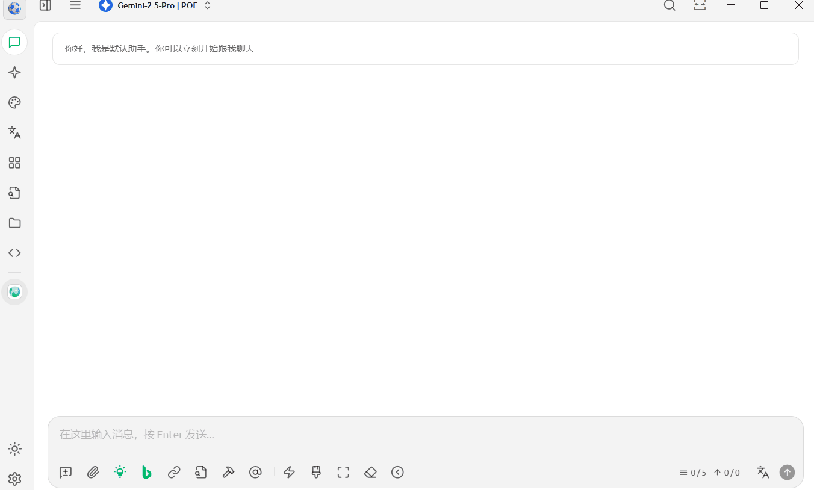
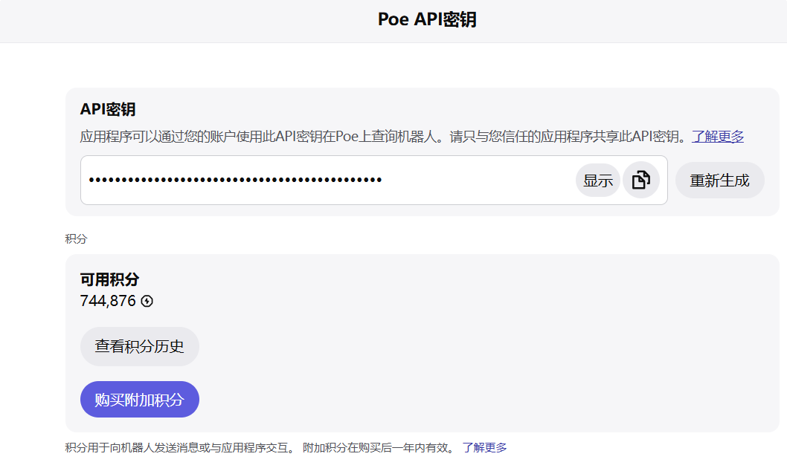
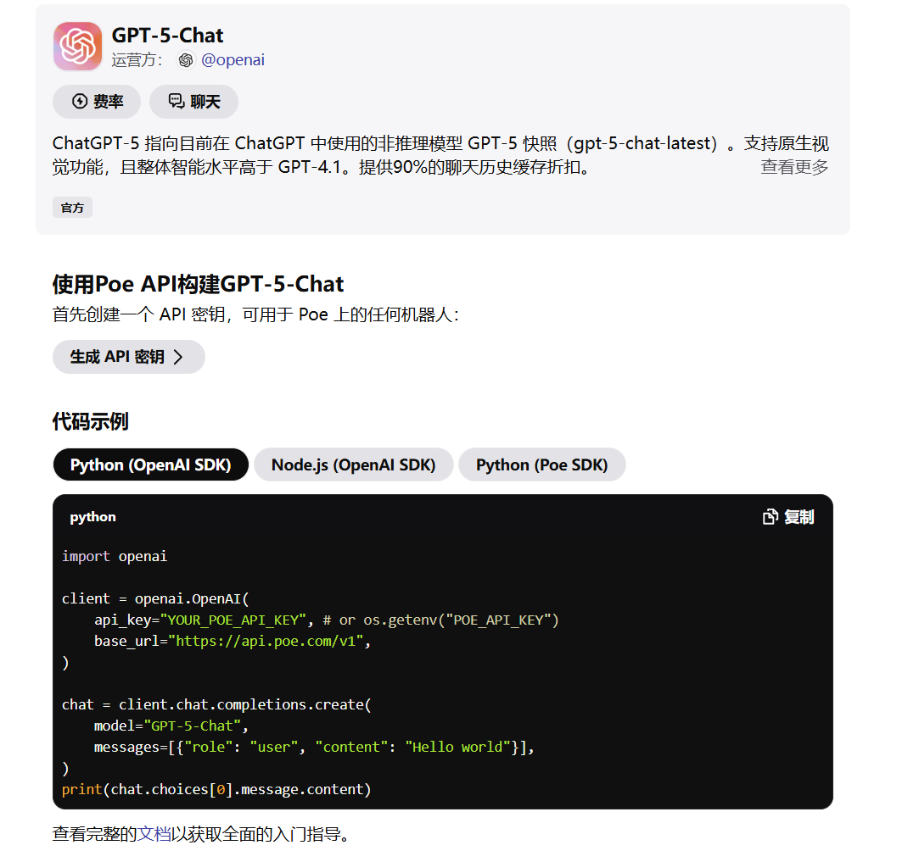
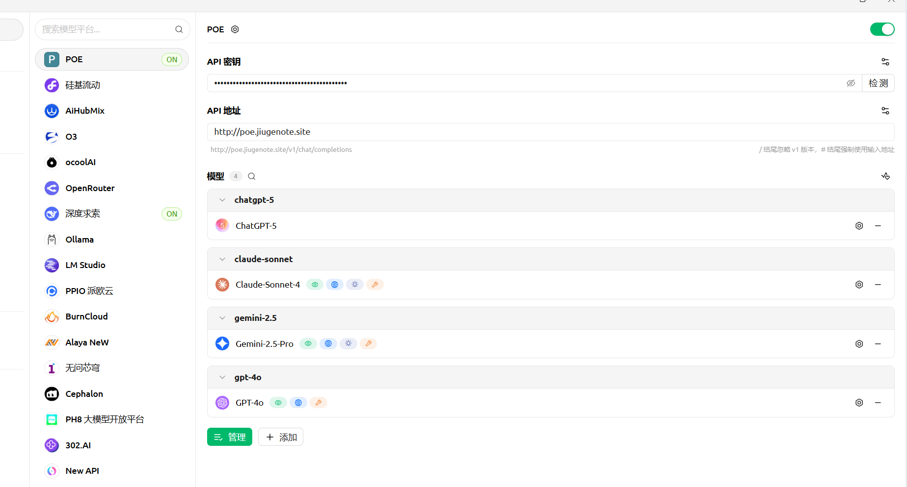
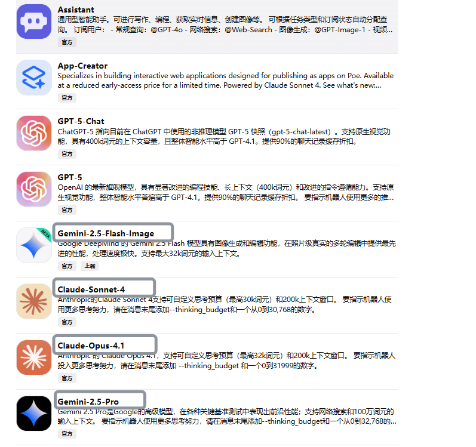
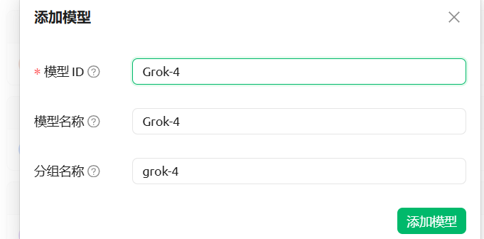
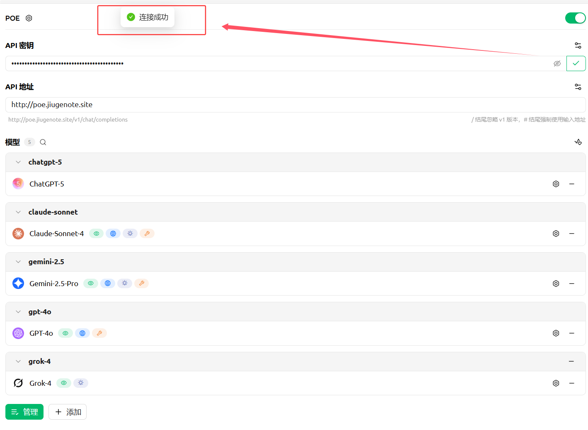

# 国内流畅使用GPT-5、Gemini2.5 Pro教程,手把手教你将Poe API集成到CherryStudio

当今世界，大模型哪家强？

我认为现在是群雄逐鹿的时候，虽然编程等一些垂直领域，Claude-4稳坐第一把交椅，但是最后三分天下有其一的，未必就是它。

作为AI用户，当然要积极享受当前的AI红利，不要将自己局限在某个平台，尽量的多去了解一下每个大模型的脾气和秉性，为后面创建智能体或者自己的AI数字员工，选择合适的大脑。我目前创意和文案的主力模型是Gemini2.5 Pro和腾讯元宝的DeepSeek R1,编程主力是Trae国际版的Claude 4。

为了能够更好更方便的自如切换和使用各种大模型，同时方便的管理，最通用的解决方法就是直接使用像CherryStudio、ChatBase这样的AI客户端，一键接入各种大模型的API，但是直接调用API，Token一旦超量，国外这些模型花费还是非常高的，所以我更喜欢每月会员付费的方式。

先给大家看一下，我直接在国内使用Gemini2.5Pro的效果，没有使用科学上网。



在之前的图文中，给大家介绍过Poe,一个套壳平台，可以使用国内外各种大模型，每月只需20每月就能拥有100万积分，完全够用了。7月底的时候，竟然开放了API，直接将Poe的服务像调用OpenAI接口一样，用到像Cursor、Cline、CherryStudio中。


其实Poe之前就提供过API功能，但是限制太多，这次开放，允许你可以把Poe 上任何一个公开bot 当成大模型来调用。注意，是任何一个bot，这就是它openrouter这种服务商最大的区别。比如你可以直接调用Poe 的App Creator服务，制作零代码AI应用，你可以直接调用GPT4o生成吉卜力风格的图片，你也可以调用你在Poe上创建的提示词机器人。

常见的Claude、Gemini2.5等模型就更不用说了，每个机器人直接增加了一个api调用说明，简直不要太贴心。       

最重要的是调用API消耗的还是你的订阅积分，跟你用网页端Poe方式一样，这样你就不需要像使用GPT一样，既要买会员又要api充值了，20美元送100万积分，对个人来说绝对够用了。

说了这么多，我们来看一下，如何将Poe 集成到 CherryStudio中吧。

**1.Poe 付费购买会员，并开通API。**

访问https://poe.com/api_key，生成API key 



**2.选择需要使用的机器人，查看API调用方式。**



**3.打开CherryStudio，找到设置按钮，添加供应商，填写API密钥和API地址。**



这个时候大家发现问题了，Poe国内无法直接访问，怎么办，你直接填上https://api.poe.com/v1 这个API地址，是无法访问的。

**怎么办？哈哈，我已经给大家解决了，我自己写了个代理服务，放在了一个腾讯云新加坡服务器上，你只需要将API地址改为 http://poe.jiugenote.site就可以了，免费的。如果觉得不安全，可以自己部署，代理脚本直接放在文章最后。**

**4.添加模型，将Poe的bot名字，填写到模型ID，或者从bot的API属性中，复制model变量的值**





添加模型完毕后，点击API密钥后面的检测按钮，就可以测试连接是否成功，如果没有问题，就可以正常使用了。



大功告成，就是这么简单，大家感兴趣的，赶紧动手吧！

<callout emoji="🍰">
**附Python代理脚本**
</callout>

```Python

import httpx
from fastapi import FastAPI, Request
from fastapi.responses import StreamingResponse
import uvicorn

# Poe API 的目标主机
POE_API_HOST = "api.poe.com"

app = FastAPI()

# 创建一个可复用的 httpx 异步客户端
client = httpx.AsyncClient(base_url=f"https://{POE_API_HOST}", timeout=30.0)

@app.api_route("/{path:path}", methods=["GET", "POST", "PUT", "DELETE", "OPTIONS", "HEAD", "PATCH"])
async def reverse_proxy(request: Request, path: str):
    """
    一个通用的反向代理，将请求转发到 POE_API_HOST。
    """
    # 构建目标 URL
    target_url = httpx.URL(path=f"/{path}", query=request.url.query.encode("utf-8"))

    # 准备请求头
    headers = {k: v for k, v in request.headers.items() if k.lower() != 'host'}
    headers['host'] = POE_API_HOST # 必须将 Host 头设置为目标主机

    # 准备请求体
    req_content = request.stream()

    # 发送请求到目标服务器
    proxied_request = client.build_request(
        method=request.method,
        url=target_url,
        headers=headers,
        content=req_content,
    )
    proxied_response = await client.send(proxied_request, stream=True)

    # 将响应流式传回
    return StreamingResponse(
        proxied_response.aiter_bytes(),
        status_code=proxied_response.status_code,
        headers=proxied_response.headers,
        media_type=proxied_response.headers.get("content-type"),
    )

if __name__ == "__main__":
    # 启动uvicorn服务器
    uvicorn.run(
        "poeapi:app",
        host="0.0.0.0",
        port=8090,
        reload=True,
        log_level="info"
    )
```