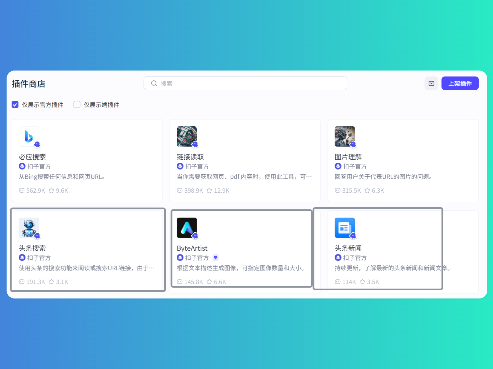
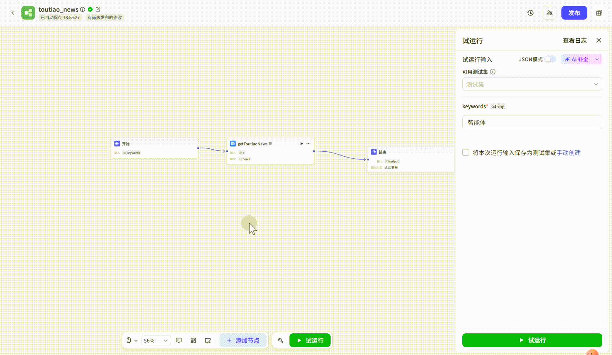
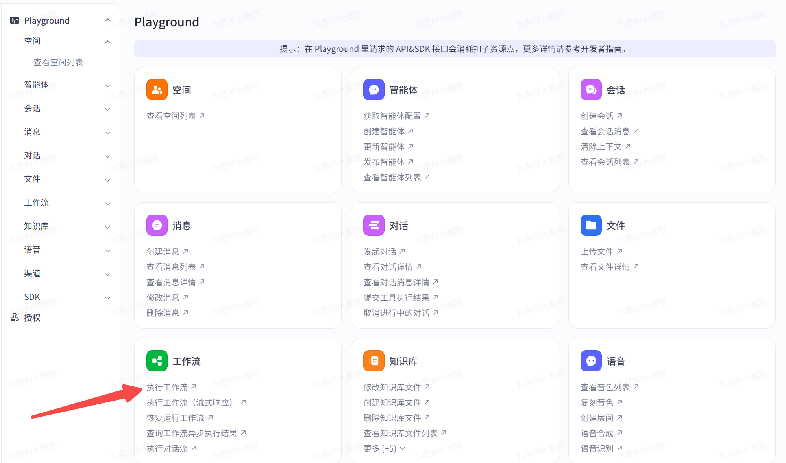
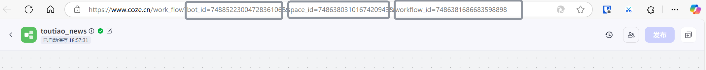
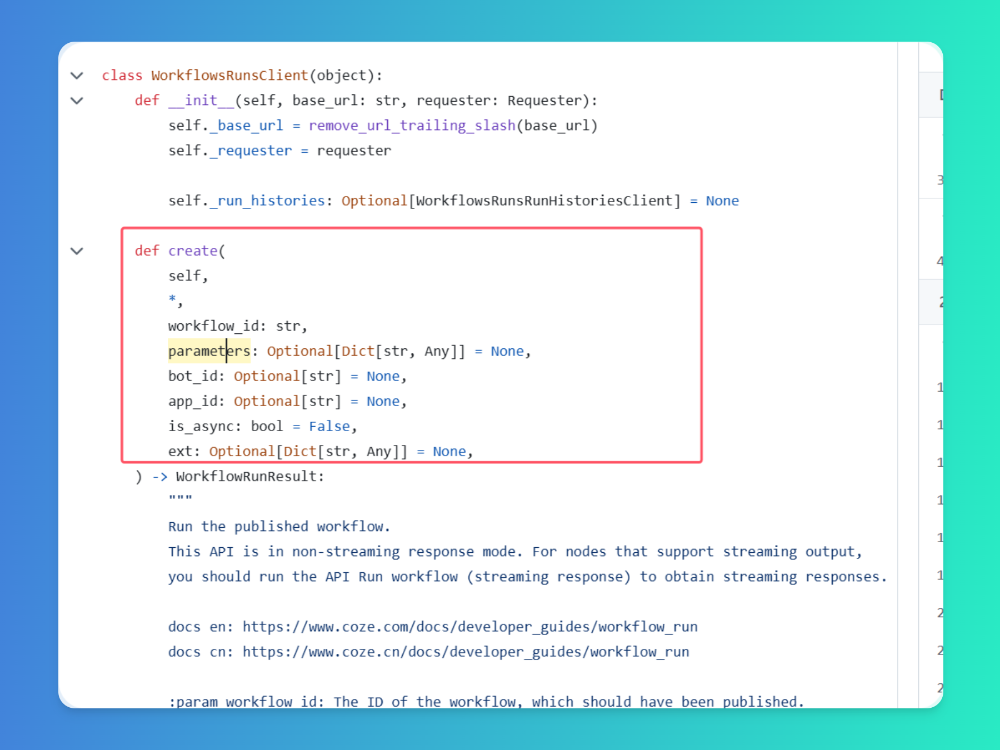
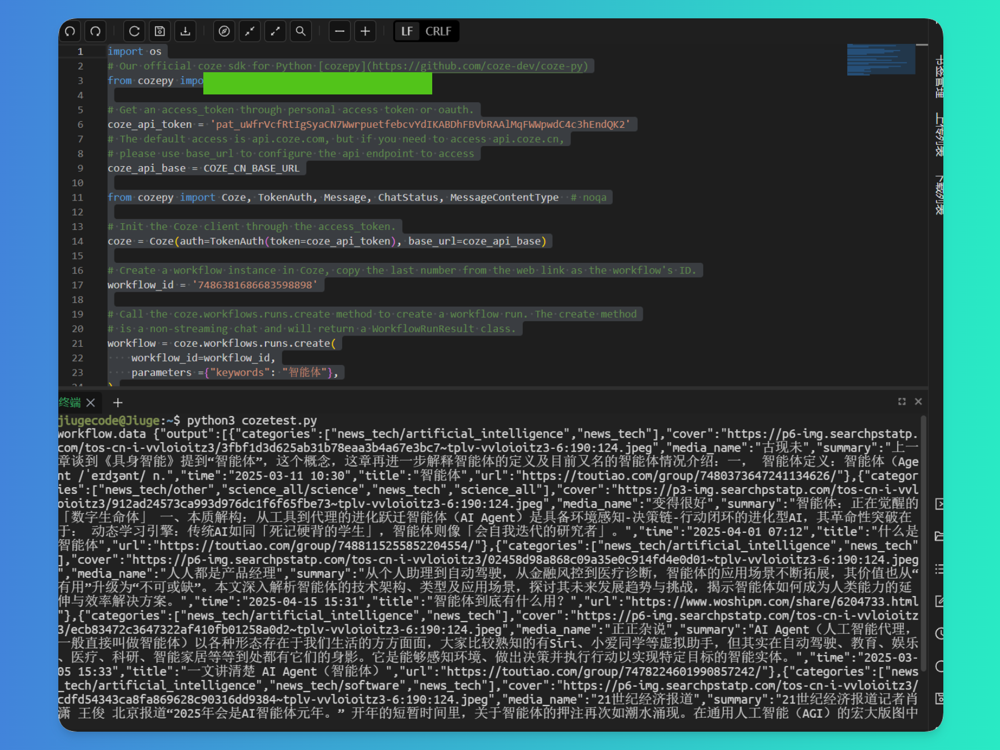
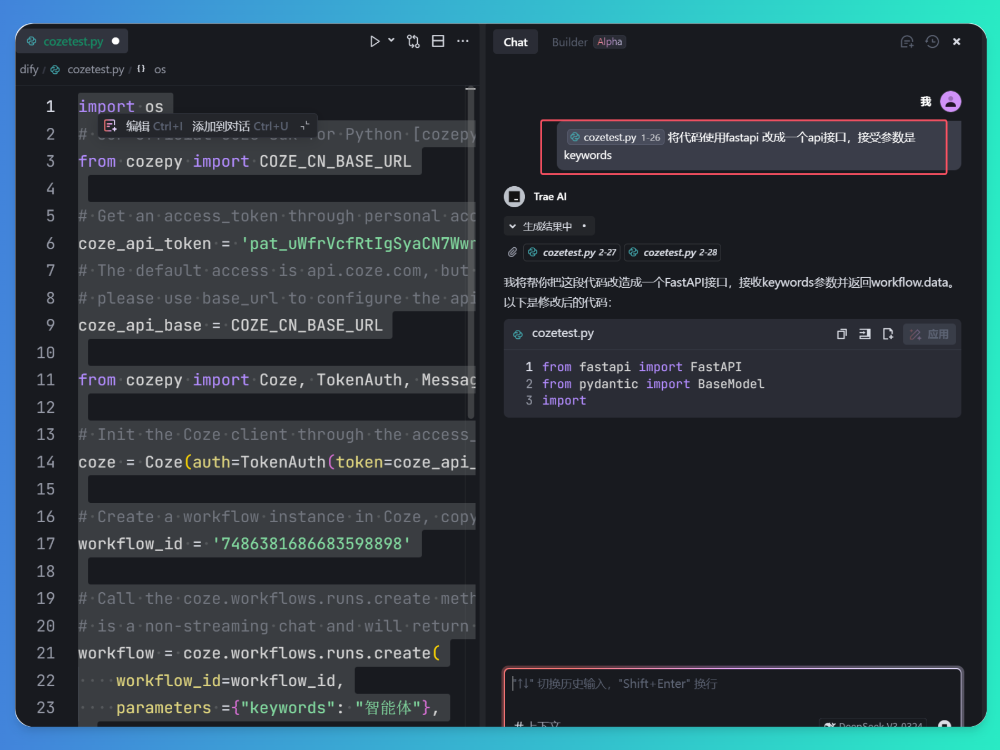
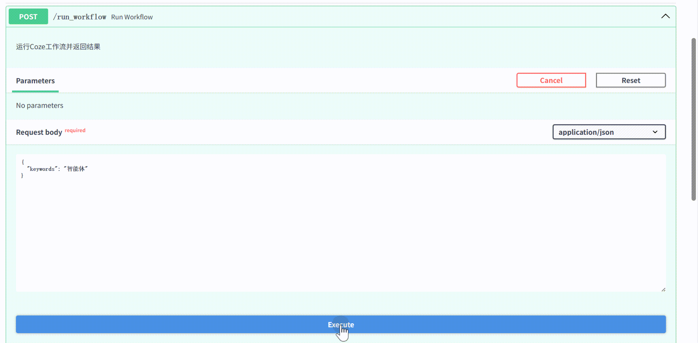
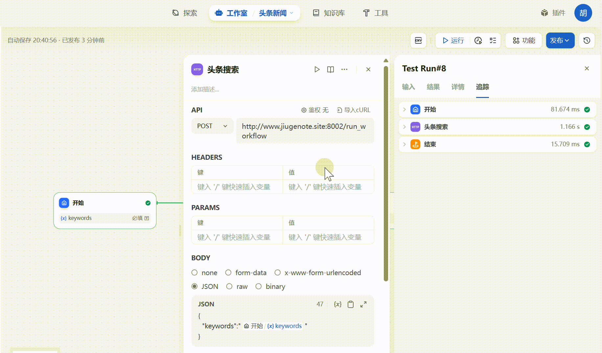

# 如何在Dify工作流节点中使用Coze的插件商店

大家好，我是九歌。

在前几天的文章《论MCP Server与工作流在智能体开发场景中的作用和区别》，我提到了一个观点，MCP和工作流的关系将是你中有我，我中有你。Dify工作流可以将MCP Server作为工作流中的某个关键节点；同样，Dify工作流可以发布为Mcp Sever，由大模型选择和使用。

同样，对于各大智能体开发平台来说，不管是生态庞大的Coze还是开源界的扛把子Dify,在将来也是这种互联互通的状态，只要他们各家的API足够开放就行。

比如，因为Coze的爸爸就是字节跳动，他家的插件中自然少不了头条内容的支持。



比如头条新闻，我们顺手搭建一个Coze工作流，就能够使用该插件。开始节点用户可以输入搜索词，插件帮助返回相关的最新新闻资讯。



但是，如果我们想在Dify中使用头条新闻这个插件，直接根据搜索词获取最新的新闻资讯，可就难了。

还好，Coze的API功能足够强大，足够开放，我们通过Coze API可以调用任何一个工作流或者智能体！如果我们想使用Coze的某个插件，直接将其包装在工作流中，然后通过在Dify使用接口调用节点的方式，不就可以愉快地在Dify中使用Coze的插件了嘛！！！



Coze的API功能提供了PlayGround功能，也就是可以在线可视化测试，通过下面的网页，我们可以很清楚知道，调用Coze工作流Api，需要设置好workflow_id、bot_id、parmeters、is_async等多个参数值。


上面的几个参数，我们可以很容易在工作流的URL参数中获取到。



不过这里面有个坑，Coze的 Python调用方式，不管是个官方给的示例还是PlayGroud给出的示例代码，都没有说明工作流中的开始节点参数如何传入！！！所有我直接阅读了源码，搞明白了Coze API中 Python调用工作流，传入参数值的方式。

比如我们要使用的头条新闻工作流，开始节点要接收keyword这个参数，也就是用户想检索哪方面的新闻。



下面是补充完整的Coze工作流API，Python调用代码。

```python
import os
# Our official coze sdk for Python [cozepy](https://github.com/coze-dev/coze-py)
from cozepy import COZE_CN_BASE_URL

# Get an access_token through personal access token or oauth.
coze_api_token = '你自己的Coze token'
# The default access is api.coze.com, but if you need to access api.coze.cn,
# please use base_url to configure the api endpoint to access
coze_api_base = COZE_CN_BASE_URL

from cozepy import Coze, TokenAuth, Message, ChatStatus, MessageContentType  # noqa

# Init the Coze client through the access_token.
coze = Coze(auth=TokenAuth(token=coze_api_token), base_url=coze_api_base)

# Create a workflow instance in Coze, copy the last number from the web link as the workflow's ID.
workflow_id = '7486381686683598898'

# Call the coze.workflows.runs.create method to create a workflow run. The create method
# is a non-streaming chat and will return a WorkflowRunResult class.
workflow = coze.workflows.runs.create(
    workflow_id=workflow_id,
    parameters ={"keywords": "智能体"},
)
#将worlflow.data直接return 
print("workflow.data", workflow.data)
```

我们把上面这段代码在自己服务器或者电脑上跑一下，发现运行正常，可以很快得到头条新闻的搜索结果。



接下来，我们要把上面的代码封装成能够外部HTTP请求的接口。使用FastAPI就可以了。直接把代码扔给deepseek-V3，生成接口代码。



直接运动该代码，并测试这个接口，没有问题，一次成功！我们可以放在自己电脑上，或者直接部署到云服务器上都可以。



头条新闻的接口准备完毕，在dify中新建工作流，在开始节点添加变量"**keywords**"


添加**HTTP请求**节点，将搭建好的头条搜索API链接填写完整，并将开始节点传入的keywords设置到body请求信息中，点击运行就大功告成了。



以上就是一个非常简单的教程，抛砖引玉，教大家如何在Dify中使用Coze的插件生态。相关的代码和工作流我已经放在《人人都会做智能体》知识库，点击“阅读原文”或者后台回复“知识库”获取。