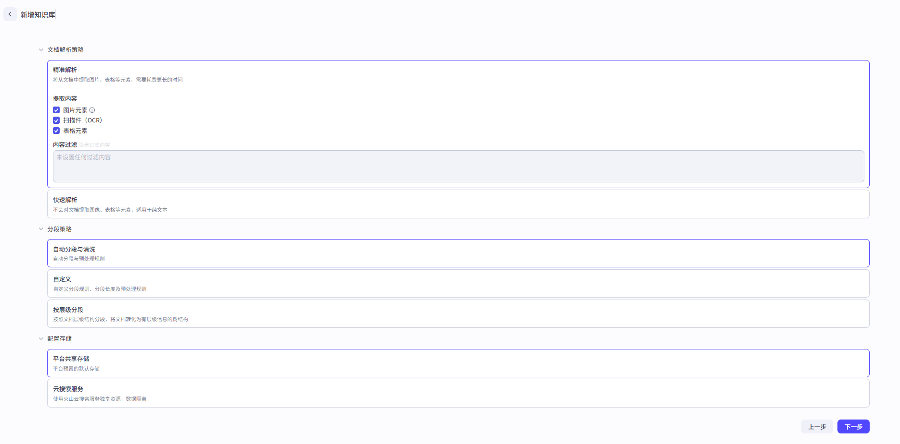
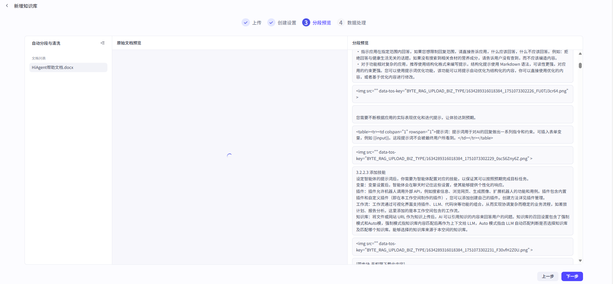

# 如何用好知识库，以搭建智能体编排助手为例

大家好，我是九歌。

今天跟大家分享一下，我是如何用知识库，搭建一个能够给我提供智能体编排建议的Agent的。全部操作都在Coze上完成。

更多的是感悟和经验分享，知识库的建设是一件长远的事情。

**（一）知识库的构建**

提示词和知识库的构建不言而喻。相比直接上手写提示词，我想花点时间，把这个助手的知识库认真的梳理一下，而不是找一些相关的文档直接上传。

一个智能体的生成质量，主要是两个关键因素：行业的KnowHow和数据。具体内容，可以看我之前写的这篇文章《行业Know How +数据准确=企业智能体两大护城河》。

回到智能体编排助手这个Agent为例，应该怎么建设它的知识库呢？

首先，我们可以肯定的是，智能体编程助手这个Agent，本质上是一个通用型的Agent,而通用行业知识的RAG，因为用户使用需求不确定，很难做出彩来，有时候还不如通用大模型。

举个例子，比如我想建一个编排一个财务相关的智能体，那么这个知识库中，是不是得有财务的专业经验和知识，

2.基于具体业务（智能体）的知识库容易确定边界和穷举

