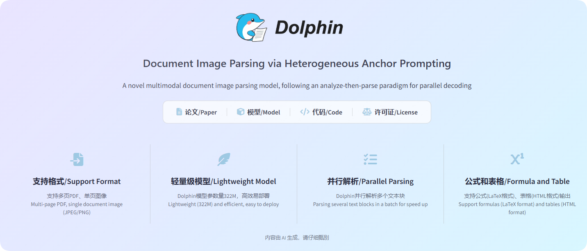
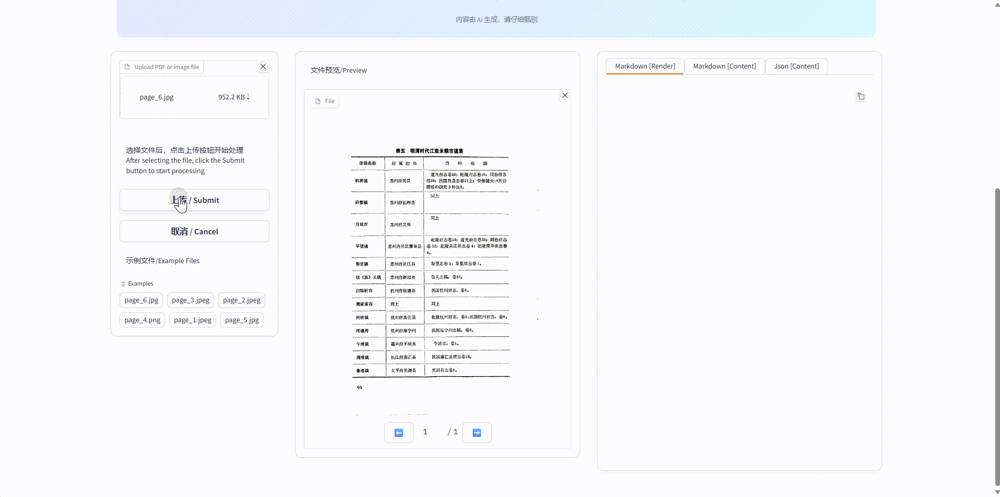
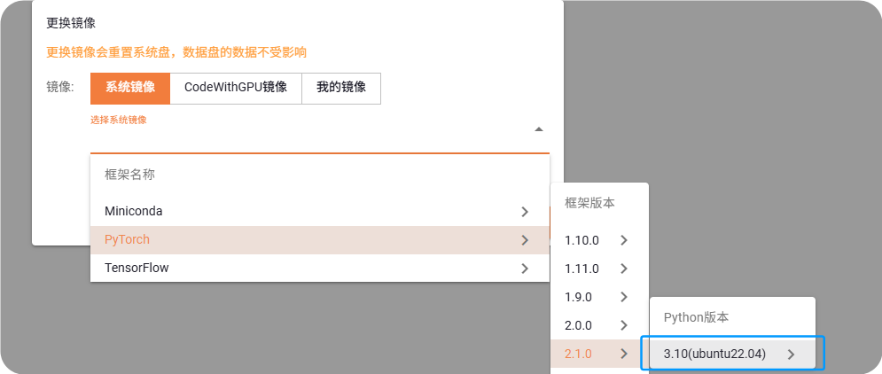
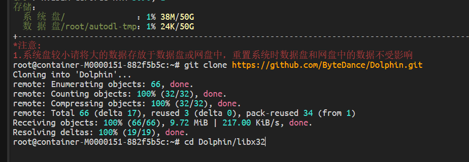
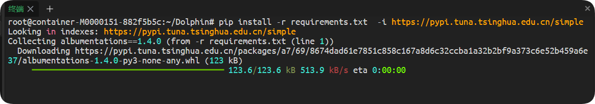
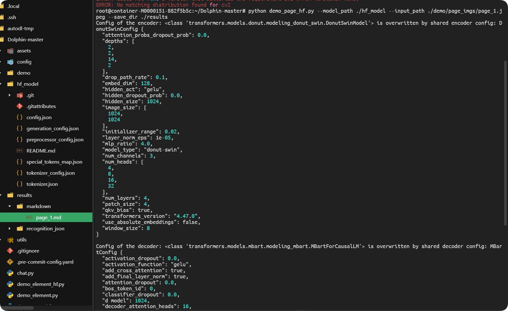
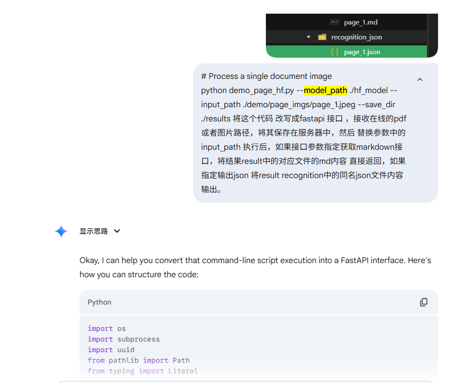

# 字节跳动Dolphin多模态文档解析神器开源，16G显存就能流畅运行，效果不输GPT4.1!

最近字节跳动开源了一款创新多模态文档图像解析模型——Dolphin，基于先解析结构后解析内容的两阶段方法，参数只有322M，16G显存就能流畅运行，而且效果比不输GPT-4.1！



目前支持Pdf和图片直接解析成Markdown和Json格式。官网直接给出了Demo在线地址，真的太良心了！直接上手体验！

```Plain Text
http://115.190.42.15:8888/dolphin/
```

**（1）15秒识别表格图片**



**（2）30秒识别公式**


是不是很酷的感觉，我看了一下github项目文档，安装也非常简便，我们按照教程一步步来。

1.根据Dolphin项目requirements.txt要求，准备安装环境，安装torch2.1.0版本环境。我这里准备了一个干净的docker容器。



2.下载 Dolphin Github 项目仓库

```Plain Text
git clone https://github.com/ByteDance/Dolphin.git
#下载慢的，直接下载zip文件，上传到服务器
```



2.下载安装所有依赖（Long time！！），这里浪费了我一个小时时间。

```Plain Text
pip install -r requirements.txt  -i https://pypi.tuna.tsinghua.edu.cn/simple
```



3.接下来我们需要安装Git LFS，方便下一步下载模型大文件。

```Plain Text
apt update
apt install git-lfs
```

4.下载预训练模型文件，这个模型文件托管在HuggingFace网站上，国内是无房直接访问的。还好我之前吃过亏，这里直接使用了HuggingFace的国内镜像站

```Plain Text
#切换到终端到项目文件夹，执行下方命令
git clone https://hf-mirror.com/ByteDance/Dolphin  ./hf_model
```


5.激动的时刻来了，运行测试命令

```Plain Text
python demo_page_hf.py --model_path ./hf_model --input_path ./demo/page_imgs/page_1.jpeg --save_dir ./results
```



整体比较顺利。下面我们把这个服务做成API，这样就可以用在我们的智能体工作流中了！

在Google Gemini中输入一下提示词，就可以使用FastAPI创建接口了。

```Plain Text
# Process a single document image 
 python demo_page_hf.py --model_path ./hf_model --input_path ./demo/page_imgs/page_1.jpeg --save_dir ./results   将这个代码 改写成fastapi 接口 ，接收在线的pdf或者图片路径，将其保存在服务器中，然后替换参数中的input_path 执行后，如果接口参数指定获取markdown接口，将结果result中的对应文件的md内容 直接返回，如果指定输出json 将result recognition中的同名json文件内容输出。
```



  我们再安装fastapi、uvcorn、httpx 等Python库，然后运行生成的代码，就可以拥有Dolphin的接口了！

