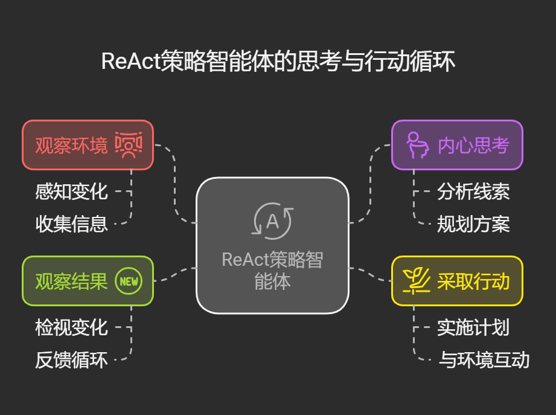
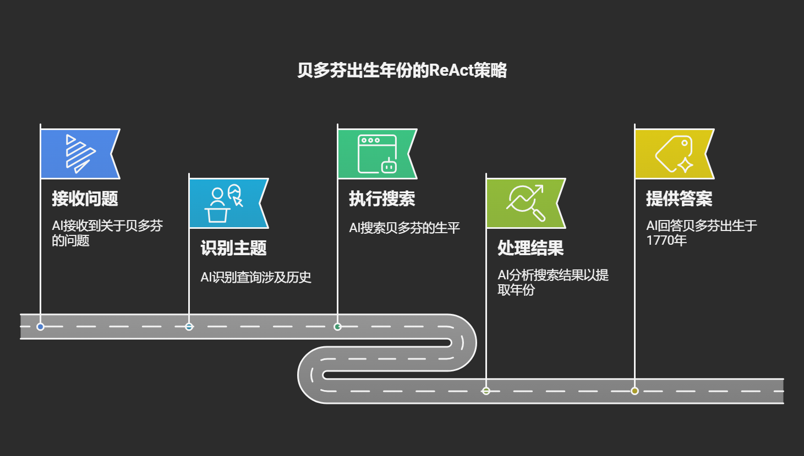
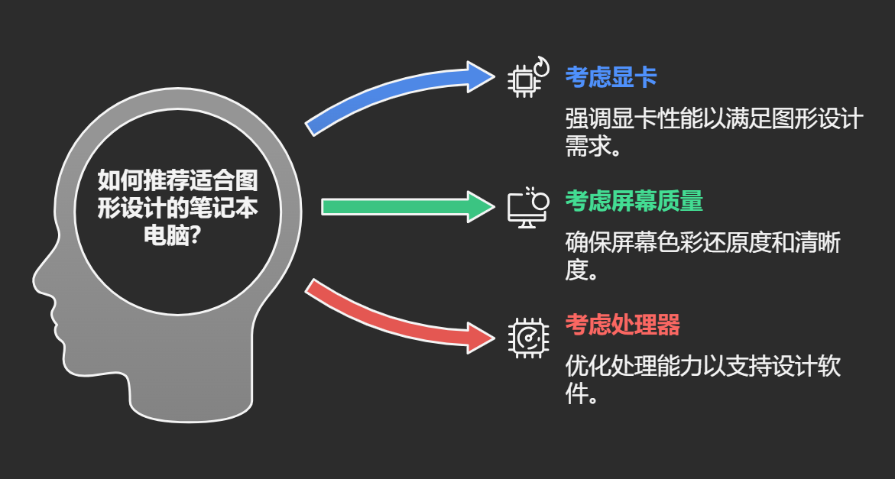

# 工具调用×大模型思考=超级智能体：ReAct 策略如何改变AI能力

想象一下，如果普通AI是一个只会机械执行指令的机器人，那么采用ReAct策略的智能体就像是一个会先思考后行动的侦探。

在解决问题时，它不会匆忙跳入结论的深渊，而是沿着"观察-思考-行动-观察"的螺旋阶梯，一步步接近真相。这就是ReAct（Reasoning + Acting）策略的魅力所在。

## ReAct策略：智能体的"内心独白"与"外在行动"

ReAct就像给AI装上了"内心独白"和"行动执行器"两个齿轮，让它们交替转动：

1. **观察环境**：智能体睁大眼睛，感知周围世界
2. **内心思考**：像侦探一样在脑海中分析线索，规划方案
3. **采取行动**：迈出实际步伐，与环境互动
4. **观察结果**：检视行动带来的变化，为下一轮思考提供新线索

这种策略让AI不再像无头苍蝇般乱撞，而是像国际象棋大师，每走一步棋都经过深思熟虑。



## 案例一：寻找名人出生年份

想象智能体面对这个问题："贝多芬出生于哪一年？"

**伪代码示例：**

```Plain Text
观察：收到问题"贝多芬出生于哪一年？"

思考：这是关于历史人物的问题，我需要查找贝多芬的生平信息。

行动：[搜索] 查询"贝多芬生平"

观察结果：搜索返回"路德维希·范·贝多芬(1770-1827)，德国作曲家..."

思考：从结果中我可以看到贝多芬的出生年份是1770年。

行动：[回答] "贝多芬出生于1770年。"
```

这个过程就像一个学生在做历史作业，先理解问题，思考获取信息的方法，查阅资料，最后从资料中提取答案。

## 案例二：解决需要多步推理的复杂问题

现在来看一个更复杂的问题："贝多芬和莫扎特谁的音乐生涯更长？"

**伪代码示例：**

```Plain Text
观察：收到问题"贝多芬和莫扎特谁的音乐生涯更长？"

思考：要比较音乐生涯长度，我需要知道两人的出生年份、逝世年份以及开始创作音乐的时间。

行动：[搜索] 查询"贝多芬生平"

观察结果：得到"路德维希·范·贝多芬(1770-1827)，8岁开始学习音乐..."

思考：贝多芬1770年出生，1827年逝世，8岁开始音乐生涯。下面我需要查询莫扎特的信息。

行动：[搜索] 查询"莫扎特生平"

观察结果：得到"沃尔夫冈·阿玛多伊斯·莫扎特(1756-1791)，5岁开始作曲..."

思考：莫扎特1756年出生，1791年逝世，5岁开始音乐生涯。现在我需要计算各自的音乐生涯长度。

行动：[计算] 贝多芬音乐生涯 = 1827 - (1770 + 8) = 49年
         莫扎特音乐生涯 = 1791 - (1756 + 5) = 30年

思考：经过计算，贝多芬的音乐生涯为49年，莫扎特为30年，所以贝多芬的音乐生涯更长。

行动：[回答] "贝多芬的音乐生涯更长，共49年。而莫扎特的音乐生涯为30年。虽然莫扎特更早开始(5岁)，但贝多芬活得更久，因此创作时间更长。"
```

这个例子就像解谜游戏，需要收集多块拼图，通过逻辑推理将它们拼接起来，才能看到完整图景。



## ReAct策略如何提升智能体能力

### 像导航仪一样校正路线

普通AI像一个按照固定路线前进的火车，而ReAct智能体则像一辆装有GPS的汽车，每行驶一段距离就会重新评估位置，随时调整路线。当遇到错误转弯时，它会立即察觉并纠正，而不会固执地走向错误目的地。

例如，在搜索"拿破仑的出生地"时，如果第一次查询返回不明确结果，ReAct会思考："我需要更精确的查询"，然后尝试新的搜索词"拿破仑·波拿巴出生地详细信息"。

### 像拆解积木一样分解问题

面对"计算爱因斯坦发表相对论时的年龄"这样的复杂问题，ReAct会将其分解为：

1. 查询爱因斯坦出生年份
2. 查询相对论发表年份
3. 计算两者之差

这就像厨师先准备所有食材，再一步步完成烹饪，而不是盲目地一股脑儿把所有东西倒入锅中。

## 生活中的ReAct应用场景

### 智能购物助手

想象一个帮你选购新笔记本电脑的ReAct智能体：

```Plain Text
用户：帮我推荐一台适合图形设计的笔记本电脑。

思考：用户需要适合图形设计的笔记本，应该考虑显卡性能、屏幕色彩还原度和处理器性能。

行动：[检索] 查询"2025年图形设计推荐笔记本"

观察结果：得到多款高性能笔记本信息...

思考：需要了解用户预算和对轻薄度的要求。

行动：[询问] "您的预算大约是多少？对笔记本的轻薄度有要求吗？"

用户：预算8000元，希望便于携带。

思考：根据预算和轻薄需求，需要在性能和便携性间平衡...

...（持续思考-行动循环）

行动：[推荐] "根据您的需求，我推荐以下三款笔记本..."
```

这个过程就像一位经验丰富的导购，不断通过交流了解需求，思考可行方案，最终提供个性化建议。



### 健康顾问机器人

一个帮助用户制定健身计划的ReAct智能体：

```Plain Text
思考：需要了解用户的身体状况、健身目标和时间安排。

行动：[询问] 收集用户基本信息...

思考：用户是健身新手，希望增肌，每周有3天时间锻炼，需要设计循序渐进的计划。

行动：[检索] 查询"初学者增肌训练计划"

思考：根据用户情况，建议先从基础动作开始，逐步增加强度...

行动：[生成] 制定个性化的三阶段健身计划...
```

就像一位私人教练，ReAct智能体不仅提供标准化建议，还会根据用户的特点和反馈不断调整计划。

## 思考：AI的思考之舞

ReAct策略为智能体带来了"思考与行动"的双重能力，如同赋予机器一种特殊的舞蹈节奏。在这场舞蹈中，思考是审慎的步伐，行动是舞者的跃动，两者交织形成优雅而高效的问题解决流程。

通过这种交替前进的方式，AI不再是简单的命令执行者，而成为了能够思考、规划、执行和调整的智能助手。在未来的AI发展中，ReAct策略无疑代表了从"机械反应"到"思考行动"的关键跨越，为构建更智能、更自然的人机交互铺平了道路。

正如侦探需要线索、推理和行动才能破案，配备ReAct策略的智能体也能够在复杂多变的世界中，以更加人性化的方式帮助我们解决各种难题。