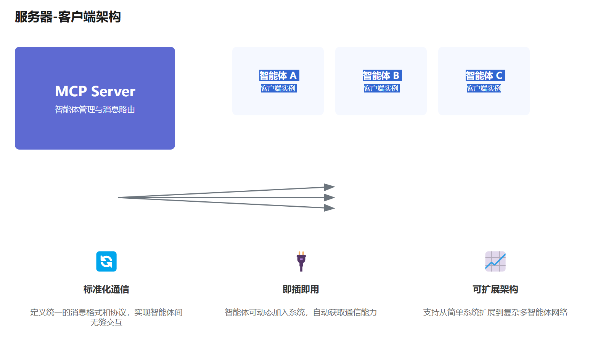
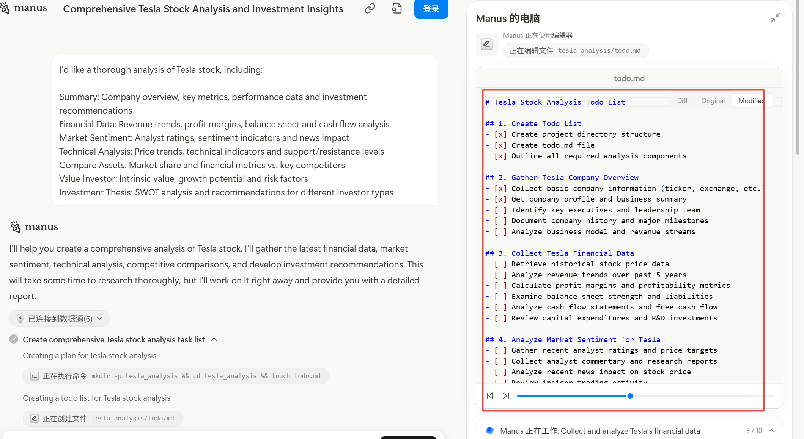
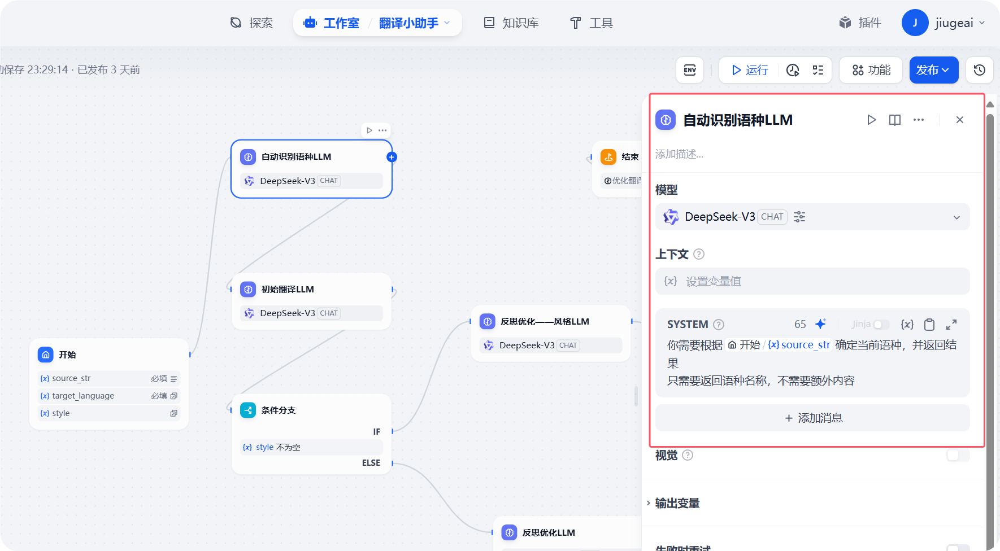
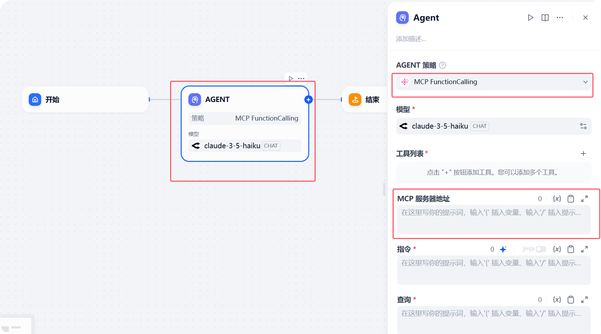
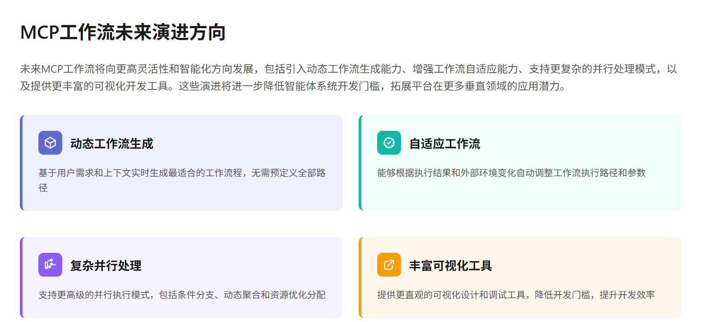

# 我悟了！论MCP Server与工作流在智能体开发场景中的作用和区别

文/九歌

图/长文配图助手

今天讨论的是个很无聊的话题---意义，但是却困扰我很长时间，下面我把最近关于智能体开发中工作流、Mcpserver的一些思考分享给大家。

阅读本文前，默认大家已经对智能体开发、Mcp工作流、Dify有了一定的认识，如果还没了解过，可以看我以前的文章。

其实不管工作流还是MCP Server,适合传统行业的,主要有以下两条智能体路线：  
  
1. 大模型+MCP+软件工具 ，这个更接地气，更有生产价值 ，因为专业数据和资料的生产处理依然教给传统专业的生产软件去操作，只是决策者由人变成了大模型。在这个路线中，大模型充当军师和将军的角色，出谋划策，排兵布阵和带兵打仗的活，都要一手抓。

  
2. 大模型+RAG+知识库/工作流，这条路目前研究的人也比较多，出现的也比较早，以Coze和Dify平台为例，但是目前真正有价值的落地场景还是屈指可数。玩过工作流的朋友，应该比较清楚，在这个路线中，大模型充当大头兵的角色，干的都是小活脏活累活。

  
上面两条线路的主要区别就是MCP模式和工作流谁占主导的问题。

Dify 类工作流，是一种人为设定的思维链和行动链，什么时候思考，什么时候用什么工具都由人设定好，基于人的专业能力而定。  
  
MCP模式是把思维和行动的权利让渡给大模型，让大模型通过 ReAct 这种范式，去决定下一步思考干什么，该用什么工具，调用哪些接口，获取什么数据。  
  
但是 MCP模式想做好，想要每次得到稳定可靠的输出结果，也必须要用结构化提示词或者工作流再去指导大模型使用MCP,基于 MCP的提示词设计和工作流设计也将会一种更高阶的编程语言。

到最后，就是你中有我，我中有你。Dify工作流可以将MCP Server作为工作流中的某个关键节点；同样，Dify工作流可以发布为Mcp Sever，由大模型选择和使用。

MCP Server与Dify工作流分别从协议层和应用层重构了智能体开发范式：前者如同"智能体的USB HUB"，解决工具接入标准化问题；后者则是"智能体的流程图绘制板"，解决任务执行结构化问题。二者的协同使用，既能通过MCP突破工具生态限制，又能借助Dify保证核心业务流程可控性，共同推动AI应用从"功能堆砌"向"智能协同"演进。

简而言之，MCP解决工具碎片化问题，Dify解决流程碎片化问题，共同构建完整Agent开发生态，两者是能力互补的关系。

不过作为大模型和MCP连接的平台，Cursor、Claude Desktop、Vscode + Cline以及各种收费或者免费的大模型Chat客户端，最近纷纷上线了功能。其实一般传统行业的软件都需要编程，所以 Cursor +MCP 更有实用价值，Chat 客户端+MCP 目前更适合个性化的小场景需求。

但是像什么操作文件列表  控制浏览器、读取数据库的单个MCP server ，感觉都很寻常的技术，不过是把之前的脚本 API 或者rpa技术 用MCP 协议封装成了MCP  server,原子化功能的mcp意义不大，怎么把这些能力缝合成一个能解决实际问题的业务项目才有意义。

  
三月初爆火的Manus把这些能力缝合了，但是做的还是那些采集数据写个没啥用的数据报告之类的场景。

  
核心还是业务需求  还是我们人的能力。我们到底想用来干什么，解决什么问题。这个东西纯靠技术，靠程序员是解决不了这个问题的。

  
所以智能体场景一定是垂直的，而不是通用的，真正能思考出落地业务场景的人，这个人可能就是项目经理  一线销售  公司老板 行业专家，但是这部分人精力有限，不能深入了解技术细节，可能又想不出很具体的基于 MCP 的场景需求来。主要问题是[技术方案](https://zhida.zhihu.com/search?content_id=716643652&content_type=Answer&match_order=1&q=%E6%8A%80%E6%9C%AF%E6%96%B9%E6%A1%88&zhida_source=entity)和[业务适配](https://zhida.zhihu.com/search?content_id=716643652&content_type=Answer&match_order=1&q=%E4%B8%9A%E5%8A%A1%E9%80%82%E9%85%8D&zhida_source=entity)两个部分从业者很难同时具备这两样能力。

发现真的对用户有价值的工作流，将会是这个行业的竞争力和壁垒，技术反而平权没有壁垒。

以上就是我最近一段时间的思考，分享出来，希望得到大家的积极评论和反馈。