# 智能体（Agent）的 3种表现类型：聊天助手、工作流与对话流

大家好，我是九歌AI，一名智能体科普与落地实践者。

在上一节《什么是简单、中等、复杂的智能体》一文中，通过对智能体组成的解构，相必大家对智能体已经有了一个比较粗浅的认知。

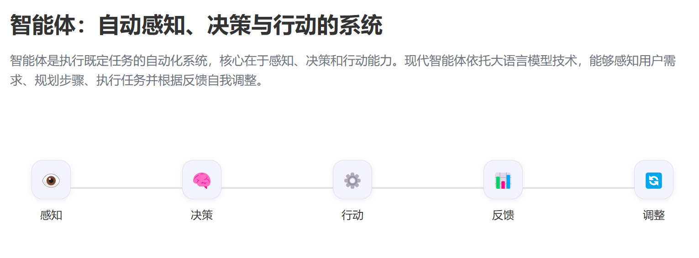

智能体主要由大语言模型（LLM）+ 提示词（Prompt）+知识库（RAG）+工作流（WorkFlow）+工具（Tools）等若干元素组成。

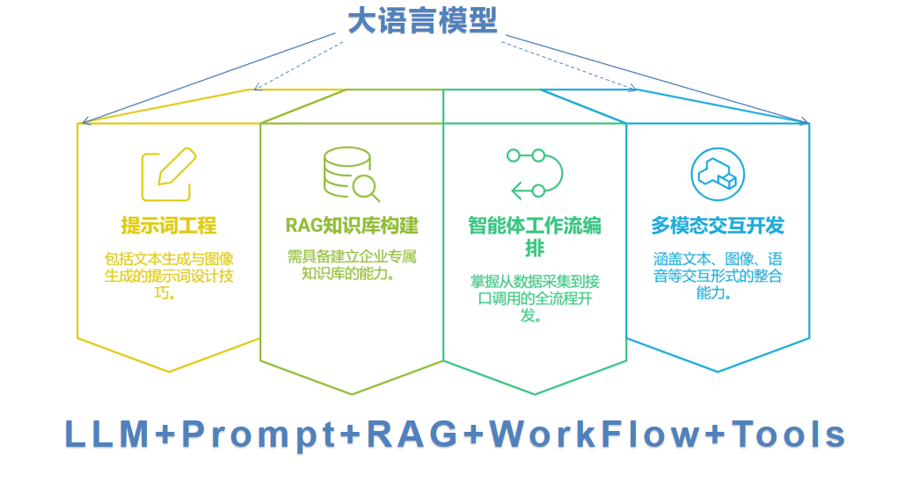

今天我们开启**《人人都会做智能体》**公开课第 2 节：智能体（Agent）的 3种表现类型——聊天助手类型、工作流类型、对话流类型。

「**本文配图主要来源于我的长篇图文写作助手**」

与智能体的组成不同，所谓的智能体表现模式，就是智能体呈现给大家的样子或者交互方式。智能体开发平台Dify里面，将智能体的类型分成了5种，但是我觉得这种分法很容易让初学者产生误解。

上图种的Agent竟然是应用类型，Agent不是智能体的英文名称吗？下图种工作流的节点也叫Agent??

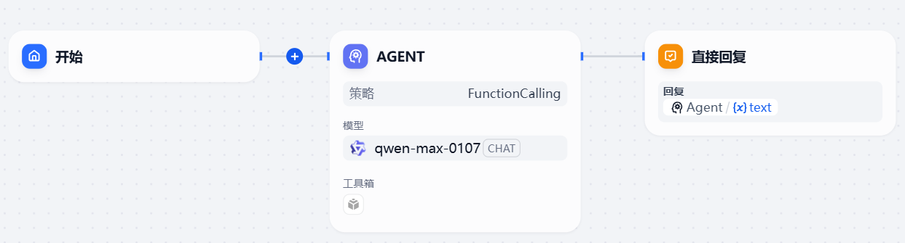

Dify的插件分类中也有Agent?另外Dify中的工具和插件的区别是什么？

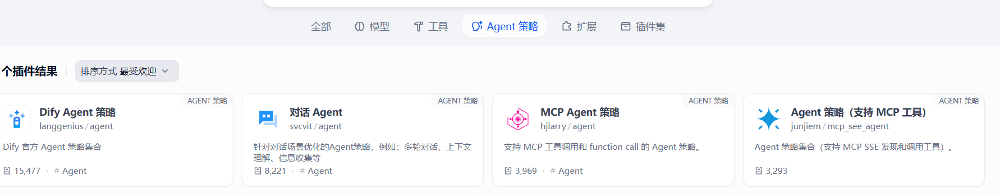

所以说，Dify产品虽然非常优秀，但是在我这种喜欢扣字眼的产品经理眼里，Dify对产品的功能组件的定义显得太过随意，大部分人只是时间长了，用习惯了，自然而然的接受了，但是对于初学智能体开发的人来说，理解这些功能将会非常痛苦。

经过对各种智能体的分析总结，智能体其实主要分为这么三类，下面给大家详细介绍一下。

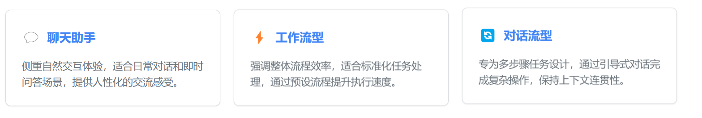

**（1）聊天助手类型**  

这种是最常见的智能体形态，腾讯混元、通义千问、DeepSeek 的网页聊天窗口其实就是智能体，也是普通用户使用大模型使用的入口，越来越多的功能挂载到这个入口，这个网页聊天窗口已经从最简单的聊天对话助手，变成了一个整合多模态能力的超级智能体。

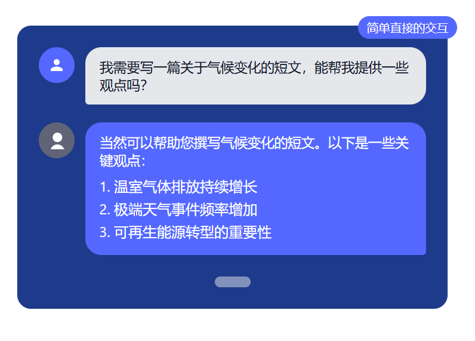

聊天助手类型的主要有以下特点：

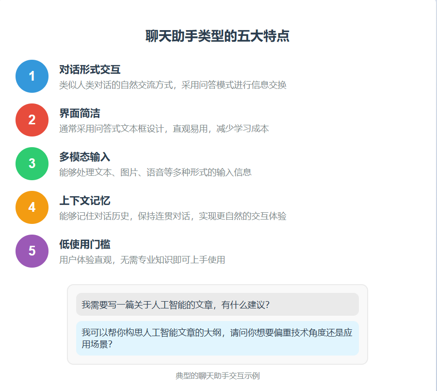

在Dify种，聊天助手类型的智能体，开发界面一般是这样的，如果这个智能体需要在对话时调用外部工具，则只需将工具添加进来就可以了。

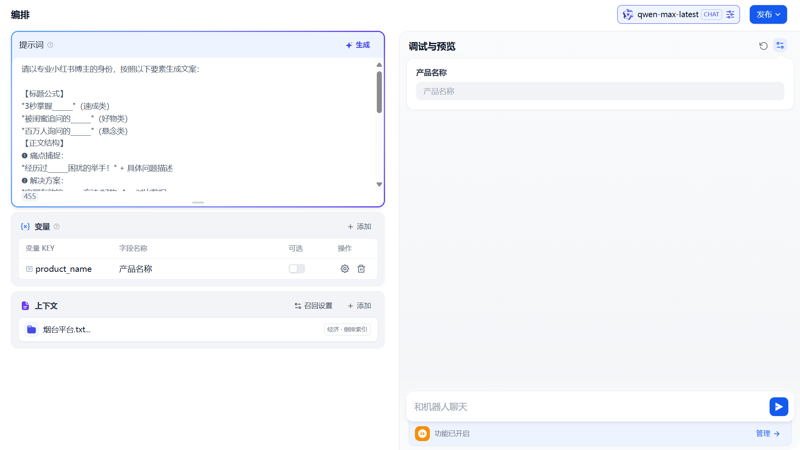

**（2）工作流类型**

工作流类型的智能体更加复杂和强大，它允许用户设计一系列预定义的步骤，让智能体按照这些步骤自动执行任务。

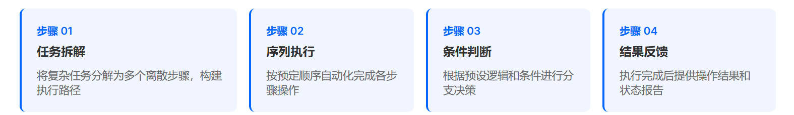

工作流型Agent具备执行复杂任务的能力，通过集成外部工具、API和数据库实现更强大的功能。它们能够按照预设流程完成一系列操作，如自动化数据分析、文档处理或信息搜集。

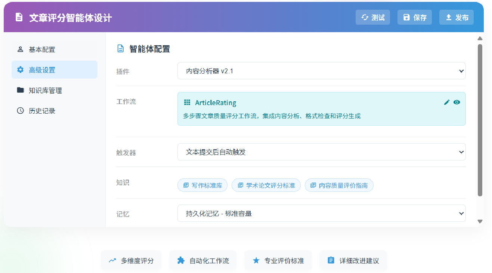

工作流的本质是一个流程图或者说决策树。

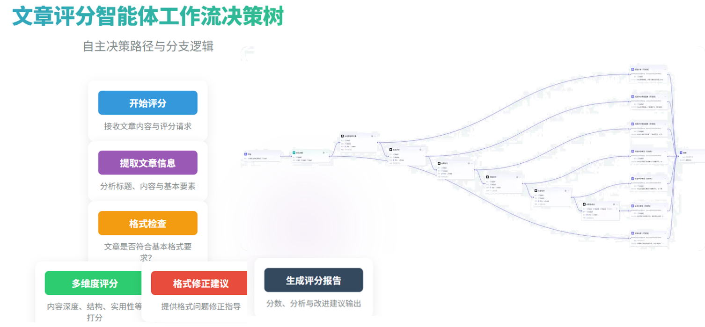

在Dify中，工作流类型的智能体开发及效果通常是这样：

**（3）对话流类型**  
  
对话流类型融合了聊天助手和工作流的特点，它通过预设的对话路径和决策树，引导用户完成特定目标。对话流l类型智能体是最高级的智能体形态，它结合了聊天助手的自然交互和工作流的任务执行能力。这类智能体能在对话中理解用户需求，动态规划并执行任务序列，同时保持上下文一致性。

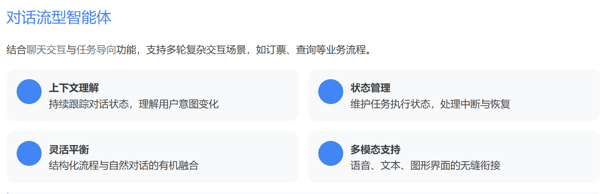

代表性产品如Siri、Google Assistant等多轮对话系统，它们能够处理复杂意图解析，并通过多轮交互完成渐进式任务，为用户提供沉浸式智能体验。

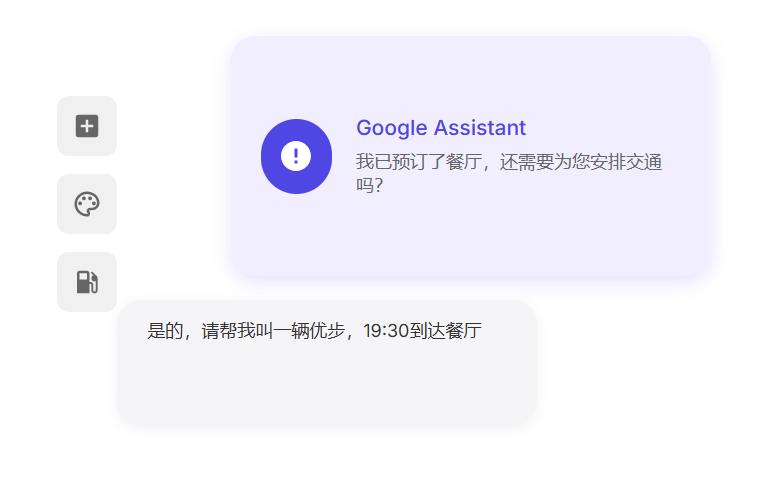

在Dify中，对话流类型的智能体界面通常是这样：

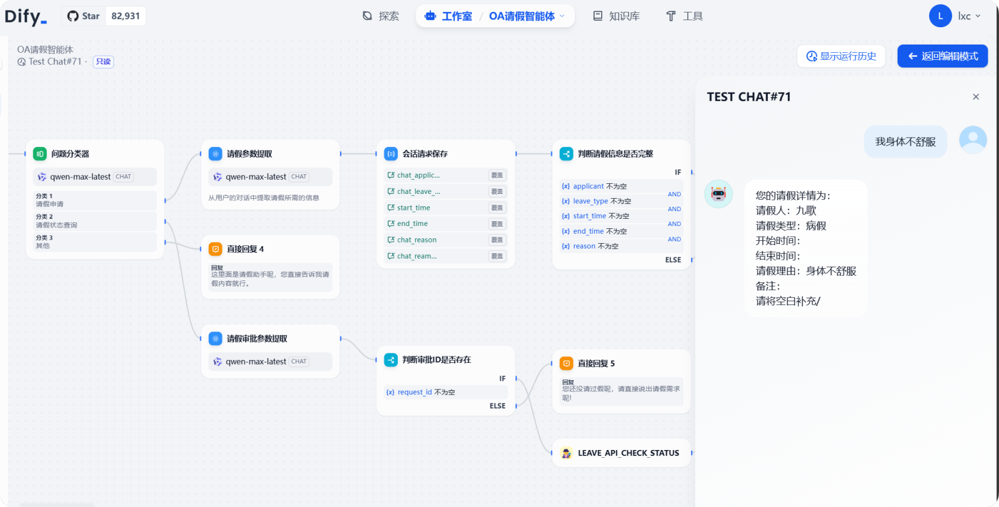

**智能体类型选择**

不同类型的智能体各有特点，根据应用场景选择合适的类型可以提升效率和用户体验。以下是三种主要智能体类型及其应用建议。

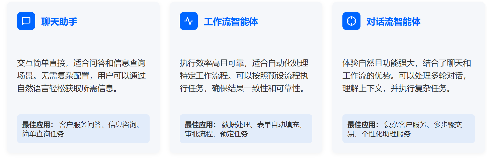