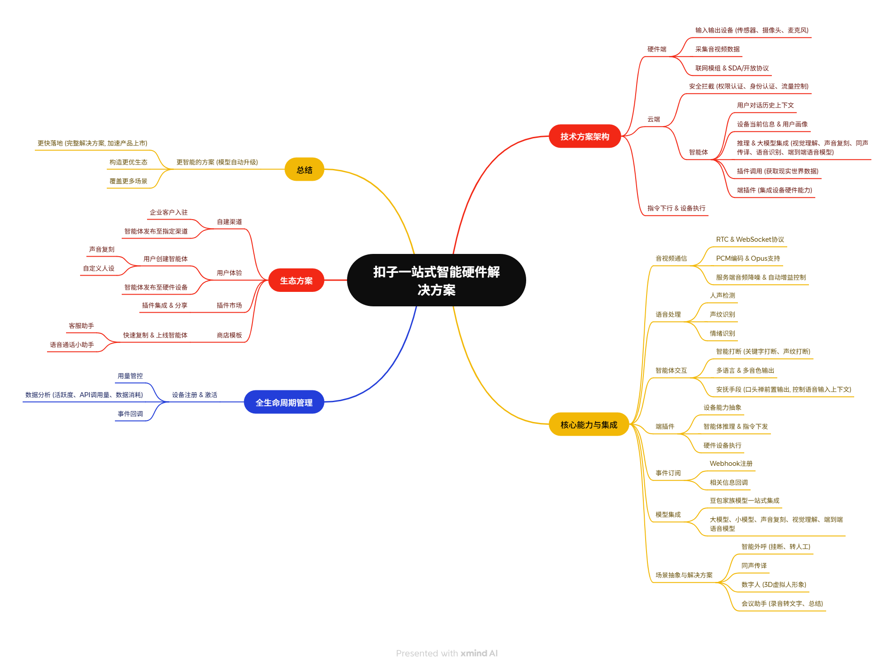
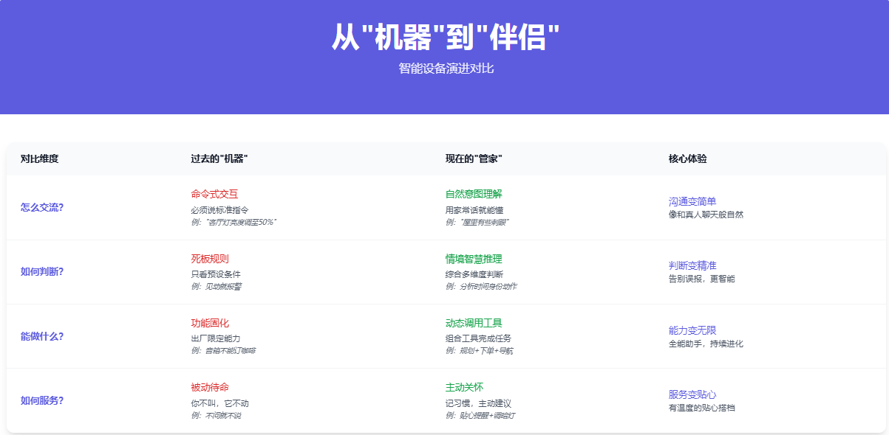
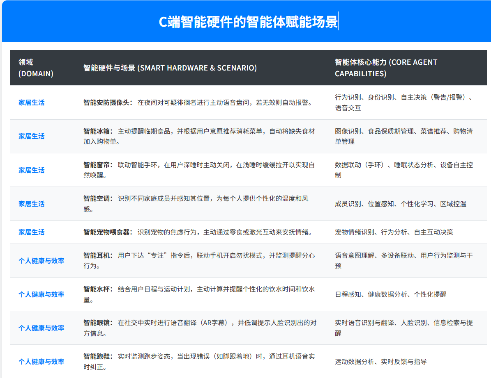
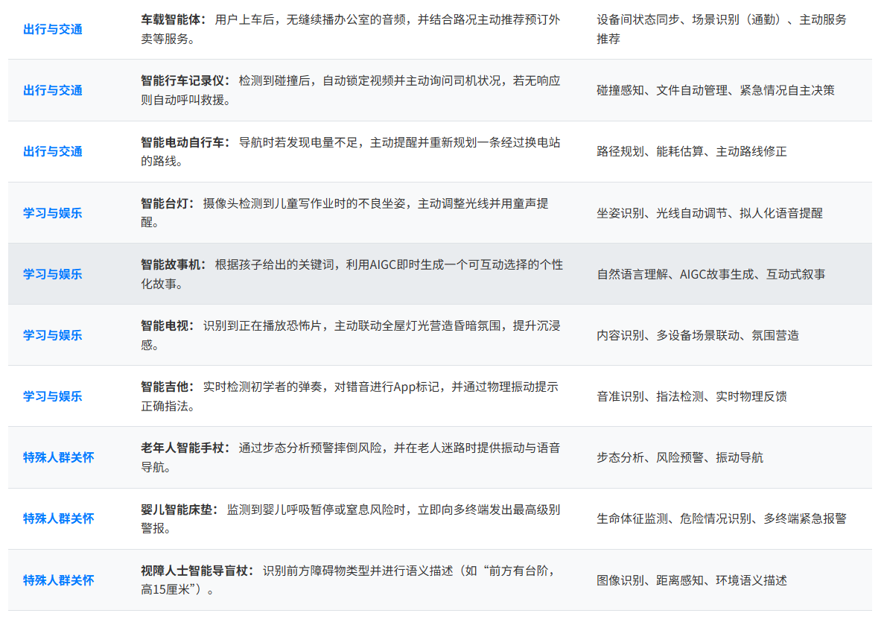

# 智能体可以给C端消费智能硬件带来什么？附20大落地场景

大家好，我是九歌。

这两天前前后后把火山引擎原动力大会的直播回放整理了一下，感觉信息量还是非常大的。先谈谈最感兴趣的地方——智能硬件。

下面是第二天的专场——扣子企业交流日，扣子硬件技术负责人的主题分享视频。

我直接把视频喂给大模型，让其生成了一张思维导图。生成方法是把视频上传通义千问音视频速读助手，然后到处思维导图为xmind格式，再导入到在线xmind，进行文字和样式的优化。

其实整个智能硬件核心方案主要就一句话：**为硬件设备快速且低成本地实现端到端的音视频通话功能。**

扣子的一站式智能方案覆盖技术架构、输入输出设备、信息上传流程、智能体的上下文理解与推理、模型接入、私有云及数据安全等六大方面，强调了智能体与硬件设备的高效交互、端插件能力、全生命周期管理及开放生态建设。整体看，这个方案还是非常强大的，能早点开源就好了（偷笑）。

从本质上看，就是如何将当前的聊天对话式的网页智能体，通过硬件交互的方式实现。这个赋能方案可以说很大，因为当前主流的C端硬件的用户交互方式就是语音对话或者视频对话，再加上触屏。这个赋能方案也可以说很小，因为智能硬件的范畴不可能只有音视频通话，具身智能机器人的应用场景更庞大。

在大模型和智能体没有像今天这般普及之前，智能硬件产品已经在我们的生活中存在很长时间了，从智能音箱到扫地机器人，从智能马桶到智能冰箱。

所以，我有个疑问，智能体Agent在当下的智能硬件中，将会扮演什么重要的角色，它的实际功能是什么？

带着这个困惑，我与多个大模型进行了友好亲切的交流，总结凝练后，整理如下结论。

过去的智能机器和以后的数字伴侣，虽然场景看似一样——窗帘还是那个窗帘，杯子还是那个杯子，车还是那辆车——但里面那个“大脑”已经发生了革命。这不再是简单的自动化升级，而是人机关系的一次跃迁：从一个“听话但笨拙的工具”，变成一个更懂我们自己、会思考、能主动服务的“数字生活伴侣”。

我们的生活，需要的不只是效率，更需要理解和温度。未来的智能硬件，正在朝这个方向大步迈进。

