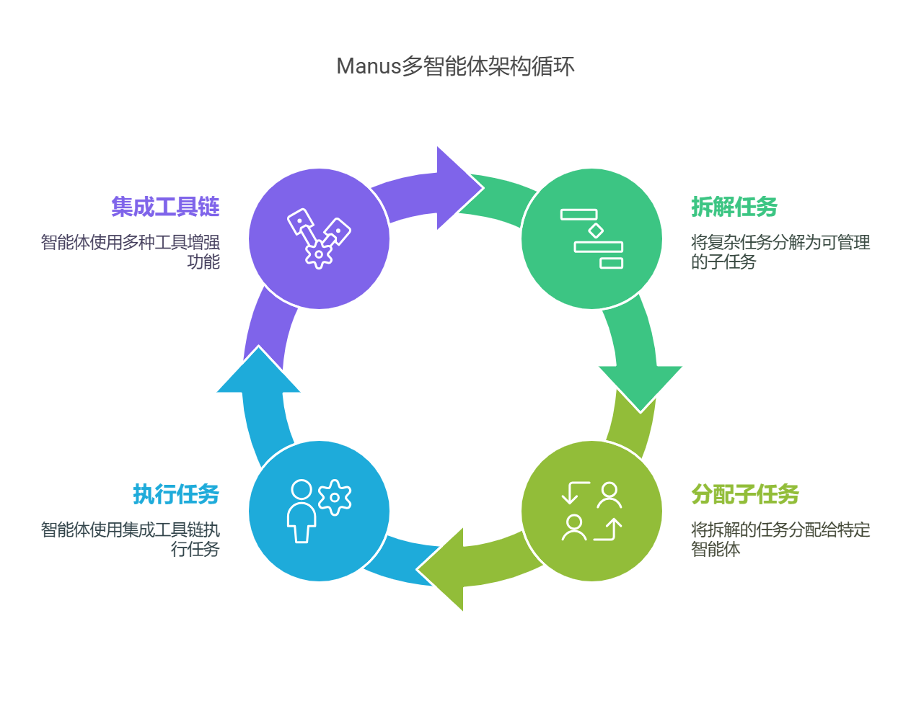
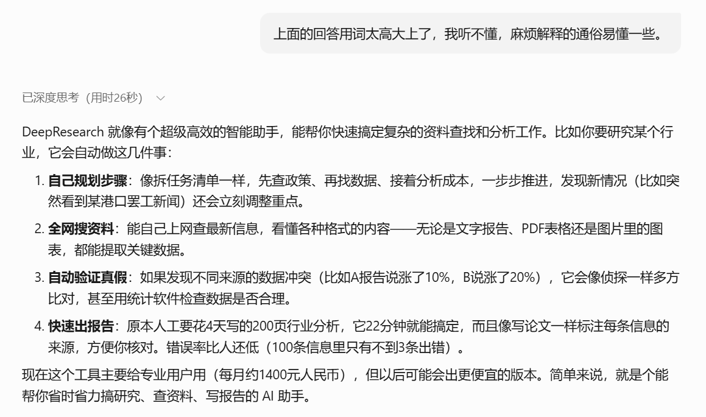
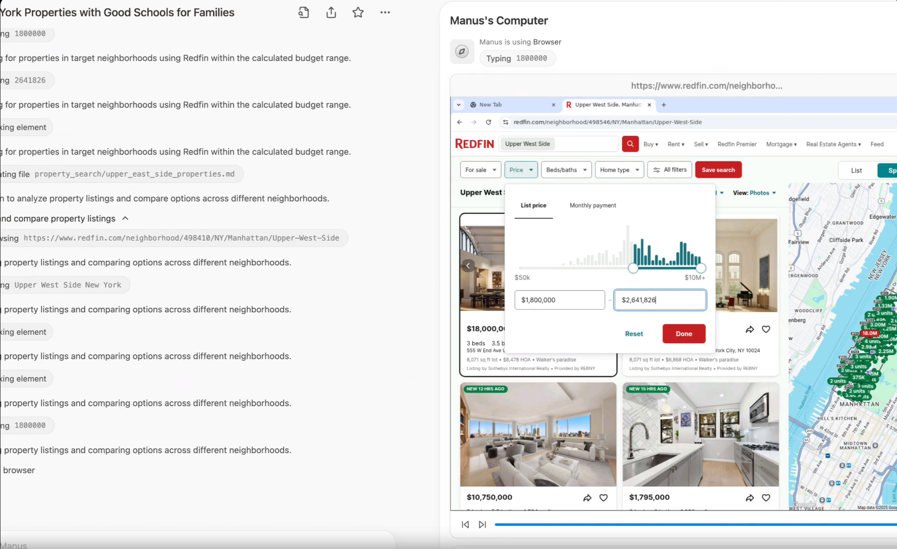

# 祛魅Manus！大模型通过Deep ReSearch驾驭Multi-Agent原理深度剖析

大家好，我是九歌AI。

这两天AI产品的频繁出圈，都把大家整焦虑了，我朋友圈有同学宣布一个月不看AI新闻，闭关了。

为啥，都是Manus闹的。当然，背后其实是自媒体无底线的**尬吹**。

我今天一直在考虑要不要蹭Manus的流量，内心纠结了半天，后来看到某大V连续两天发的文章，就释怀了。

人家是真本事啊，第一天把Manus吹上天，第二天又发文理性批评，真是妙啊，好人坏人都当了，这流量赚的的是满满的。

真是昨天叫人家小甜甜，今天改叫人家牛夫人了，像极了一个满头大汗耳鬓厮磨一哆嗦后，进入**贤者模式**的油腻中年男人。

客观公正的讲，Manus其实是一个成熟度已经非常可以的产品了，理念也非常不错，再把产品打磨打磨，依然会有很多用户，就是营销用力过猛了！

**Manus 最大是亮点就是把其他大模型 后台运行的Deep Research 工作过程**，在网页上通过虚拟机用所见即所得的方式呈现出来了。其实技术壁垒不是很高，而且虚拟机需要大量的硬件资源做支撑，没钱很难保持技术优势，算是现象级产品，下一步就是融资吧。

Manus从架构上来讲，是一种**Multi-Agent（多智能体）架构**，功能是能够将复杂任务拆解为多个子任务，并分配给不同的**Agent（智能体）**执行，每个智能体均具备**工具链**集成属性，集成多种工具，如网络搜索、代码执行、文件处理等，以增强智能体的功能。



上面这段话是不是很绕，没读明白，其实把Manus想成**你自己的公司**，把里面的智能体想成**你自己**就明白了。

公司如何管理我们这些员工的呢，每个公司的运行机制可能五花八门，这个运行机制就是我们今天要讲的DeepReSearch。

不过这里要强调一下，我们在大模型搜索框下面看到的深度搜索一般是指DeepSearch，DeepSearch和Deep Research还是有区别的，大体可以这么区分，DeepSearch是工蜂，干脏活的，DeepReSearch是蜂后，一大家子都得听她的，围着她转。

啰嗦了这么多，终于绕道正题了，Deep ReSearch的工作原理到底是啥。我也是个小白（尴尬脸\~），要不问问DeepSeek吧！


好家伙，说了这么多高大上的术语，如果DeepSeek是售前经理，还不得把甲方爸爸给忽悠晕了 。让DeepSeek说人话！



这样就清晰多了，其实这里面的关键词就三个：**深度规划，深度搜索、深度优化**。

### **（1）深度规划**

深度规划的作用类似公司的CEO,执行董事会的命令（用户的需求提示词），规划筹谋任务，然后再把这些活分给下面的人去做，下面的人即使反馈结果回来，他能动态的调整任务的规划。

用DeepSeek的话说，就是像拆任务清单一样，根据需求，先查政策、再找数据、接着分析成本，一步步推进，发现新情况（比如突然看到某港口罢工新闻）还会立刻调整重点。

这就完了吗？就这么简单，其实整个事情就是这么回事，但是用我们普通人听不太懂的专业话术包装一下就立马高大上了。

> **语义拆解算法**：基于Deepseek-r1模型的任务树生成，采用蒙特卡洛树搜索（MCTS）优化决策路径。例如在分析"新能源汽车供应链"时，系统自动生成包含「锂电池原料价格预测→充电桩分布热力图生成→政策补贴影响建模」的任务节点树，每个节点附带执行策略（如调用Wind API获取钴价数据）。
> **实时权重调整**：通过Q-learning算法动态更新任务优先级矩阵，当检测到东南亚镍矿出口波动时，镍价预测子任务的权重系数从0.3提升至0.7。

上面的**语义拆解算法** 本质就是任务清单拆解的技术实现，给甲方爸爸讲故事，不可能直白的说，啊那个深度规划就是分任务，这样你的产品肯定卖不出去。

作为智能体应用层面的从业者，也只能研究到这个层面了，再深就是数学算法、人工智能底层生态的科研工作者的任务了，而我还不具备那个水平，方向也不在这里,因此也就没有**Fomo**的心态！

### **（2）深度搜索**

谈下一话题，深度搜索 Deep Search!

最厉害最科学的搜索方式，管它什么深的浅的，就是像真人一样去搜索。

不知道大家知道Selenium这个能控制浏览器的爬虫库不，当时看到Manus宣传片出来的虚拟机，只觉得很眼熟，很亲切，因为让浏览器自动刷新页面，然后从页面上获取数据这个流程，我太熟悉了。我好几年前还写过一篇文章。

《[*Selenium*](https://mp.weixin.qq.com/s/0ATzRldRcBTrdrf89bF0sA?token=1586366463&lang=zh_CN)[控制已打开的浏览器抓取公开跨境电商数据](https://mp.weixin.qq.com/s/0ATzRldRcBTrdrf89bF0sA?token=1586366463&lang=zh_CN)》



这种直接在浏览器操作网页或者电脑的技术，其实已经很普及了，提出MCP协议，大名鼎鼎的Claude 开源的computer use，能够与操纵计算机桌面环境的工具进行交互，类似的还有browser use。Manus其实就是将computer use这类的工具进行了深度整合，再加上Deep ReSearch的工程原理，Manus团队的整合能力和执行能力确实优秀，最后能够成功出圈，也有种**天道酬勤**的感觉。


其实不管控制电脑也罢、使用API也罢，**本质都是为大模型决策收集能够利用的数据。**

所以深度搜索主要是很多前就攒下来的爬虫技术栈，现在用LLM这个**狗头军师**重新武装了一下，没想到以前游走在擦边灰产和逆向工程的爬虫技术，因为AI又焕发了第二春。

深度搜索就好像公司的CMO,干具体活的，有了大模型后，爬虫技术和搜索技术变得高级一点，可以使用大模型对搜索结果实时判断了，**在搜索过程中不断判断结果是否符合用户需求。如果不符合，就重组关键词，继续搜索，继续爬取，直到找到匹配的内容为止。**

LLM这个狗头军师是怎么和爬虫框架**狼狈为奸**的，用了哪些计谋，我这里贴上DeepSeek给我总结的专业术语。

> **循环控制优化**：采用令牌预算感知的早停机制（Early Stopping），当置信度达95%或消耗80%预算时触发强制终止，避免无效计算。实测显示该策略降低30%的冗余计算。
> **多级验证协议**：在半导体产业分析案例中，系统检测到台积电财报与SEMI行业数据的产能数据差异18%时，自动启动三级验证：①横向比对8份行业报告；②执行T检验（p=0.032）；③调用专家知识库修正数据权重。

已经对多种多样数据进行处理的能力，专业术语叫**异构数据统一表征**。

> **跨模态索引构建**：使用CLIP模型将图像（如港口卫星图）与文本（货运报告）映射到同一向量空间，相似度计算误差控制在5%以内。在分析鹿特丹港拥堵时，系统自动关联卫星图像中的船舶密度与文本描述的吞吐量下降数据。
> **结构化数据转换**：通过SPARQL生成器将Excel表格转换为RDF三元组，支持知识图谱的实时更新。某汽车供应链分析中，成功将1357行BOM表数据转化为3789个实体关系。

**（3）深度优化**

深度优化类似于公司里面的质量监控机制或者公司里面的法务、财务这些**合规岗**，比如发现不同来源的数据冲突（比如A报告说涨了10%，B说涨了20%），深度优化功能就会像会像侦探一样多方比对，甚至用统计软件检查数据是否合理。

上面功能的实现也是由专干这个事情的智能体组成的。最常见的案例就是我们让大模型写了一篇文章，但是不知道这个文章写的科学与否，那么就可以将这篇文章交给一个专门负责文章科学性检测的智能体去**体检**一下，评个分。

这个智能体使用技术比较简单，就是长上下文勘误，使用大模型对整篇文档进行校验和优化，确保逻辑连贯、内容准确，当然体检的项目由你的**提示词**来决定。这也就从另一方面告我们，**提示词工程**虽然有点玄学，但是作用和地位却很重要。

具体到技术实现，就看你的算法怎么设计了，简单的直接用我们的大白话给智能体设置评分标准，专业的则像下面这种专业的AIGC生成质量保证体系。

> **可信度量化模型**
> - 四维评估矩阵通过梯度提升树（GBDT）动态调整权重，当分析医疗行业时，来源权威性权重提升至40%（考虑期刊影响因子）。某创新药研发报告中，系统识别到预印本论文与临床试验数据的矛盾，自动降权处理。
> **可视化溯源系统**
> - 双层注释系统采用React框架实现交互式报告，用户点击"海运成本上涨23%"结论时，可展开查看马士基财报原文（OCR识别准确率98.7%）和ARIMA预测模型的参数（p=2,d=1,q=1）。

出了对大模型与Agent生成质量的深度优化，也有效率和性能方面的优化。比如下面这种。

> **混合检索加速**
> - 向量检索（Milvus）与关键词检索（Elasticsearch）的混合查询响应时间优化至平均230ms，在查询"5G基站能耗"时，语义检索召回率提升至92%，精准率85%。
> **增量更新策略**
> - 动态知识图谱采用差异更新算法，每次搜索仅更新12.7%的节点。在跟踪俄乌冲突对能源市场影响时，更新效率较全量更新提升8倍。

#### **（4）Deep Research在Manus中的体现**

在Manus的演示案例中，Deep Research的能力得到了充分体现。例如，在“分析特斯拉股票”的任务中，Manus通过不断执行搜索、检查、勘误和反思的过程，最终生成了一份高质量的分析报告。这种能力不仅依赖于强大的搜索算法，还需要高效的规划和整合能力。

```Plaintext
示例报告生成流程：
1. 搜索特斯拉的财务数据 -> 填充到“财务分析”章节
2. 搜索特斯拉的市场表现 -> 填充到“市场分析”章节
3. 使用大模型对整篇报告进行校验和优化
```

没想到研究这种专业理论只是比去设计个智能体还费时间，这篇文章从中午12点有想法，到搜集资料到落笔写成一直持续到了晚上10点半。

路漫漫其修远兮，吾将上下而求索。杭州深度求索，DeepSeek的公司名。

深夜人会更加感性，所以多说几句。

谢谢你能读到这里，也谢谢DeepSeek出圈对大模型普及起到的巨大作用，培育了这么多求知欲旺盛的优秀读者。

本来写文章只是当做输出型学习实践的探索，对自己研究实践的记录，没想到这段时间被这么多人看到了文章，也点评了文章，有点受宠若惊，写文章反而有点瞻前顾后了，怕被批评和嚼舌根。

**学习未知的技能，探索更大的世界，认识更好的自己，共勉！**