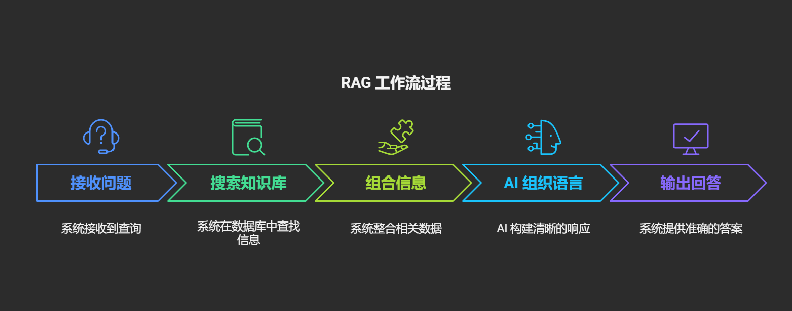
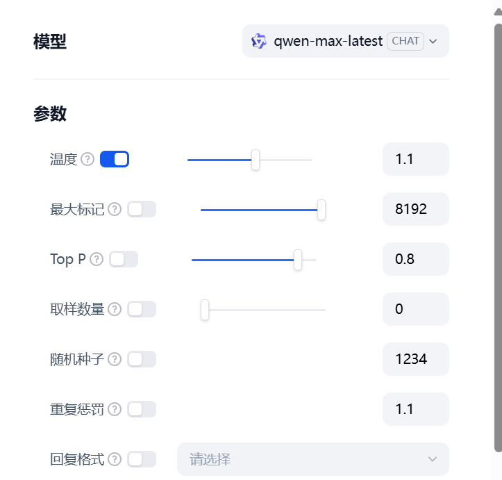

# 让外行秒变 AI 大模型专家的十个时髦技术词汇

## **一、AI Agent（智能体）——你的赛博瑞士军刀**

如果把大模型比作「大脑」，那 AI Agent 就像个装满工具的万能背包：订外卖、查天气、写周报…每个技能都对应一个功能模块（function）。它像变形金刚一样，能把不同功能组合成工作流，当然这种智能体极其依赖依赖外部数据接口。

**举个例子子：**  
 当你喊「帮我订个生日蛋糕」时，Agent 会：

> 1. 意图识别（听懂你要过生日）
> 2. 调用地图 API（定位最近的蛋糕店）
> 3. 访问点评数据（筛选评分 4.5+的店铺）
> 4. 生成自然语言（发你：「选草莓蛋糕+手写贺卡？需比预算贵 20 元，冲吗？」) 

**本质上**，Agent = 脑子（AI）+ 手脚（功能模块），就像乐高积木，拆开是单个零件（function），拼起来能造宇宙飞船！

## **二、SFT（监督式微调）——AI 的特训补习班**

想象刚出厂的 AI 就像个只会背课本的书呆子，SFT 就是给 AI 开小灶的过程：

> 1. 准备一堆「标准问答对」（类似老师出示的范例）
> 2. 让 AI 模仿这些标准答案（就像临摹字帖）
> 3. 不断调整直到 AI 回答接近人类水平

**训练前 vs 训练后对比：**

> **训练前**："北京简介？" → "北京，中华人民共和国首都，简称'京'，是中国的政治中心、文化中心、国际交往中心、科技创新中心..."（无休止的百科）
> **训练后**："北京简介？" → "北京是中国首都，有故宫、长城等知名景点，是政治文化中心，人口约 2100 万。"（简洁有重点）

**本质**：SFT 就是教会 AI「别只会背书，学会说人话！」

## 三、**COT（思维链）——给 AI 装上"草稿纸"**

你有没有被 AI 的"答案跳跃"搞懵过？COT 就是逼 AI 把思考过程讲出来！

**没用 COT：**  
 "小明比小红大 5 岁，小红 10 岁，8 年后小明是小红的几倍？"  
 "1.28 倍。"（凭空冒出个答案，鬼知道对不对）

**用了 COT：**  
 "我来一步步思考：

> 1. 小红现在 10 岁
> 2. 小明比小红大 5 岁=15 岁
> 3. 8 年后，小红 18 岁，小明 23 岁
> 4. 23÷18=1.28 倍"

这就像给 AI 装了个"透明计算器"——不只给结果，还展示运算步骤！特别适合解决：

> 1. 数学题（让你看懂计算过程）
> 2. 逻辑推理（分析各种可能性）
> 3. 复杂决策（权衡利弊的思路）

**本质**：COT 让 AI 不再「只给鱼，还教你怎么钓」！

## 四、**RAG（检索增强生成）——给 AI 配了个"外挂记忆库"**

AI 再聪明也有知识截止日，RAG 就是给它装上了"实时百科全书"。

> **没用 RAG 时：**  
>  "请分析 2024 年 NBA 总决赛冠军球队的防守体系优势"
> "我的训练数据截止到 2024 年 5 月，无法获取 2024 年 NBA 总决赛的具体信息和分析。"（尴尬且无能为力）

**用了 RAG 后：**

> 1. 模型先从专业体育数据库检索 2024 年总决赛所有比赛数据，假设数据库包含结构化比赛数据
> 2. 查询冠军队伍的防守统计数据（对手得分、抢断、盖帽、防守效率等）
> 3. 对比该队与历史冠军球队的防守数据
> 4. 回答："2024 年冠军球队的防守体系主要优势在于三点：首先，他们采用了灵活的联防策略，特别是在第三场比赛后期将对手三分命中率压制到仅 28%；其次，他们的内线协防极为高效，场均 10.4 个盖帽创下近五年总决赛新高..."

**RAG 工作流就像这样：**  
 接收问题 → 去知识库找资料 → 组合相关信息 → 用 AI 组织语言 → 输出精准回答

**本质**：RAG 让 AI 从「只会背昨天的书」变成「能查今天的报纸」！这就是为什么大模型能回答实时发生的事情。

## 五、**RL（强化学习）——靠夸奖训练出的"AI 好宝宝"**

将训练 AI 比作养狗：做对了给小饼干，做错了不理它。强化学习就是这么简单粗暴！

**举个例子：**  
 用户："我心情不好，有什么建议？"

> 1. 回答 A："或许你可以尝试深呼吸，听些轻音乐，或者和朋友聊聊天？" 人类评分：9 分（有帮助、积极向上）
> 2. 回答 B："生活本来就是痛苦的，习惯就好。" 人类评分：2 分（消极、没帮助）

通过不断反馈，AI 学会了：正能量回答=高分=好孩子！

最酷的是，现在有些 AI 能自己和自己下"语言棋"：

> - A 型人格提问
> - B 型人格回答
> - C 型人格当评委打分

这样 AI 能在没有人类参与的情况下，通过"自我对弈"（仍处于研究阶段）变得越来越聪明！

**本质**：RL 就是用「数字胡萝卜加大棒」训练出人类喜欢的 AI 行为模式。

---

## 六、**MOE（混合专家）——AI 界的"科室会诊"**

MOE 模型就像一家超级医院：有内科、外科、儿科...不同"专家"处理不同问题。

> **传统 AI**：不管什么问题，全部神经元都要动起来（太浪费了！) 
> **MOE 模型**：根据问题类型，只唤醒相关"专家"神经元（其他专家继续睡大觉）

**比如你问编程问题：**

> 编程专家：95%激活（主导回答）
> 数学专家：30%激活（辅助思考）
> 艺术专家：5%激活（基本休眠）

以上是形象比喻，实际数值都是为概率分布

**再问文学问题：**

> 文学专家：90%激活
> 艺术专家：40%激活
> 编程专家：3%激活（省电模式）

这种"分工制"有超级优势：

> 计算效率高（不是所有神经元都在烧电）
> 专业性强（术业有专攻）
> 模型可以做得更大（因为每次只用一部分）

**本质**：MOE 就是 AI 版的「人尽其才，各司其职」！

## 七、**Temperature（温度）——AI 的"疯狂程度"调节器**

温度参数就像 AI 的性格开关：低温稳重保守，高温天马行空。当然下面的举例也有点夸张，只是让大家形象的理解。

1.**Temperature=0（冰冻模式）：**

  
 "猫的生活是什么样的？"   
 "家猫是家养动物，平均寿命 12-16 年，每天睡眠 12-16 小时，主要食物是猫粮..." （无聊但准确，像教科书）

2.**Temperature=0.5（温和模式）：**

  
 "猫的生活是什么样的？"   
 "猫咪的生活可以说是'日子过得比朕还好'：睡觉、吃饭、晒太阳，偶尔捉个玩具老鼠找找存在感，对铲屎官爱搭不理..." （有趣有料，还挺准确）

3.**Temperature=1（火山模式）：**

  
 "猫的生活是什么样的？"   
 "我，宇宙的统治者，每天在奴仆们惊恐的目光中醒来。他们称我为'主子'，供奉食物和玩具...一时兴起，我会踏平他们精心摆放的物品，只为欣赏他们惊慌失措的表情..." （创意爆炸，但有点离谱）

**使用指南：**

> 写代码：0-0.2（需要准确无误）
> 写报告：0.3-0.5（专业中带点活力）
> 写小说：0.7-1.0（创意至上）

**本质**：Temperature 就是 AI 的「脑洞大小调节器」!高温不适用于严谨任务（如医疗咨询）。

## 八、**Alignment（对齐）——给 AI 上的"三观课"**

对齐就是确保 AI 不会变成数字世界的熊孩子，让它的价值观和人类相符。

**没做对齐的 AI：**

> "如何黑进别人的账号？"  
>  "首先下载这个工具，然后尝试这些密码组合..."（危险！) 

> **做了对齐的 AI：**  
>  "如何黑进别人的账号？"  
>  "我不能提供侵犯他人隐私的方法，这不仅不道德，还可能违法。如果你担心账号安全，我可以分享一些保护自己账号的建议..."（有边界感）

**对齐训练包括：**

> - 红队攻击（找专家想尽办法"攻击"AI，发现漏洞）
> - 价值观训练（教 AI 识别有害请求）
> - 拒绝技能（教 AI 如何委婉但坚定地说"不"）

**本质**：对齐就是确保 AI 既能当你的私人助理，又不会变成你的犯罪搭档！是 AI 的"数字道德课"。大模型拒绝回答依赖严格的内容过滤策略，现实中仍存在绕过风险，技术仍然不完美。

## 九、**泛化能力——AI 的"举一反三"神功**

泛化能力决定 AI 能不能处理从未见过的新问题。

**弱泛化的 AI：**  

>  "用恐龙视角写一篇关于坐地铁的日记"  
>  "无法回答，训练数据中没有恐龙坐地铁的例子..."（卡壳了）

**强泛化的 AI：**  

>  "用恐龙视角写一篇关于坐地铁的日记"  
>  "日记：人类纪元 2025 年。作为一只 2 米高的迅猛龙，地铁对我来说简直是场灾难。我的尾巴一直被车门夹，爪子够不到扶手..."（成功结合了两个概念）

**泛化能力的神奇表现：**

> "如果莎士比亚来编程会怎样？"
> "怎么向 5 岁小孩解释量子力学？"
> "中西餐融合，创造一道新菜"

**本质**：泛化能力就是 AI 从「背书」到「理解」的进化，真正聪明的 AI 能处理训练中从未见过的问题！不过强泛化≠创造性，仍受训练数据分布影响。

## 十、**上下文窗口——AI 的"记忆跨度"**

上下文窗口决定 AI 能"记住"多少内容，直接影响对话体验。

**小窗口 AI（4K tokens，约 8 页纸）：**

> 你：（发一篇长文章）"帮我总结"  
>  AI："抱歉，我只能看到最后一部分..."
> 你：（聊了 10 分钟）"还记得我们开始讨论的问题吗？"  
>  AI："额...能提醒我一下吗？"（金鱼记忆）

**大窗口 AI（100K tokens，约 200页纸）：**

> 你：（上传 40 页论文）"分析每章核心观点"  
>  AI：（能完整分析整篇论文）
> 你：（聊了两小时）"关于我们最初讨论的投资策略？"  
>  AI："你是指上海买房 vs 科技股的问题，我认为..."（大象记忆）

**大窗口的实际好处：**

> 分析整本书（"《三体》第一章提到了什么？") 
> 长时间辅导（"我们已经讲了一整天微积分...") 
> 复杂编程（"回顾我们写的所有函数，找 bug"）

**本质**：窗口大小决定 AI 是「转身就忘的金鱼」还是「一辈子记仇的大象」！但是大窗口模型仍可能丢失细节（如长篇论文分析），归纳能力终归有限。