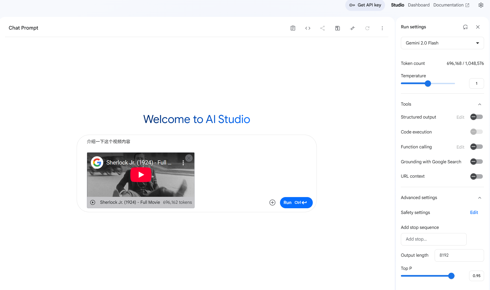
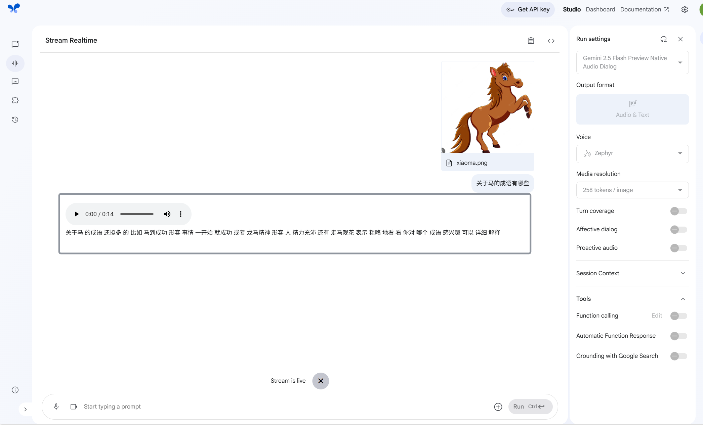
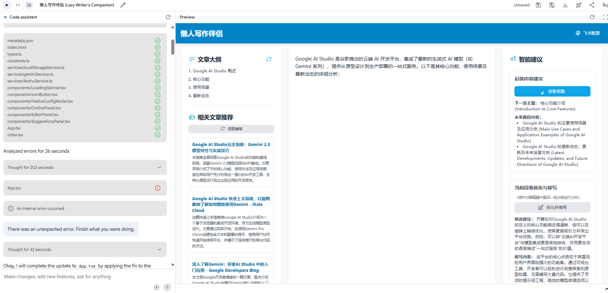

# 谷歌AI Studio 10分钟开发网页应用，真正的所想所见所得的Vibe Coding！

哈喽，Everybody, I'm  九歌～一个智能体空想家。

今年的新词特别多，AI编程这个叫法都out了，fashion 的说法是vibe coding(氛围编程）。

最近上手体验了google aistudio 新上线的build  app 功能，不能说十分惊艳，那是相当得惊艳，真正我能想象出的所想所见即所得的编程方式，特别是对我这种靠嘴吃饭，需要设计产品原型的非程序开发人员来说。

Google AI Studio （https://aistudio.google.com）是谷歌推出的云端 AI 开发平台，集成了最新的生成式 AI 模型（如 Gemini 系列），提供从原型设计到生产部署的一站式服务。目前有4种模式：Chat、Stream、Gernerate Media、Build App。

**Chat 模式**和我们日常使用国产大模型的习惯差不多，可以支持对多模态文件的分析。



**Stream Live模式**，指的是你可以通过语音聊天或者视频的方式，与大模型进行对话。回答结果也会直接以语音朗读的方式输出，可以指定音色，这个国内的大厂都做的挺好。



**Gernerate Media** 就是文生图、文生视频这些，最近很火的Google Veo3的上一版本Veo就可以在这个地方体验。


啰嗦了这么多，今天的主角登场了！Build apps with Gemini!


我们先看一下官方提供的Demo示例。

第1个例子，是一个能让卡通动物带着表情自言自语的小应用，很有意思。通过这个示例，我们可以看到build apps界面分为3类，分别是聊天区、代码区和效果预览区。左上角是这三个区域的显示和隐藏按钮。如果你不想看代码区域，可以直接将其隐藏掉。

<figure view-type="Preview"><source mime="video/mp4" origin-height="1080.000000" origin-width="1816.000000"/></figure>

第2个例子，是一个能根据提示词制作GIF图片的应用，有意思的是可以把Gif的每一帧图片都能生成出来。生成的应用直接可以在线运行预览，我想这个功能Cursor都做不到吧，得自己动手。

<figure view-type="Preview"><source mime="video/mp4" origin-height="1080.000000" origin-width="1820.000000"/></figure>

下面我们开始自己动手做一个网页应用。我的想法是做一个懒人写作伴侣，就是再文本编辑框两边加上一下大模型的提示功能。我们将下方的提示词输入进去。

```Plain Text
应用名称：懒人写作伴侣
主要功能：
（1）在网页中间的编辑区编写文字后，在右侧的区域增加两个功能，让大模型根据书写的段落内容，1.给出下一段的的主题和未来两段的主要内容。2.给当前写的段落进行修改建议和续写200字。
（2）在左侧的区域，点击刷新安娜，通过联网搜索功能，推荐出和写作内容相关文章标题和摘要，点击文章标题，能跳转到对应链接。
```

下面这个视频是完整的应用生成过程。Gemini大模型通过对提示词分析，自动整理所有需求，并生成相应的代码架构，然后按照架构使用React前端框架开发。目前好像只支持React。（从1分30秒后观看更佳）

<figure view-type="Preview"><source mime="video/mp4" origin-height="1080.000000" origin-width="1814.000000"/></figure>

能体现出氛围编程的地方，就是你可以继续在聊天窗口，对生成的应用程序进行迭代版本的开发或者功能完善，比如我让它对应用功能按钮进行了美化。我们可以在预览窗口看到实时修改效果，感觉非常酷，我们也可以直接在代码区域，直接带生成的代码进行编辑修改。

<figure view-type="Preview"><source mime="video/mp4" origin-height="1080.000000" origin-width="1786.000000"/></figure>

剩下的就是你要不停的根据生成结果，和大模型交互，告诉你的想法。你就是一个产品经理，而它就是一个非常听话的全栈程序员！下方是我最后的生成效果，基本满足我的需求了。



以上就是对Google Ai Studio 开发应用的初步体验，其实这样的产品已经非常多了，我早先还用过Poe 的AppCreator，但是那个并不能直接生成项目代码，只是生成一个非常大的Html代码，整体体验并没有Google Ai Studio好。

后续我将会继续体验Google Ai Studio 开发应用功能，让他设计出我真想做的产品，并实际部署！奥力给！