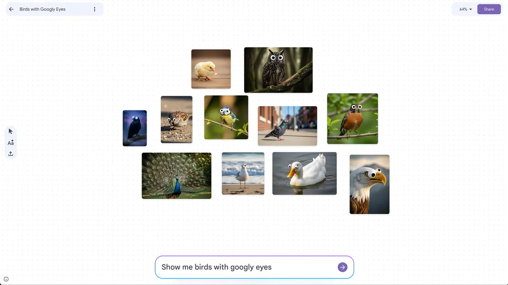
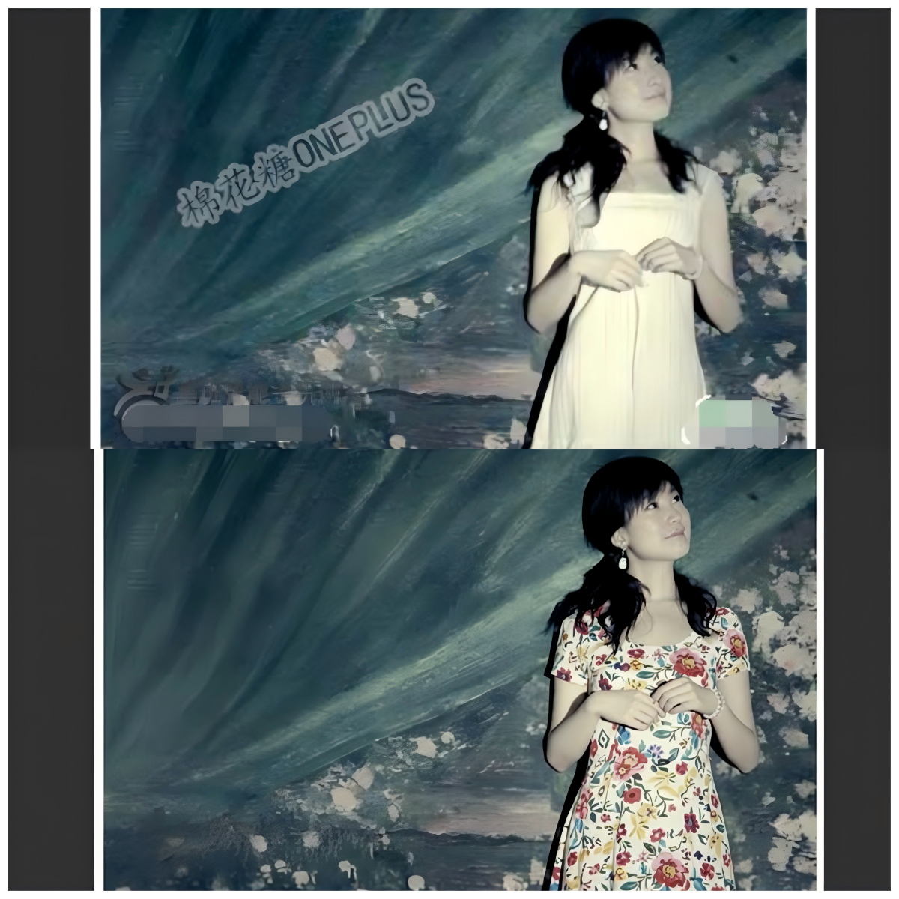
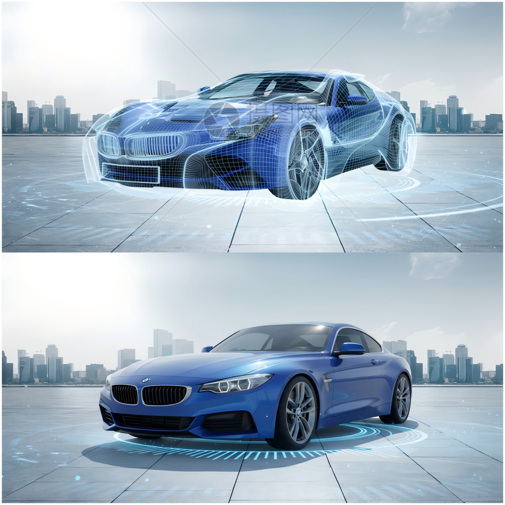
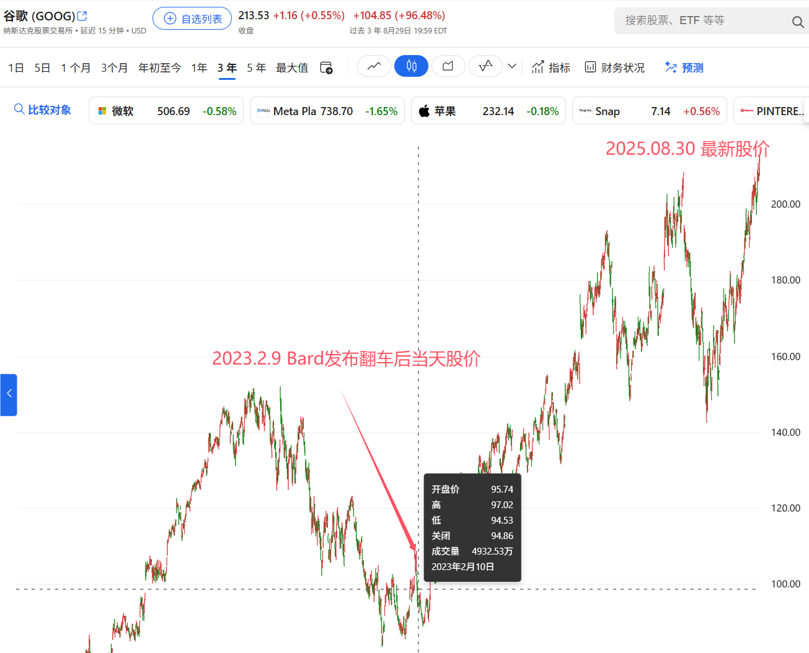
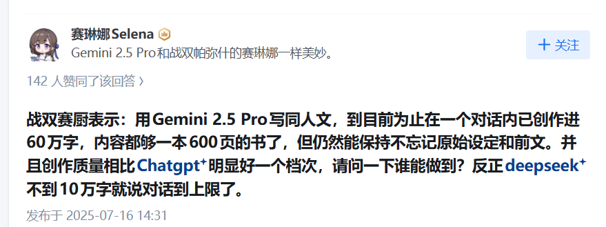
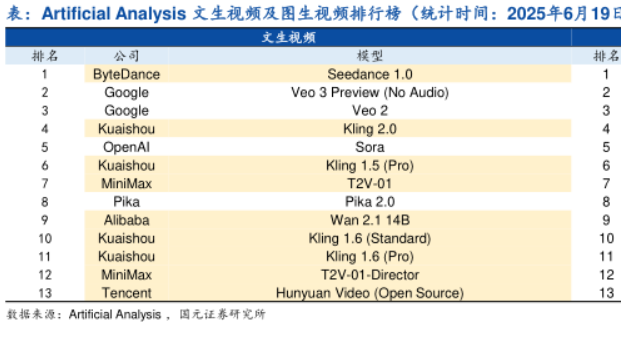

# 谷歌在文图影AI领域已经全面弯道超车并遥遥领先

大家好，我是九歌。

这篇文章断断续续，拖拉了一个多月才成稿。

刚开始写的时候，谷歌Nano Banana刚上线，现在估计小孩子都知道了。前两天，谷歌直接把Nano Banana封装成了一款新的画板产品 ，取名Mixboard。

Mixboard可以帮你即时把自己天马行空的创意给可视化，比如上图中我们让它绘制出长着卡姿兰大眼的鸟儿，每张图片都能接着进行编辑，感觉就挺有意思的。当然，Nano Banana最逆天的功能还是Ps功能，你可以要求他把一些图片中的元素移植到生成效果中。

下面这张图，上图是我随便从网上找的一张带马赛克的图片，下图是让Nano Banana修改后的修改，说实话非常震撼，看来马赛克都没有存在价值了！

下面这张图，也是从网上随便找了带马赛克的跑车照片，Nano Banana给修复了一下，如果以前的文生图搞得都是写意作品，那现在的文生图在写实领域真的有点逆天了。

回到正题，为什么说谷歌在文字、图片、视频三端，已经弯道超车并遥遥领先了呢。

文生图和图生图方面，上面我们已经用Nano Banana给出说明了，现在我们聊大模型方面，谷歌怎么弯道超车的。

两年多前，ChatGPT横空出世的时候，最尴尬的莫过于谷歌了。因为在AI领域，谷歌一直是业内的标杆，阿尔法GO横扫中韩顶尖围棋高手的场景，更是一代人记忆深处的烙印。

然后此一时彼一时，掀起AI新时代序幕，被永久写入历史的公司，叫OpenAI。作为Thransformer架构的发明者，谷歌成了这个历史事件的观众。

面对OpenAI的ChatGPT,谷歌一开始竟然毫无还手之力，在巨大的外部压力下推出聊天机器人Bard，灾难性的发布会直接让谷歌的股价一天大跌7%。

AI不光代表了人类最先进的科技技术，谷歌失去这个光环其实也到没啥，但是AI会取代用户使用搜索引擎的习惯，这简直就是要了谷歌的老命了。

痛定思痛后，谷歌立即快速整合内部资源，形成合力。长期以来，Google Brain和DeepMind虽然都成绩斐然，硕果累累，但某种程度上是独立运作的。为了集中最顶尖的人才和技术，谷歌直接将这两大王牌团队合并，成立了统一的Google DeepMind部门。这一举动极大地减少了内耗，为后续集中力量办大事铺平了道路，没多久Gemini大模型就发布了。

看来国内外企业都一样呀，据说淘宝闪购能在外卖大战中杀出，就是蒋凡把淘宝和饿了么的资源整合在一起产生的化学反应。

如今两年多过去了，谷歌也确实在文图影AI领域已经全面弯道超车，股价创了历史新高【截止发文，谷歌股价已经涨到251美元】。

当然，本文无意探讨投资。我们一起看看谷歌在大语言模型端的统治力。

MaaS服务商Openrouter最新的数据统计中，Gemini大模型的token使用量，已经在前五席中占据了3席。大家可别忘了，国外大模型的API费用可比国内贵多了，而且国外用户付费习惯更好，所以Gemini大模型的token收入和Gemini会员，就能给谷歌带来不少利润，更不用说衍生产品了。

这也从侧面印证，谷歌的股价为什么会一直不断新高。

在几个月前，知乎上就有一个问题一直出现在我的时间线上：“为什么我感觉Gemini 2.5pro 异常的强”，回答中提到最多的就是其恐怖如斯的上下文能力，我觉得大模型颠覆网文行业，只是时间问题了。

最后我们再来看看谷歌在文生视频生成领域的代表性产品 Veo3吧。OpenAI Sora的发布并没有带来超预期的反馈，而且价格过于昂贵。原因无他，之前吹牛吹大了。

从网上找了一份研究报告，文生视频模型，谷歌占据了2-3名的位置。但是，我自己更多的是在使用Veo3。

下面是我随手用Veo3生成的视频。

1.提示词：机械臂拖地

<figure view-type="Preview"><source mime="video/mp4" origin-height="720.000000" origin-width="1280.000000"/></figure>

2.提示词：机械臂帮忙遛狗

<figure view-type="Preview"><source mime="video/mp4" origin-height="720.000000" origin-width="1280.000000"/></figure>

无论是Nano Banana让想法可视化变得如此简单，还是Gemini在理解与推理上展现的惊人能力，亦或是Veo将高质量视频生成的门槛大幅降低，谷歌产品的弯道超车，都标志着AI竞争已进入一个全新的阶段——不再是单个模型的参数竞赛，而是生态、体验与应用场景的全面融合。

在当下的AI领域，如果只看国外公司，谷歌将是唯一能和阿里、字节在多个AI领域全面发展的公司，这三家公司也将会是在AI领域走得最远，直到拥有绝对的领先优势的企业。