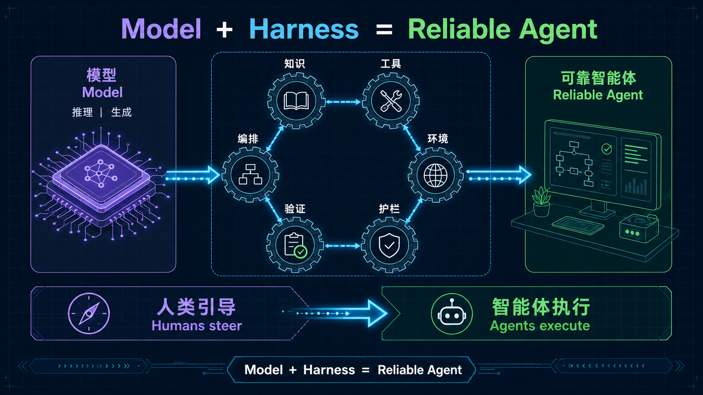
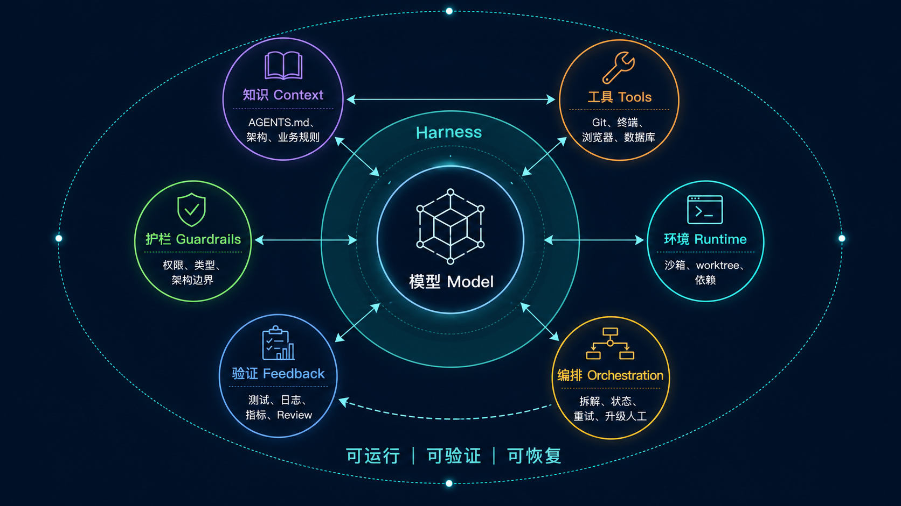
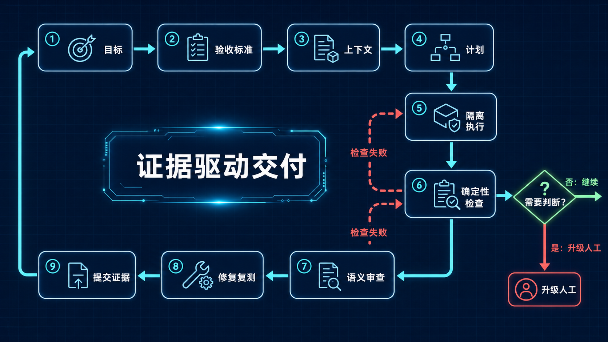
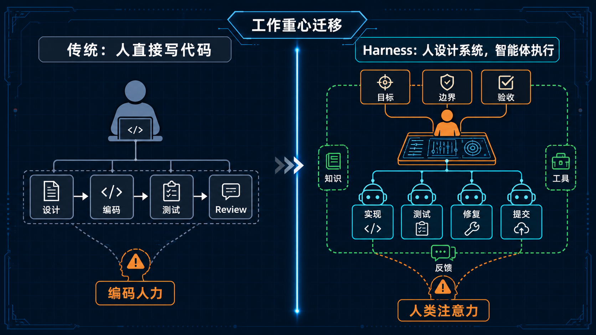
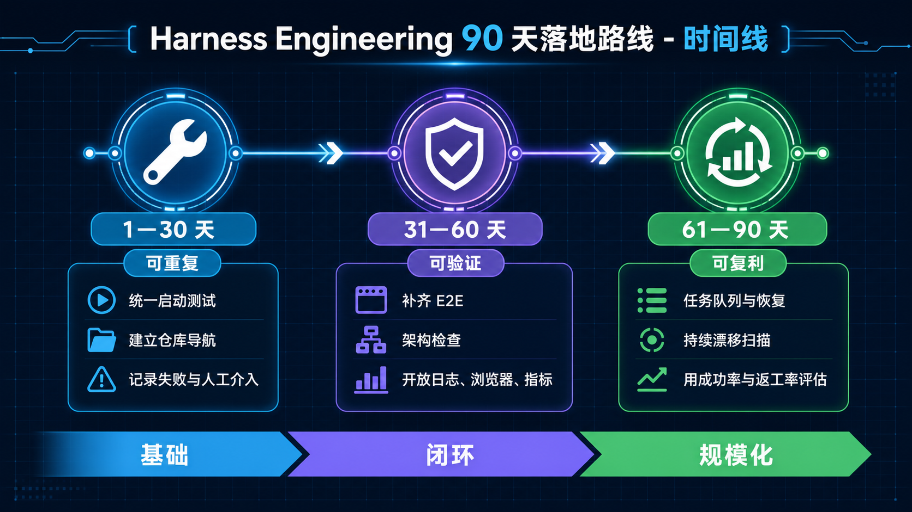

# AI 写代码还不够！Harness Engineering，才是智能体真正落地的关键

模型越来越强，AI 编程为什么仍会翻车？答案可能藏在 Harness 工程里。

大家好，我是九歌。

最近一年，AI 编程工具越来越猛。

写代码、跑测试、改 Bug、提 PR，甚至连续干几个小时不休息。看起来，程序员终于可以坐在旁边喝茶了。

但真正把 AI 智能体放进项目，你很快就会发现：

**会写代码，和能稳定交付，中间还隔着一条大峡谷。**

它可能不知道团队的架构约束，可能改完代码忘记跑测试，也可能信心满满地告诉你“问题已解决”，结果页面一打开，还是熟悉的报错。

模型明明很强，为什么一到真实项目就掉链子？

问题很可能不在模型，而在模型外面的那套系统。

这套系统，就叫 **Harness**。

今天跟大家聊一个 2026 年很值得关注的新概念：**Harness Engineering**。

话不多说，直接开讲。



## 一、Harness Engineering 到底是什么？

先说人话。

如果把大模型比作一台性能很强的发动机，那么 Harness 就是方向盘、仪表盘、刹车、护栏和维修手册。

发动机决定车能跑多快。

但车会不会冲出悬崖，能不能安全到达目的地，靠的是整套控制系统。

业界有一个很简洁的公式：

> **Agent = Model + Harness**

模型负责理解、推理和生成。

Harness 负责告诉它：

- 去哪里找项目知识；
- 可以使用哪些工具；
- 能修改什么，不能碰什么；
- 做完以后如何验证；
- 失败了怎么重试；
- 什么情况必须找人处理。

所以，Harness Engineering 不是“研究一个更长的提示词”。

它真正要做的，是把团队经验、项目规则和质量标准，变成智能体**看得见、用得上、能执行、可验证**的工程系统。



## 二、为什么光会写 Prompt 不够？

写一个小脚本，好 Prompt 确实很有用。

可真实的软件项目不是一次性问答。

它有几百个文件，有历史包袱，有业务规则，还要考虑测试、发布、性能和安全。任务一长，单靠 Prompt 很容易遇到四个坑。

### 1. AI 看不到团队的隐性知识

架构决策放在会议记录里，业务规则藏在群聊里，发布经验装在老员工脑袋里。

这些信息如果没有进入智能体能够访问的环境，对它来说就等于不存在。

你以为它在“理解项目”，其实它只是在当前能看到的几份文件里摸黑走路。

### 2. AI 会在长任务中逐渐跑偏

任务刚开始还挺正常。

改着改着，它可能复制旧代码、绕过现有抽象，或者为了让测试变绿，直接把测试改得失去意义。

有点像让一个执行力很强的新同事独自干三天，却没告诉他公司的红线在哪里。

### 3. “代码写完了”不等于“功能完成了”

代码能编译，只能说明语法大概率没问题。

真正的完成，还包括：页面能不能操作、接口是否符合预期、性能有没有退化、日志是否完整、线上能不能安全回滚。

没有验证工具，智能体的“完成”很多时候只是它自己觉得完成了。

### 4. 人工纠错没有形成复利

今天人工提醒一次“不能跨层调用”，明天换一个任务，AI 又犯同样的错误。

这就很亏。

Harness Engineering 的思路是：**同一个问题出现第二次，就不要只改代码了，还要升级系统。**

把它写进架构检查、Lint 规则、测试或项目说明，让后面的智能体自动避坑。

## 三、一套靠谱的 Harness，至少要有这 6 层

废话不多说，直接看干货。

### 1. 知识层：给 AI 一张项目地图

包括 `AGENTS.md`、架构文档、领域概念、接口说明、历史决策和执行计划。

注意，不是把所有内容塞进一个几万字的说明书。

更好的方式是“地图 + 路标”：入口文件保持简短，再告诉智能体去哪里读取具体规则。

### 2. 工具层：让 AI 真正动手干活

只让 AI 输出代码块，还不能算智能体开发。

它需要直接使用文件系统、终端、Git、浏览器、数据库、日志平台和测试工具。

能观察、能操作、能验证，才算形成闭环。

### 3. 环境层：每个任务都有独立工位

给任务准备隔离沙箱或独立 worktree，并提供统一的安装、启动、测试和清理命令。

这样多个智能体同时工作时，才不会互相踩文件、抢端口、污染环境。

### 4. 护栏层：自由发挥，但不能越界

护栏包括权限控制、类型检查、数据边界、目录规范和架构依赖规则。

好的护栏不是规定每一行代码怎么写，而是明确哪些边界绝对不能破坏。

一句话：**边界集中管理，边界以内允许发挥。**

### 5. 验证层：别听它说，看证据

测试、Lint、日志、指标、链路追踪、截图和 AI Review，都属于验证层。

能用确定性工具检查的，优先交给工具。

比如编译、类型检查、单元测试、依赖分析，速度快、成本低，结论也更稳定。涉及需求理解、过度设计和可读性，再交给 AI Review 或人工判断。

### 6. 编排层：让长任务不再“一跑就丢”

复杂任务需要拆解、保存状态、设置检查点、失败重试，并在必要时升级人工。

否则智能体跑了两个小时，一次意外退出就全部重来，简直是大型电子牛马翻车现场。

## 四、可靠的智能体，是怎么完成一次开发任务的？

一套成熟的流程，大致是这样的：

1. 读取任务目标；
2. 明确验收标准；
3. 查找项目知识和相关代码；
4. 制定执行计划；
5. 在隔离环境中修改代码；
6. 运行类型检查、Lint 和测试；
7. 进行语义审查；
8. 根据反馈自动修复并复测；
9. 提交 PR、截图、日志或指标等证据；
10. 只有遇到需要判断的问题时，才找人处理。



你会发现，这套流程并不追求 AI 一次就把事情做对。

它追求的是：**犯错以后能够自己发现，发现以后能够自己修复。**

这个区别非常重要。

真正可靠的工程系统，从来不是“永不出错”，而是“错误很难逃过检查”。

## 五、Codex、Claude Code、Hermes，分别怎么做 Harness？

讲完方法论，我们直接落到工具。

Codex、Claude Code 和 Hermes 都能执行代码任务，但它们建设 Harness 的重心并不一样。

| 工具 | 更适合扮演的角色 | Harness 建设重点 |
|---|---|---|
| Codex | 代码库内的工程执行器 | `AGENTS.md`、Skills、沙箱、自动验证、PR 闭环 |
| Claude Code | 交互式编码与长任务执行器 | `CLAUDE.md`、Hooks、权限、子智能体、验收标准 |
| Hermes Agent | 可自托管的通用智能体运行时 | 记忆、Skills 自进化、审批、容器、委派与定时任务 |

它们不是非此即彼。

真正应该复用的是 Harness 里的知识、脚本、测试和验收标准，而不是把整个团队绑死在某一家模型上。

### 1. Codex：把仓库本身改造成智能体操作系统

Codex 路线的核心，是让项目仓库成为唯一事实源。

第一步，在根目录放一个短小的 `AGENTS.md`：

```markdown
# 项目工作规则

- 修改前先阅读 docs/architecture.md
- 只允许依赖方向：domain → application → infrastructure
- 完成前必须运行：npm run check
- UI 改动必须用浏览器验证并保存截图
- 禁止直接修改生产数据库和密钥
```

注意，它应该是一张地图，不是一本百科全书。

第二步，把重复流程做成 Skills 或仓库脚本，例如：

- `/how-to-test`：告诉 Codex 如何启动测试环境；
- `/browser-qa`：执行关键用户旅程并保存证据；
- `/architecture-review`：检查依赖方向和模块边界；
- `scripts/check.ps1`：统一运行格式化、类型检查、单测和结构测试。

第三步，给每个任务独立 worktree 或沙箱，让 Codex 可以放心启动应用、改代码、跑浏览器和读取日志。

第四步，要求它提交的不只是代码，还包括验证证据：执行了哪些命令、测试结果如何、页面前后截图有什么变化、哪些风险需要人工判断。

OpenAI 的内部案例，本质上就是把这条路线做到了极致：约 5 个月、约 100 万行代码、约 1,500 个 PR。真正的关键不是代码量，而是浏览器、日志、指标、架构 Lint、Review 和恢复机制都进入了 Codex 的工作闭环。[OpenAI：Harness engineering](https://openai.com/index/harness-engineering/)

### 2. Claude Code：用 CLAUDE.md + Hooks 把规则卡在执行路径上

Claude Code 的思路和 Codex 相似，但它很适合用 Hooks 做“动作前后拦截”。

先在项目中建立 `CLAUDE.md`，写清楚架构入口、常用命令、禁止事项和完成定义：

```markdown
# Definition of Done

1. 先复现问题，再修改代码
2. 不得绕过现有 service 层直接访问数据库
3. 提交前运行 pnpm lint && pnpm test
4. 功能变更必须更新对应测试
5. 删除数据、部署生产环境必须请求人工确认
```

然后用 Hooks 把关键规则变成自动动作：

- 编辑文件后自动格式化；
- 执行测试前检查依赖是否安装；
- 提交前强制运行快速测试；
- 遇到危险 Shell 命令时阻断或请求确认；
- 任务结束时检查是否遗漏测试和文档。

复杂任务可以拆给不同子智能体：一个负责实现，一个负责测试，一个站在挑刺的角度做 Review。规划器先把需求拆成可验收的小块，再让执行器逐块交付。

Anthropic 的长时开发实验采用了规划器、生成器、评估器三种角色。每个 Sprint 开始前先协商“完成契约”，再编码并用 Playwright 验收。这里的关键不是多开几个 Claude，而是让实现方和验收方依据同一份、可测试的标准工作。[Anthropic：Harness design for long-running application development](https://www.anthropic.com/engineering/harness-design-long-running-apps)

### 3. Hermes：让 Harness 自己积累经验

Hermes 不能漏掉，而且它的玩法还真不太一样。

Nous Research 的 Hermes Agent 不是单纯的 IDE 编程助手，而是一个可自托管、可长期运行的通用智能体。它可以使用不同模型，接入终端、文件、浏览器和 MCP，也可以运行在本机、服务器或消息平台上。[Hermes Agent 官方文档](https://hermes-agent.nousresearch.com/docs/)

Hermes 做 Harness，最值得关注的是下面五件事。

#### 第一，用项目上下文文件告诉它“这里怎么干活”

Hermes 会自动发现 `.hermes.md`、`AGENTS.md`、`CLAUDE.md`、`SOUL.md` 和 `.cursorrules` 等上下文文件。

也就是说，同一份仓库规则可以同时服务 Codex、Claude Code 和 Hermes。为了避免多份规则互相打架，建议把稳定约束集中在 `AGENTS.md`，工具专属能力再放到对应文件里。

#### 第二，把事实放进 Memory，把流程放进 Skills

Hermes 自带跨会话记忆：

- `MEMORY.md` 保存环境事实、项目约定和踩坑经验；
- `USER.md` 保存用户偏好；
- Skills 保存较长的操作流程，需要时才加载。

大白话理解：Memory 像桌面便利贴，Skills 像标准作业手册。

例如，“项目使用 pnpm”适合放进 Memory；“如何执行一次数据库迁移并验证回滚”则应该保存为 Skill。

Hermes 在完成复杂任务、绕过死路或收到用户纠正后，可以创建或更新 Skill。这样一次踩坑，后面的任务就有机会直接复用正确路径。这正是它内置学习闭环最有意思的地方。[Hermes：Skills System](https://hermes-agent.nousresearch.com/docs/user-guide/features/skills)

但这里一定要加闸门。

```yaml
# ~/.hermes/config.yaml
skills:
  write_approval: true

memory:
  write_approval: true
```

打开审批以后，Hermes 对 Skill 和 Memory 的修改会先进入待审区。确认内容没有把临时方案、错误经验或敏感信息写成“永久真理”，再允许它影响后续会话。

#### 第三，用容器和危险命令审批守住安全边界

Hermes 支持 Docker 等终端后端，并提供危险命令审批。建议从手动模式开始：

```yaml
approvals:
  mode: manual
  timeout: 60
  cron_mode: deny
```

定时任务遇到危险操作时默认拒绝，不要为了“全自动”直接把审批关掉。

如果让 Hermes 接触真实代码库，最好再配合 Git worktree。每个任务使用独立分支和目录，出问题可以通过检查点和 `/rollback` 回退。[Hermes：Security](https://hermes-agent.nousresearch.com/docs/user-guide/security/)

#### 第四，用子智能体做职责隔离，而不是无脑堆数量

Hermes 可以并行委派子任务，并为子智能体选择不同工具集：

- `terminal + file`：编码和调试；
- `file`：只读代码 Review；
- `web`：资料检索；
- 主智能体：汇总证据、判断是否交付。

一个实用分工是：主智能体负责任务拆解，编码子智能体负责实现，只读子智能体检查改动，最后由主智能体运行统一验证命令。

不要让所有子智能体共享同一个工作目录乱改文件。并行编码时，仍然应该给它们独立 worktree。[Hermes：Subagent Delegation](https://hermes-agent.nousresearch.com/docs/user-guide/features/delegation)

#### 第五，用定时任务做“代码库垃圾回收”

Hermes 的长处不只是写一次代码，还可以长期运行。

可以让它定期执行：

- 扫描过期文档；
- 检查依赖风险；
- 查找重复代码和架构漂移；
- 汇总失败测试；
- 生成待人工确认的修复建议。

这里建议定时任务只负责发现问题和准备证据，不要默认允许自动部署、删数据或修改生产系统。



### 4. 三套工具，怎样共享同一套 Harness？

最稳妥的方式，是把公共 Harness 放进仓库：

```text
project/
├─ AGENTS.md                 # 所有智能体共享的稳定规则
├─ CLAUDE.md                 # Claude Code 专属交互说明
├─ .hermes.md                # Hermes 专属运行说明
├─ docs/                     # 架构、业务、发布与排障文档
├─ skills/                   # 操作流程的版本化源文件，按工具安装或同步
├─ scripts/check.*           # 统一验证入口
├─ tests/                    # 可执行验收标准
└─ evidence/                 # 截图、报告和性能结果
```

Codex、Claude Code、Hermes 可以使用不同模型、不同编排方式，但最后都必须通过同一个 `scripts/check`。

这才是真正可迁移的 Harness。

换模型不需要重建质量体系，换智能体也不会把团队经验全部清零。

## 六、普通团队怎么开始？给你一份 90 天路线

别一上来就挑战“零手写代码”。

这个目标很酷，但也很容易把项目搞成大型实验现场。

更稳妥的做法，是分三步走。

### 第 1—30 天：先让任务可重复

- 选一个边界清晰、风险可控的仓库；
- 统一安装、启动和测试命令；
- 建立简洁的仓库导航；
- 记录智能体失败类型和人工介入时间。

这个阶段不要急着追求全自动。

先搞清楚 AI 经常在哪里迷路。

### 第 31—60 天：再让结果可验证

- 补齐关键业务流程的 E2E 测试；
- 增加架构依赖检查；
- 开放浏览器、日志和指标查询；
- 把重复出现的 Review 意见写成规则。

衡量标准也别只看写了多少代码，要看一次通过率、返工率和缺陷逃逸率。

### 第 61—90 天：最后让经验可复利

- 建立任务队列和失败恢复；
- 设置人工升级条件；
- 持续扫描死代码、依赖风险和架构漂移；
- 自动发起小步重构，而不是年底统一大扫除。



## 七、最后说几句

Harness Engineering 的核心，可以浓缩成一句话：

> **模型决定能力上限，Harness 决定这份能力能不能稳定变成结果。**

它没有推翻传统软件工程。

恰恰相反，测试、模块化、文档、可观测性、CI/CD、最小权限和架构约束，在智能体时代反而更重要了。

因为当代码生成速度提高一个数量级，原本几个月才会暴露的问题，可能几天就堆满整个仓库。

如果你也准备在团队里引入编码智能体，可以先从三个问题开始：

1. 这次失败，是因为智能体缺少什么信息或工具？
2. 什么验证信号能让它自己发现错误？
3. 如何把这次人工纠正，变成以后自动执行的规则？

把这三个问题持续问下去，你就在做 Harness Engineering。

赶紧选一个小项目试试吧。

如果你正在使用 Codex、Claude Code 或其他编码智能体，也欢迎在评论区聊聊：**你遇到最多的问题，是上下文不够、工具不全，还是验证不靠谱？**

我是九歌，关注我，一起用 AI 提升效率。

## 参考资料

1. [OpenAI：Harness engineering — leveraging Codex in an agent-first world](https://openai.com/index/harness-engineering/)
2. [OpenAI：An open-source spec for Codex orchestration — Symphony](https://openai.com/index/open-source-codex-orchestration-symphony/)
3. [Anthropic：Harness design for long-running application development](https://www.anthropic.com/engineering/harness-design-long-running-apps)
4. [Martin Fowler：Harness engineering for coding agent users](https://martinfowler.com/articles/harness-engineering.html)
5. [Hermes Agent：官方文档](https://hermes-agent.nousresearch.com/docs/)
6. [Hermes Agent：Skills System](https://hermes-agent.nousresearch.com/docs/user-guide/features/skills)
7. [Hermes Agent：Persistent Memory](https://hermes-agent.nousresearch.com/docs/user-guide/features/memory/)
8. [Hermes Agent：Security](https://hermes-agent.nousresearch.com/docs/user-guide/security/)
9. [Hermes Agent：Subagent Delegation](https://hermes-agent.nousresearch.com/docs/user-guide/features/delegation)
